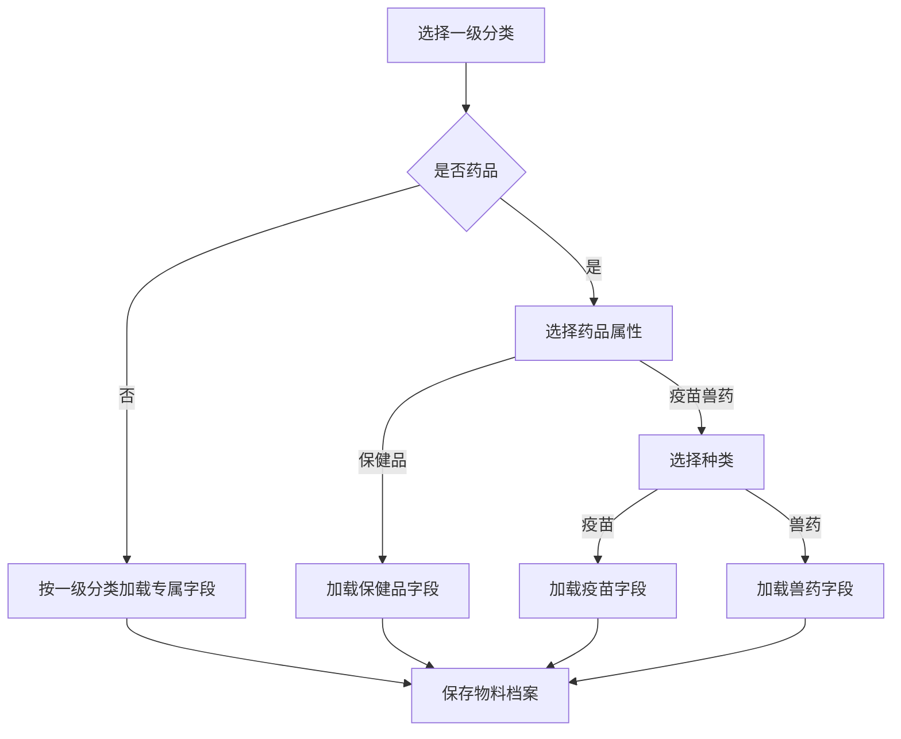
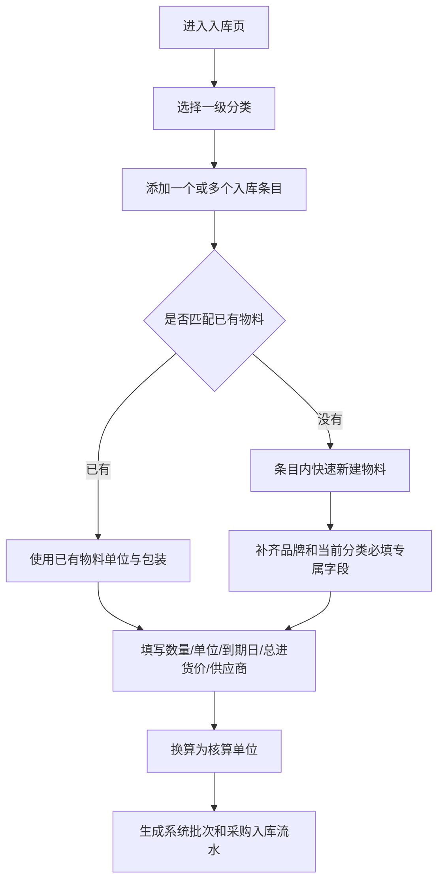
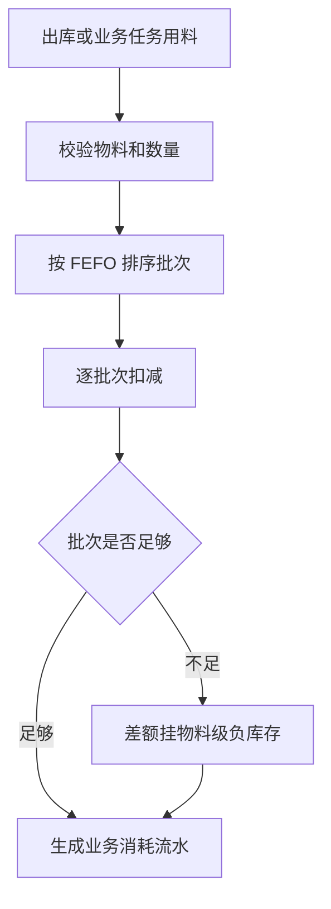
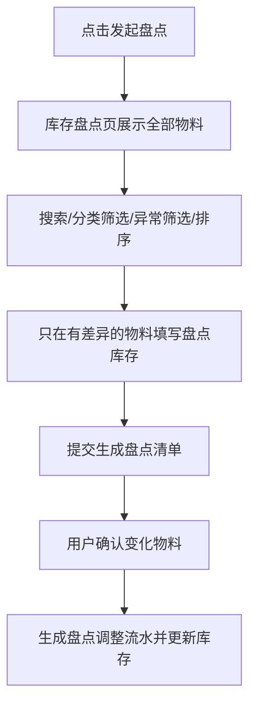
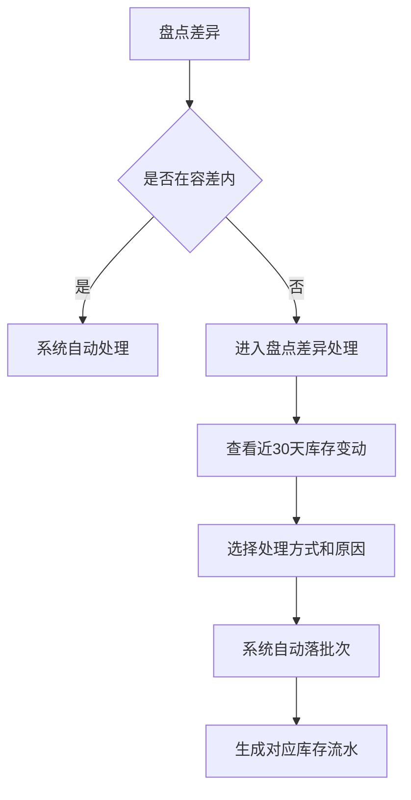

# 库存系统代码结构与流程说明

更新时间：2026-07-07

## 1. 当前代码入口

| 文件 | 当前职责 | 备注 |
|---|---|---|
| `src/components/inventory/inventoryData.ts` | 库存类型、分类枚举、物料档案字段配置、mock 数据、入库/出库/盘点/差异/报废/风险/流水工具函数 | 当前职责过重，是库存领域逻辑的实际中心 |
| `src/components/inventory/ConsoleInventoryPage.tsx` | Console 库存首页、入库、出库、库存流水、物料详情、盘点、盘点清单、盘点完成、盘点差异处理、报废抽屉 | 页面状态多，已依赖 `inventoryData.ts` 的领域函数 |
| `src/components/inventory/BatchReceivePanel.tsx` | Console 卡片式批量入库页面 | 复用入库快建和单位换算逻辑 |
| `src/components/inventory/BatchReceiveInlineNewMaterial.tsx` | 入库条目内新建物料的必填/选填档案表单 | 药品属性选择复用 `MaterialProfileFields` |
| `src/components/inventory/MaterialProfileFields.tsx` | 按一级分类、药品属性和药品种类渲染专属字段 | 物料管理和入库快建共用 |
| `src/components/inventory/MobileInventoryToolsPage.tsx` | Mobile 查库存、入库、盘点 | 复用同一套物料、入库、盘点工具函数 |
| `src/components/VaccineCatalogPage.tsx` | 设置中的物料管理 | 复用库存物料模型，不再维护独立药品模型 |
| `src/components/inventory/inventoryUtils.test.ts` | 库存领域回归断言 | 覆盖分类、入库、出库、盘点、差异、风险、财务图表源码约束 |

## 2. 当前分类模型

库存一级分类固定为：

- `饲料`
- `药品`
- `消耗品`
- `工具`
- `其他`

药品类必须继续使用细分属性：

| 字段 | 含义 | 取值 |
|---|---|---|
| `medicineSubtype` | 药品属性 | `疫苗兽药`、`保健品` |
| `medicineKind` | 疫苗兽药下的具体种类 | `疫苗`、`兽药` |

分类展示口径：

- 一级列表、tab、筛选、图表维度使用五个一级分类。
- 药品类在标签或详情中展示为 `药品 · 疫苗兽药` 或 `药品 · 保健品`。
- 当 `medicineSubtype = 疫苗兽药` 时，继续用 `medicineKind` 决定疫苗字段或兽药字段。

## 3. 核心流程

### 3.1 物料档案

关键函数：

- `getMaterialProfileFieldSpecs`
- `isMaterialProfileIncomplete`
- `formatMaterialCategoryLabel`
- `resolveMedicineBaseUnitRecommendations`

### 3.2 入库

关键函数：

- `createDefaultBatchNewMaterialForm`
- `buildBatchInlineNewMaterialDraft`
- `validateBatchInlineNewMaterial`
- `calculateInventoryBaseQuantity`
- `buildInventoryReceiveEntry`

### 3.3 出库与任务消耗

关键函数：

- `buildInventoryOutboundTransaction`
- `getInventoryLotsForMaterial`
- `formatInventoryQty`

### 3.4 盘点

关键函数：

- `buildInventoryStocktakeScope`
- `buildInventoryStocktakeTransaction`
- `buildInventoryStocktakeDifferences`

### 3.5 盘点差异处理

关键函数：

- `isInventoryDifferenceWithinTolerance`
- `resolveInventoryToleranceDifferences`
- `buildInventoryDifferenceResolution`

## 4. 当前结构问题

| 问题 | 影响 |
|---|---|
| `inventoryData.ts` 同时包含类型、mock、配置、交易函数和视图辅助函数 | 文件过大，改动容易互相影响，代码评审难定位 |
| Console 页面状态集中在单个 `ConsoleInventoryPage.tsx` | 页面分支多，后续新增库存能力容易继续膨胀 |
| 测试以脚本断言为主，覆盖面广但定位粒度粗 | 适合样机回归，不适合长期模块级单测 |
| 文档曾经历七类到五类口径迁移 | 历史修改日志保留旧口径，当前开发应只看最新 PRD 与本结构说明 |

## 5. 建议的后续拆分边界

优先保持外部 import 兼容，逐步从 `inventoryData.ts` 拆出：

| 建议文件 | 迁移内容 |
|---|---|
| `inventoryTypes.ts` | 所有 `Inventory*` 类型定义 |
| `inventoryCatalog.ts` | 分类、药品属性、专属字段、物料档案校验和展示 |
| `inventorySeedData.ts` | `inventorySeedMaterials`、`inventorySeedLots`、`inventorySeedLedgers`、`inventorySeedDifferences` |
| `inventoryTransactions.ts` | 入库、出库、盘点、差异处理、报废交易函数 |
| `inventoryAnalytics.ts` | 饲料预计可用天数、经营分析、风险项、流水筛选 |
| `inventoryData.ts` | 兼容导出入口，短期只 re-export 以上文件 |

拆分顺序建议：

1. 先拆类型和 mock 数据，不改业务逻辑。
2. 再拆物料档案配置和入库/盘点纯函数。
3. 最后拆 Console 页面，把入库、盘点、差异处理拆成子组件。
