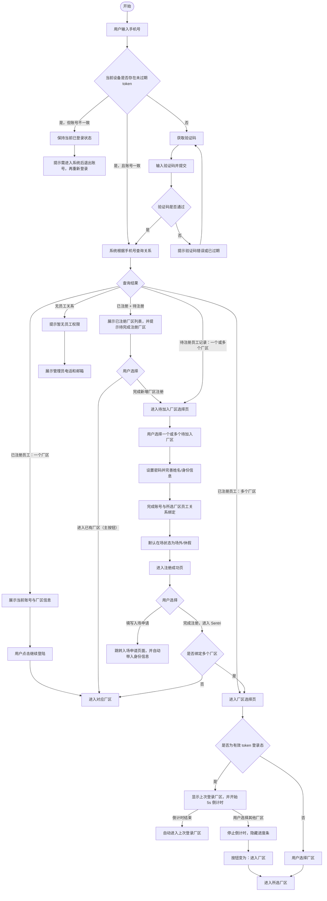

# Sentri 统一访问流程

更新时间：2026-06-01

## 背景

注册、登录、入场申请不再作为三套彼此独立的流程处理，而是统一到同一个访问入口中。用户访问的是一个通用入口链接，入口本身不携带 `farmID`，也不携带员工邀请信息。

统一流程先识别用户是谁，再由系统根据手机号查询用户与厂区、员工之间的关系，最后分流到对应业务页面。

入场申请不属于登录流程本身。注册完成后的成功页面需要提供“填写入场申请”的入口，用户可从该入口跳转到入场申请页面。

## 已确认决策

### 决策 1：统一入口先验证手机号

第一步页面只输入手机号并完成验证码验证，不让用户手动输入厂区。

原因：

- 通用入口不携带厂区信息，用户手动输入厂区不可靠。
- 厂区名称可能重复，用户也不一定知道标准名称。
- 厂区关系应由系统根据手机号查询，而不是由用户声明。
- 多厂区用户应在身份验证完成后，从系统返回的合法厂区范围内选择。

手机号验证通过后，系统以手机号为索引查询：

- 是否已有账号
- 是否有关联厂区
- 是否有待注册员工记录
- 是否有已注册员工关系

### 决策 2：手机号命中多个待注册员工记录

如果同一个手机号被多个厂区添加为待注册员工，手机号验证通过后进入“待加入厂区选择页”。

用户可以多选要完成注册/绑定的厂区。确认后进入注册流程，一次完成账号与多个厂区员工关系的绑定。

### 决策 3：手机号同时命中已注册员工关系和待注册员工记录

如果用户已经属于一个或多个厂区，同时又被其他厂区添加为待注册员工：

- 优先展示已注册厂区列表，用户可以直接进入已有厂区。
- 页面提示用户“还有待完成注册的厂区”。
- 用户可以进入待注册厂区绑定流程，完成新增厂区关系绑定。

### 决策 4：无员工关系

如果手机号没有已注册员工关系，也没有待注册员工记录，只提示：

当前手机号暂无员工权限，请联系管理员添加员工。

该页面不提供“填写入场申请”入口。

### 决策 5：注册成功页按钮主次

注册成功页保留两个出口：

- 主按钮：完成注册，进入 Sentri
- 次按钮：填写入场申请

已注册员工登录成功页不展示入场申请入口，登录成功只负责进入厂区。

### 决策 6：注册流程必须设置密码

待注册员工完成手机号验证后，注册流程必须包含：

- 设置密码
- 确认密码
- 完善姓名/身份信息

完成后才能建立账号与员工关系。后续用户可使用手机号/邮箱 + 密码登录。

### 决策 7：有效 token 与输入手机号不一致

如果当前设备已有未过期 token，则视为已登录状态。

当用户想登录的手机号与当前 token 对应账号不一致时，不在手机号验证页直接切换账号，也不复用该手机号继续验证。

处理方式：

- 保持当前已登录状态。
- 用户需要先进入系统后退出当前账号。
- 退出后再使用新的手机号重新登录。

### 决策 8：有效 token + 多厂区的默认进入逻辑

如果当前设备已有未过期 token，且该账号拥有多个厂区权限，进入厂区选择页后需要提供自动进入上次登录厂区的体验。

页面规则：

- 默认选中/展示上次登录的厂区。
- 页面底部展示按钮：`5s 后进入上次登录的厂区`。
- 按钮内或按钮上方展示倒计时进度条。
- 5 秒倒计时结束后，自动进入上次登录的厂区。
- 如果用户选择其他厂区，倒计时立即停止，进度条消失。
- 此时底部按钮变为实体按钮：`进入厂区`。
- 用户点击后进入当前选择的厂区。

该逻辑只用于“已有有效 token 的多厂区登录态”。如果用户是通过验证码/密码重新登录后进入多厂区选择页，不默认触发自动倒计时，除非后续产品另行确认。

### 决策 9：待加入厂区多选后的进入方式

用户可以一次选择多个待加入厂区并完成注册/绑定。

如果用户一次绑定多个厂区，注册成功后点击“完成注册，进入 Sentri”，进入厂区选择页，由用户选择本次进入哪个厂区。

### 决策 10：已注册 + 待注册并存时的页面主行动

如果手机号同时命中已注册员工关系和待注册员工记录：

- 已注册厂区列表作为主要区域展示。
- 主按钮是进入已有厂区。
- 待注册厂区作为下方提示/辅助区域展示。
- 用户可从辅助区域进入新增厂区注册/绑定流程。

### 决策 11：注册成功页跳转入场申请时自动带入身份信息

用户从注册成功页点击“填写入场申请”进入入场申请页面时，自动带入：

- 手机号
- 姓名
- 已绑定厂区

这些身份与厂区信息不可修改，用户只填写入场相关字段。

### 决策 12：无员工权限页面展示管理员联系方式

如果手机号没有已注册员工关系，也没有待注册员工记录，页面提示当前手机号暂无员工权限，并展示管理员联系方式：

- 管理员电话
- 管理员邮箱

用户通过联系管理员完成员工添加。

## 统一流程图

## 当前待继续确认的问题

暂无。当前确认内容可作为前端改造依据。

## 前端改造依据

后续前端页面不再按“新注册流程 / 新登陆流程”两个孤立模块设计，而应逐步合并为“统一访问流程”的不同分支页面。

入场申请页面仍然作为独立业务页面存在，不进入登录主流程，只从注册成功页等后续入口跳转。

当前第一步页面应只保留：

- 手机号输入
- 获取验证码
- 验证码输入
- 继续按钮

第一步页面不展示厂区输入项。厂区选择、厂区确认、注册完善均发生在手机号验证通过后的分支页面中。

注册成功页需要提供两个出口：

- 主按钮：完成注册，进入 Sentri
- 次按钮：填写入场申请

如果注册成功后已绑定多个厂区，点击“完成注册，进入 Sentri”后进入厂区选择页。

从注册成功页进入入场申请页面时，应自动带入手机号、姓名和已绑定厂区，且不可修改。
