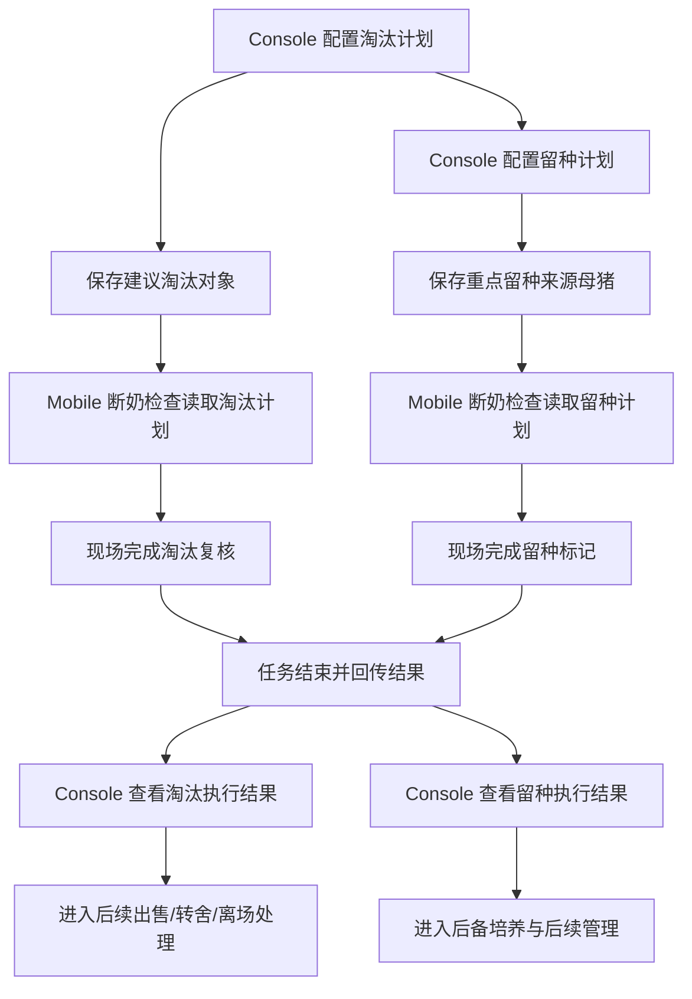
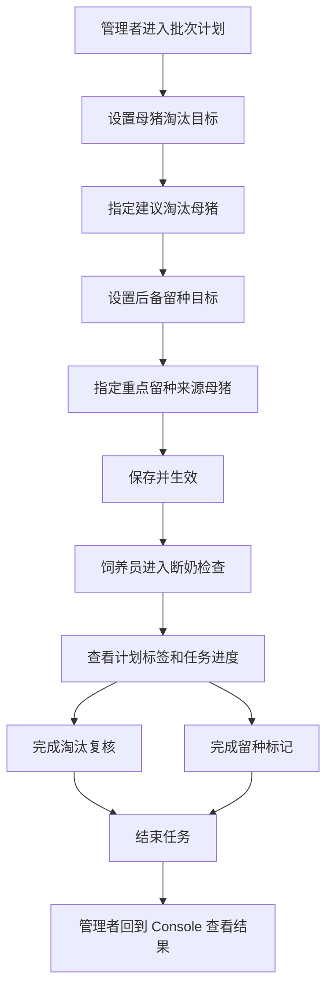

# PRD：淘汰与留种业务总览

## 背景

在一个批次开始前，管理者通常需要先想清楚两件事：

- 这一批预计要淘汰多少生产母猪，哪些母猪需要现场重点复核。
- 这一批未来要补多少后备母猪，现场在断奶时应该优先关注哪些母猪的后代。

这两件事本质上都不是单独的“现场动作”，而是管理者先设定目标，现场再在执行任务时逐头判断并落地。

当前业务口径已经明确：

- 淘汰不做成一个独立任务，而是在现有任务里提供 `淘汰复核` 能力。
- 留种不是外部补猪，而是在断奶阶段从仔猪中选择未来可培养的后备母猪。
- Console 负责计划配置与结果查看，Mobile 负责在现场任务中执行和回传。

## 目标

- 让 Console 用户在批次开始前，完成淘汰目标和留种目标的计划配置。
- 让 Mobile 用户在断奶检查中，按计划提示完成淘汰复核和留种标记。
- 让管理者在任务结束后，能清楚看到计划与执行之间的差异。
- 让现场确认的 `需淘汰` 对象能顺畅进入后续出售、死亡、转移到其他场等处理，让留种结果进入后备培养流程。

## 对象

| 用户角色 | 说明 | 主要关注点 |
|---|---|---|
| Console 用户 | 在批次计划阶段配置目标，并在执行后查看结果 | 计划是否合理、执行是否达成、偏差在哪里 |
| Mobile 用户 | 在断奶检查中逐头完成检查、淘汰复核和留种标记 | 操作是否清楚、标签是否明确、是否容易漏做 |
| 管理复盘用户 | 在任务结束后根据结果安排下一步动作 | 是否需要继续处理淘汰对象，留种是否够用 |

## 价值

- 对管理者：把“本批次要淘多少、留多少”提前定下来，减少任务做完后才发现方向偏了。
- 对现场操作员：在一个任务里就能看到该重点关注哪些猪，不需要靠口头交代或纸面名单。
- 对场区协同：Console 的计划和 Mobile 的执行用同一套口径，减少前后理解不一致。
- 对复盘工作：结果能回到批次维度统一查看，而不是分散在多个页面和记录里。

## 适用范围

- 本文档只说明淘汰与留种功能的整体定位、Console 与 Mobile 的联动关系，以及模块之间的职责拆分。
- 单个页面怎么展示、按钮怎么跳转、什么情况下阻断提交、哪些异常要提示，都放到各子模块 PRD 中展开。

## 程序流程图

## 操作流程图

## 模块拆分

| PRD | 覆盖范围 |
|---|---|
| `01-console-母猪淘汰计划.md` | Console 端的淘汰目标设置、建议淘汰母猪选择、淘汰结果查看 |
| `02-console-后备留种计划.md` | Console 端的留种目标设置、重点留种来源母猪选择、留种结果查看 |
| `03-mobile-淘汰复核.md` | Mobile 端与淘汰相关的标签、进度、母猪状态页、结束任务校验 |
| `04-mobile-留种标记.md` | Mobile 端与留种相关的标签、进度、仔猪信息页、留种选择与结果回传 |
| `05-console-淘汰&留种计划编辑与生效规则补充说明.md` | Console 端计划的开关、未保存状态、保存并执行、锁定与生效规则 |

