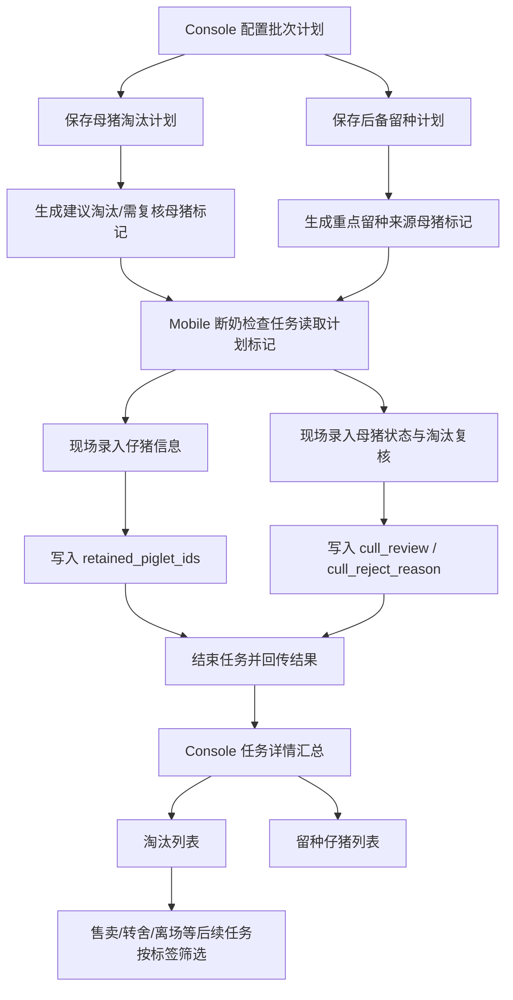
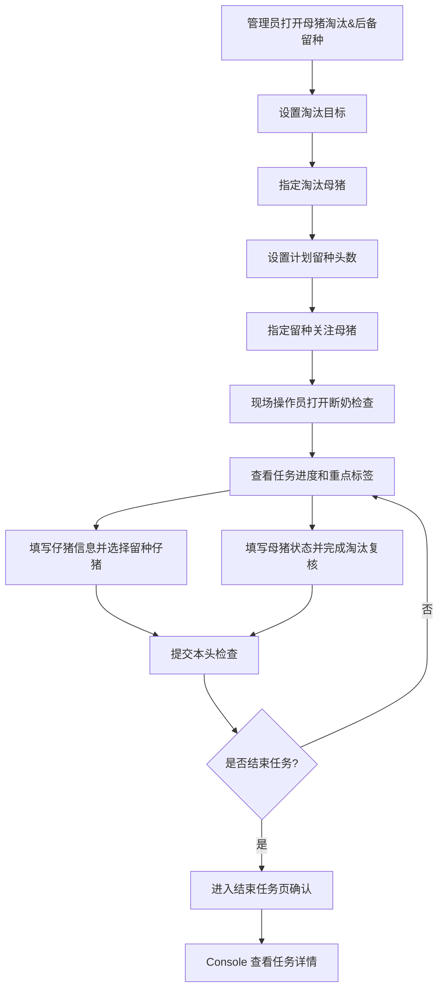

# PRD：淘汰与留种业务总览

## 背景

猪场在批次生产过程中，需要同时处理两类关键决策：

- 哪些生产母猪需要进入淘汰关注或淘汰流程。
- 本批次需要从断奶仔猪中留下多少后备母猪，并优先关注哪些母猪的后代。

此前方案曾将“淘汰”设计为独立任务，将“后备补充”理解为外部调入后备母猪。当前业务口径已修正：

- 淘汰不单独生成任务，而是作为断奶检查、母猪产后检查等现场任务中的复核项。
- 后备留种不是从其他生产线调入猪只，而是在断奶阶段从本批次仔猪中选择未来可培养的后备母猪。
- Console 负责计划配置与结果查看；Mobile 负责在现场任务中执行检查、复核、标记。

## 目标

- 让管理者在批次计划阶段提前设定淘汰目标和后备留种目标。
- 让现场操作员在断奶检查中完成淘汰复核和仔猪留种标记，不需要切换到独立淘汰任务。
- 让 Console 任务详情能集中展示断奶结果、淘汰列表和留种仔猪列表。
- 让售卖、转舍等后续业务可以通过淘汰状态或标签筛选相关猪只。
- 保持业务闭环：计划配置 → Mobile 执行 → 结果回传 → Console 查看 → 后续处理。

## 对象

| 对象     | 说明                                 | 生命周期                             |
| ------ | ---------------------------------- | -------------------------------- |
| 批次     | 管理淘汰目标、留种目标、断奶检查任务和结果汇总的业务容器       | 创建计划 → 下发任务 → 执行检查 → 结束任务 → 查看结果 |
| 生产母猪   | 当前批次参与生产的母猪，可被标记为建议淘汰，也可被圈定为留种关注来源 | 批次内在场 → 计划关注 → 现场复核 → 后续售卖/转舍/留群 |
| 仔猪     | 断奶检查中被记录数量、体重、性别，并可被选择为留种对象        | 出生/断奶 → 检查记录 → 留种标记 → 后备培养或普通流转  |
| 淘汰计划   | 管理者设定的本批次淘汰软目标与指定淘汰母猪名单            | 草稿 → 已配置 → 现场复核中 → 结果汇总          |
| 后备留种计划 | 管理者设定的计划留种头数与重点关注母猪名单              | 草稿 → 已配置 → 现场留种标记中 → 结果汇总        |
| 断奶检查任务 | Mobile 当前用于展示淘汰与留种闭环的现场任务          | 未开始 → 进行中 → 结束 → 汇总到 Console     |

## 价值

- 对管理者：提前知道本批次淘汰和留种目标是否被执行，减少批次结束后才发现后备不足或淘汰遗漏的风险。
- 对现场操作员：在一个断奶检查任务里完成检查、淘汰复核和留种标记，减少任务切换和重复录入。
- 对后端开发：淘汰与留种结果都落在任务回传数据中，后续售卖、转舍、单猪档案可复用同一套状态字段。
- 对前端开发：Console 和 Mobile 的职责边界清楚，计划配置、现场执行、结果查看分开实现。

## 程序流程图

## 操作流程图

## 功能说明（精细化颗粒度）

### 模块拆分

| PRD                           | 覆盖范围                                       | 不覆盖范围                     |
| ----------------------------- | ------------------------------------------ | ------------------------- |
| `01-console-母猪淘汰计划&后备留种计划.md` | Console 计划配置页：淘汰目标、指定淘汰母猪、留种目标、指定留种母猪      | Mobile 执行、任务详情结果页         |
| `02-mobile-断奶检查任务.md`         | Mobile 断奶检查任务：列表、详情抽屉、仔猪信息、母猪状态、淘汰复核、结束任务页 | Console 计划配置、Console 结果列表 |
| `03-console-断奶任务详情.md`        | Console 任务详情：任务数据、断奶记录、淘汰列表、留种仔猪列表         | 计划配置、Mobile 操作表单          |

### 核心状态口径

| 状态/标签  | 业务含义                            | 来源             | 后续影响                       |
| ------ | ------------------------------- | -------------- | -------------------------- |
| 建议淘汰   | 管理者在 Console 标记的淘汰关注对象，用于现场优先复核 | Console 计划     | Mobile 母猪状态页显示标签；选择不淘汰需填原因 |
| 需淘汰    | 现场在任务中确认该猪需要淘汰，表示进入淘汰流程         | Mobile 淘汰复核    | Console 淘汰列表展示；后续售卖/转舍可筛选  |
| 已淘汰    | 已完成出售、死亡、离场等淘汰处理                | 后续处理任务         | 单猪档案和不在场列表展示最终去向           |
| 重点留种来源 | 管理者圈定值得关注其后代的母猪                 | Console 后备留种计划 | Mobile 列表展示标签，提示现场优先关注其仔猪  |
| 标记留种   | 现场从仔猪中选择的留种对象                   | Mobile 仔猪信息    | Console 留种仔猪列表展示，进入后备培养流程  |

### 关键计算

| 指标        | 公式                                                                                            | 示例                                               |
| --------- | --------------------------------------------------------------------------------------------- | ------------------------------------------------ |
| 计划淘汰头数    | 百分比模式：`ceil(batch_sow_count * culling_target_value / 100)`；头数模式：`min(input, batch_sow_count)` | 批次母猪 100 头，淘汰目标 10%，计划淘汰 `ceil(100*10/100)=10` 头 |
| 需淘汰/计划淘汰  | `confirmed_cull_count / planned_cull_count`                                                   | 计划淘汰 10 头，现场确认 6 头，显示 `6 / 10 头`                 |
| 标记留种/计划留种 | `retained_piglet_count / retain_target_count`                                                 | 计划留种 6 头，现场标记 5 头，显示 `5 / 6 头`                   |
| 已检查/需检查   | `checked_count / task_total_count`                                                            | 需检查 200 栏，已检查 100 栏，显示 `100 / 200`               |

## 边际情况 / 异常情况

| 场景                            | 处理方式                                         |
| ----------------------------- | -------------------------------------------- |
| 同一母猪既被建议淘汰，又被设置为重点留种来源        | 允许同时存在；淘汰关注的是母猪去留，留种关注的是其后代价值，二者不互斥          |
| Console 建议淘汰，但 Mobile 现场选择不淘汰 | 必须填写原因，保存为 `cull_reject_reason`，供 Console 复盘 |
| 现场标记留种数量低于计划留种数量              | 允许结束任务；Console 展示留种进度不足，不强制补齐                |
| 现场确认淘汰数量低于计划淘汰数量              | 允许结束任务；Console 展示淘汰进度不足，后续由管理者决策是否继续处理       |
| 计划目标为 0                       | 仍展示进度口径，显示 `0 / 0`，不隐藏模块，避免页面结构跳动            |
| 网络提交失败                        | Mobile 保留本地草稿；后端需支持重试提交和幂等写入                 |
| 后续售卖/转舍处理完成                   | 更新单猪最终状态为已淘汰或已离场，并同步到不在场猪只或单猪档案              |

