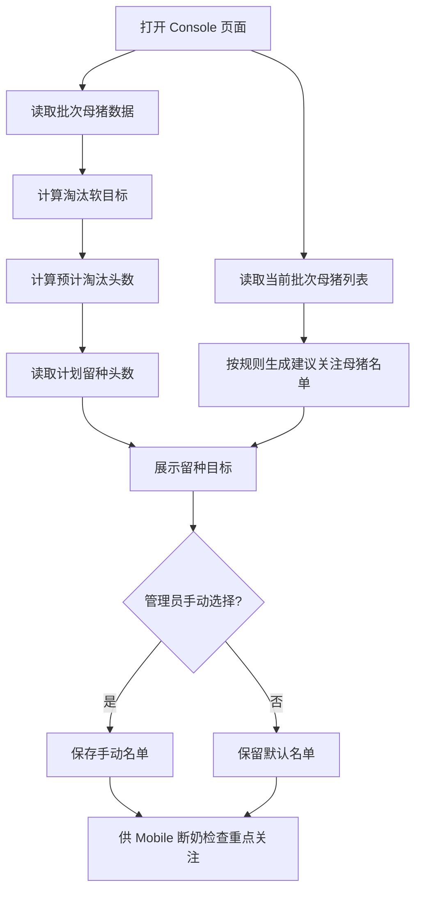

# Console PRD：母猪淘汰计划 & 后备留种计划

## 1. Stakeholders, Context & Objectives

### Roles
- 管理员：配置母猪淘汰软目标与后备留种目标。
- 场长/繁育负责人：查看系统建议、确认名单、作为后续售卖/转舍/单猪档案的决策依据。
- 系统：根据目标值、当前批次数据、断奶任务回传记录生成建议与汇总。

### Background
- 旧方案将“补充后备母猪”理解为外部补入，业务定义错误。
- 正确业务是：先圈定需要重点关注其后代的母猪，形成后备留种关注计划；后续进入断奶阶段后，再由现场根据实际断奶结果和仔猪状态完成留种标记。
- “淘汰”不再生成独立任务，Console 只负责配置目标与查看汇总；现场在断奶检查/产后检查中标记淘汰建议。

### Goals
- 管理员必须能在一个页面内完成两类配置：`母猪淘汰计划`、`后备留种计划`。其中后备留种计划在 Console 端选择的是母猪，不是仔猪。
- 两个配置模块需使用一致的卡片结构、标题层级、输入区与管理按钮布局，避免因为样式差异造成理解成本。
- 页面必须支持两种动作：`输入目标数量`、`指定具体猪只`。其中淘汰目标支持百分比/头数，留种目标只支持头数。
- 页面必须展示系统建议数量及其来源说明，不允许黑盒推荐。
- 页面输出必须能支撑后续任务联动：断奶检查回传、售卖筛选、转舍筛选、单猪档案查看。

## 2. Process Visualization

### Business Flow
1. 管理员进入 `母猪淘汰&后备留种` 页面。
2. 在 `母猪淘汰计划` 中配置软目标：百分比或头数。
3. 管理员可手动指定需要优先关注的淘汰母猪。
4. 在 `后备留种计划` 中输入计划留种头数。
5. 系统读取计划留种头数，并列出建议重点关注的母猪名单。
6. 管理员可手动勾选具体母猪，保存留种关注名单。
7. 后续进入断奶检查时，现场重点查看这些母猪后代，并继续标记 `留种` / `淘汰建议`。
8. Console 后续展示：计划配置 + 现场回传结果汇总。

### System Flow

## 3. Detailed Specifications

### Logic Matrix
| Module | Frontend Interaction/UI Logic | Backend Processing/Calculation |
|---|---|---|
| 母猪淘汰计划 | 支持 `百分比/头数` 切换；展示软目标，不阻断保存 | `planned_target = percentage ? ceil(batch_sow_count * ratio) : number` |
| 指定淘汰母猪 | 管理员可手动选择具体母猪；列表只展示经营指标，不展示系统结论标签或淘汰原因，避免替用户决策 | 保存 `manual_culling_ids[]`；后续现场标记的 `cull_suggestion=true` 仍可追加 |
| 后备留种计划 | 管理员输入 `计划留种头数`；系统据此维护“重点关注其后代的母猪名单” | `retain_target_count = user_input_number` |
| 留种关注母猪名单 | 列表字段与淘汰名单保持一致；管理员按母猪历史生产指标选择需重点关注其后代的母猪 | 返回当前批次母猪列表；后续断奶任务再根据这些母猪关联其后代完成留种标记 |
| 现场结果汇总 | 后续需在任务详情中展示 `已标记留种`、`已标记淘汰建议`；断奶任务详情页除母猪记录外，还需单独提供一个标题为 `留种仔猪` 的列表，并按 `留种公猪`、`留种母猪` 两个 tab 分开管理本批次全部被标记留种的仔猪 | 汇总断奶检查回传字段 `retain_flag`、`cull_suggestion_flag`、`retained_piglet_ids[]`、`retained_piglet_gender` |

### Data Dictionary
| Field Name | Type | Required | Validation/Enums | Default Value |
|---|---|---|---|---|
| `batch_id` | string | yes | 当前批次唯一 ID | - |
| `culling_target_mode` | enum | yes | `percentage` / `number` | `percentage` |
| `culling_target_value` | number | yes | `>=0`；百分比模式 `<=100` | `10` |
| `manual_culling_ids` | string[] | no | 母猪耳标/ID 去重 | `[]` |
| `retain_target_count` | number | yes | `>=0` | `6` |
| `selected_retention_ids` | string[] | no | 留种关注母猪 ID 去重 | `[]` |
| `average_live_born` | number | no | 母猪历史窝均活仔数，用于人工判断是否保留/淘汰 | system |
| `retain_flag` | boolean | no | 断奶任务现场回传 | `false` |
| `cull_suggestion_flag` | boolean | no | 断奶/产后任务现场回传 | `false` |

### State Machine
#### State: 母猪淘汰计划
- `DRAFT`
- `CONFIGURED`
- `SYNCED_WITH_FIELD`

#### Transition Rules
- `DRAFT + 输入淘汰目标 = CONFIGURED`
- `CONFIGURED + 保存手动淘汰名单 = CONFIGURED`
- `CONFIGURED + 断奶任务/产后检查回传淘汰建议 = SYNCED_WITH_FIELD`

#### State: 后备留种计划
- `DRAFT`
- `TARGET_SET`
- `SOW_SELECTED`
- `FIELD_CONFIRMED`

#### Transition Rules
- `DRAFT + 输入计划留种头数 = TARGET_SET`
- `TARGET_SET + 勾选留种关注母猪 = SOW_SELECTED`
- `SOW_SELECTED + 断奶检查回传 retain_flag = FIELD_CONFIRMED`

### UX Narrative
- 作为管理员，我需要直接设置计划留种头数，并基于母猪历史指标维护重点关注名单。
- 作为管理员，我可以先配目标，再让现场补充标记，不必一次性在 Console 里做完所有决定。

## 4. Robustness & Edge Cases

### Empty States
- 候选母猪为空：显示“当前批次暂无可用于留种关注计划的母猪”。
- 未手动指定淘汰母猪：显示“淘汰建议将由系统推荐与现场任务回传共同形成”。
- 未选择留种关注母猪：显示“尚未配置具体留种关注名单，仅保存目标值”。

### Constraints
- 同一母猪不得重复加入留种关注名单。
- Console 保存不得覆盖现场已回传的 `retain_flag/cull_suggestion_flag`，只能合并展示。

### Error Handling
- 候选母猪列表拉取失败：页面保留目标输入区，名单区域显示错误提示与重试。
- 保存失败：保留弹窗勾选状态，不清空草稿。
- 现场回传冲突：以后端最后更新时间为准，并记录 `updated_by` 与 `updated_at`。

## Formula Example
- 已知：`retain_target_count = 6`
- 则：系统保存的留种计划目标为 `6` 头。

若：
- `retain_target_count = 4`
- 则：系统保存的留种计划目标为 `4` 头。

解释：后备留种计划由管理员直接输入目标头数，页面不再额外要求输入安全余量，也不再提供百分比模式。
