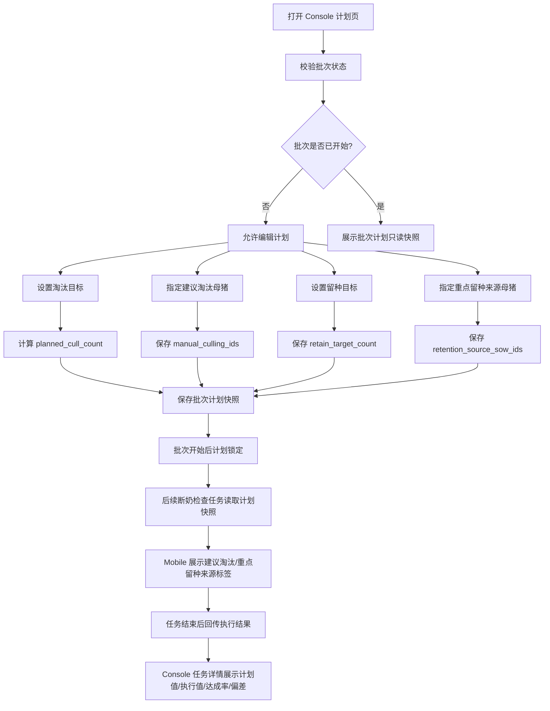
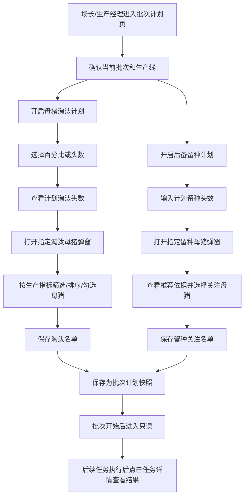

# PRD：Console 母猪淘汰计划 & 后备留种计划

## 背景

批次开始前，生产管理者需要提前判断两个问题：

- 本批次预计需要淘汰多少生产母猪，哪些母猪需要现场重点复核。
- 本批次需要保留多少后备母猪，哪些母猪的后代值得现场重点关注。

这两个问题都不是现场操作员临时决定的纯执行动作，而是批次管理者基于生产目标、母猪历史表现、场区周转压力和后备储备情况做出的计划。Console 页面承担的是“计划配置”和“计划下发”职责，不承担现场复核，也不直接完成最终淘汰或最终留种。

当前业务口径：

- `母猪淘汰计划` 是软目标，用于指导现场复核和后续处理，不强制现场必须淘汰固定数量。
- `后备留种计划` 是计划目标，用于指导断奶阶段从仔猪中选择未来后备母猪。
- Console 端的“指定留种母猪”选择的是母猪来源，不是仔猪本体；真正留种对象在断奶任务中由现场从仔猪里选择。
- 计划配置完成后，Mobile 断奶检查任务读取这些计划标记，并在现场形成淘汰复核和留种标记结果。

## 目标

- 让管理者在批次开始前完成本批次淘汰目标和留种目标配置。
- 让管理者可以手动圈定需要重点复核的淘汰母猪。
- 让管理者可以手动圈定值得重点关注其后代的母猪。
- 让现场断奶检查任务能读取 Console 计划，并在列表和表单中展示对应标签。
- 让任务结束后可以按计划值、执行值、达成率和偏差原因查看结果。
- 让淘汰和留种计划作为软约束参与任务提示、结果统计和管理复盘，而不是作为阻断现场提交的硬性规则。

## 对象

| 角色/对象 | 说明 | 典型场景 | 决策依据 |
|---|---|---|---|
| 场长 | 对批次整体目标负责，关注栏位、后备储备、批次达成率 | 批次开始前或任务下发前确认计划 | 批次配种目标、淘汰压力、后备储备、历史达成率 |
| 生产经理 | 负责把生产目标转成可执行名单和任务要求 | 配置淘汰目标、留种目标、重点关注名单 | 母猪生产指标、疾病标签、返情记录、胎次结构 |
| 繁育负责人/线长 | 了解具体母猪表现，可辅助确认名单 | 调整手动名单或查看执行结果 | 现场经验、异常记录、历史产仔表现 |
| 生产母猪 | 被评估为建议淘汰对象或重点留种来源 | 批次计划配置、断奶检查复核 | 胎次、窝均活仔、返情次数、疾病标签等 |
| 仔猪 | 最终可能被现场标记为留种对象 | 断奶检查时选择留种仔猪 | 性别、体重、健康状态、来源母猪 |
| 断奶任务 | 承接 Console 计划并回传执行结果 | 现场检查、任务结束、Console 复盘 | 计划标签、现场录入、任务状态 |

## 价值

- 对管理者：把“应该淘汰多少、应该留多少后备”提前计划出来，降低批次结束后才发现后备不足或淘汰滞后的风险。
- 对现场操作员：在 Mobile 任务中直接看到建议淘汰和重点留种来源，不需要依靠口头交代或线下名单。
- 对后端开发：计划、执行、结果三段数据边界清晰，便于设计计划表、任务回传表和结果汇总接口。
- 对经营管理：淘汰与留种不再只是单头记录，而能形成批次级达成率和偏差复盘。

## 适用范围

| 范围项 | 规则 |
|---|---|
| 适用批次 | 适用于已创建且尚未结束的生产批次；批次必须存在可关联的生产母猪列表 |
| 配置时机 | V1 仅支持批次开始前配置；批次开始后计划进入锁定态，只允许查看计划快照 |
| 只读时机 | 批次开始后、批次执行中、批次结束后，该页面展示批次开始前保存的计划快照 |
| 结果查看 | 通过页面底部 `任务详情` 进入 Console 断奶任务详情页查看执行结果 |
| 不适用范围 | 不用于外部引入后备母猪，不用于直接创建淘汰任务，不用于直接完成售卖/转舍/离场处理 |

## 功能边界

| 分类 | V1 做 | V1 不做 |
|---|---|---|
| 淘汰计划 | 设置淘汰软目标；指定建议淘汰母猪；保存到批次计划，供后续相关任务读取 | 不生成独立淘汰任务；不直接安排售卖/转舍 |
| 后备留种计划 | 设置计划留种头数；指定重点留种来源母猪；保存到批次计划，供后续相关任务读取 | 不在 Console 直接选择仔猪；不判断仔猪最终是否合格 |
| 推荐 | 提供“加入建议关注名单”的辅助动作，并展示推荐依据 | 不做黑盒自动保存；不强制采纳推荐 |
| 结果 | 提供任务详情入口查看执行结果 | 不在计划页展开完整任务明细 |
| 修改 | 批次开始前可编辑；批次开始后只读 | 不支持批次进行中随意改计划并实时覆盖现场 |

## 程序流程图

## 操作流程图

## 功能说明（精细化颗粒度）

### 1. 页面信息区

| 项目 | 规则 |
|---|---|
| 页面标题 | 展示 `母猪淘汰&后备留种` |
| 批次信息 | 展示批次名称、生产线、计划类型标签 |
| 状态提示 | 若批次已开始，展示“批次已开始，当前为计划快照，只允许查看” |
| 任务详情入口 | 当存在关联断奶任务时展示；无任务时展示不可点击状态和提示“断奶任务生成后可查看执行结果” |

### 2. 母猪淘汰计划

| 功能点 | 产品规则 |
|---|---|
| 开关 | 开启后展示淘汰目标和指定淘汰母猪；关闭后不再向新任务下发建议淘汰标签 |
| 关闭后历史配置 | V1 保留历史配置草稿；再次开启时恢复上次内容，但需重新保存后才下发 |
| 目标模式 | 支持 `百分比` 和 `头数` |
| 目标值 | 百分比范围 `0-100`；头数范围 `0-当前批次母猪数` |
| 软目标影响 | 不阻断 Mobile 提交；用于 Mobile 进度展示、Console 结果统计和偏差复盘 |
| 指定淘汰母猪 | 手动名单优先于系统推荐；被选中母猪在 Mobile 展示 `建议淘汰` 标签 |
| 指标展示 | 展示耳标号、胎次、历史难产、窝均产仔、乳头数量、窝均活仔、返情次数、疾病标签 |
| 风险标红 | 胎次过高、历史难产次数高、窝均产仔低、乳头数量低、窝均活仔低、返情次数高、疾病标签存在时标红 |

### 3. 后备留种计划

| 功能点 | 产品规则 |
|---|---|
| 开关 | 开启后展示留种目标和指定留种母猪；关闭后不再向新任务下发重点留种来源标签 |
| 留种目标 | 仅支持头数，不支持百分比，不配置安全余量 |
| 目标含义 | 表示本批次计划从断奶仔猪中留下多少头后备母猪 |
| 指定留种母猪 | 选择的是“值得关注其后代的母猪”，不是直接选择仔猪 |
| Mobile 影响 | 被选中母猪在断奶检查列表展示 `重点留种来源` 标签，提示操作员优先关注其仔猪 |
| 结果影响 | 最终留种达成以 Mobile 选择的仔猪为准，Console 指定母猪只提供关注来源 |

### 4. 推荐策略

| 项目 | 规则 |
|---|---|
| 推荐目的 | 辅助管理者快速圈定生产表现较好的母猪，降低从长列表人工筛选的成本 |
| 本期是否做推荐 | V1 提供推荐辅助按钮，但推荐结果不自动保存，必须由管理者确认 |
| 推荐排序 | 优先按 `窝均活仔` 从高到低，其次按 `窝均产仔` 从高到低，再按 `胎次` 从低到高 |
| 推荐数量 | 默认取 `max(retain_target_count, 1)` 头作为建议关注名单 |
| 推荐解释 | 每头推荐母猪需展示可解释指标，如“窝均活仔高”“窝均产仔稳定”“胎次较低” |
| 人工覆盖 | 管理者可取消推荐对象，也可手动勾选未推荐对象；最终以下发名单为准 |
| 推荐关闭 | V1 不提供全局关闭推荐配置，但用户可以不点击推荐按钮 |

### 5. 核心业务规则

| 规则 | 说明 |
|---|---|
| 同一母猪可同时为建议淘汰和重点留种来源 | 允许。淘汰决策针对母猪本体，留种关注针对其后代价值，二者不互斥 |
| 冲突不自动消解 | 系统不自动删除任一标签，Mobile 同时展示两个标签 |
| 手动名单优先级最高 | 手动指定结果优先于推荐结果和系统默认排序 |
| 批次开始后计划冻结 | 批次开始后，计划页进入只读快照；如需调整，进入 V2 的变更流程，不在 V1 实现 |
| 批次母猪状态变化 | 若批次开始前母猪离场或死亡，则保存时提示该猪已不可纳入计划；若批次开始后变化，则任务详情记录为执行偏差 |
| 关闭开关不删除历史 | 关闭只表示不继续下发；历史草稿保留，再次开启可恢复 |
| 软目标不阻断任务 | 淘汰或留种未达目标时，Mobile 允许结束任务，但 Console 结果页展示偏差 |

### 6. 结果定义

| 结果项 | 定义 | 展示位置 |
|---|---|---|
| 计划淘汰头数 | Console 计划页计算出的 `planned_cull_count` | 计划页、任务详情页 |
| 实际确认淘汰头数 | Mobile 选择 `淘汰` 的母猪数量 | 任务详情页、淘汰列表 |
| 淘汰达成率 | `实际确认淘汰头数 / 计划淘汰头数` | 任务详情页 |
| 淘汰偏差原因 | 现场选择不淘汰的原因、未复核对象、任务提前结束等 | 任务详情页、通知与决策模块 |
| 计划留种头数 | Console 输入的 `retain_target_count` | 计划页、任务详情页 |
| 实际标记留种头数 | Mobile 标记留种的仔猪数量 | 任务详情页、留种仔猪列表 |
| 留种达成率 | `实际标记留种头数 / 计划留种头数` | 任务详情页 |
| 留种偏差原因 | 标记不足、超额留种、无合格仔猪等 | 任务详情页、通知与决策模块 |

### 7. 字段口径

| 字段 | 类型 | 必填 | 校验/枚举 | 默认值说明 |
|---|---|---|---|---|
| `batch_id` | string | yes | 当前批次唯一 ID | - |
| `batch_status` | enum | yes | `planning/started/done` | - |
| `culling_plan_enabled` | boolean | yes | `true/false` | 新建计划默认开启仅为样机表现，实际可由场区模板配置 |
| `culling_target_mode` | enum | yes | `percentage/number` | 默认值来自场区模板；若无模板则为空，需用户选择 |
| `culling_target_value` | number | conditional | 百分比 `0-100`；头数 `0-batch_sow_count` | 示例值 10% 仅用于样机，不作为业务默认 |
| `planned_cull_count` | number | yes | `>=0` | 按公式计算 |
| `manual_culling_ids` | string[] | no | 当前批次母猪 ID，去重 | `[]` |
| `retention_plan_enabled` | boolean | yes | `true/false` | 默认关闭或读取场区模板 |
| `retain_target_count` | number | conditional | `>=0` | 示例值 6 仅用于样机，不作为业务默认 |
| `retention_source_sow_ids` | string[] | no | 当前批次母猪 ID，去重 | `[]` |
| `plan_snapshot_id` | string | yes | 批次计划保存时生成；后续任务读取该快照 | - |
| `plan_locked_at` | datetime | no | 批次开始后写入 | - |

### 8. 验收标准

| 编号 | 验收场景 | 预期结果 |
|---|---|---|
| AC-01 | 批次处于计划阶段，用户开启淘汰计划并输入 10% | 系统计算计划淘汰头数，并允许保存 |
| AC-02 | 用户切换淘汰目标为头数并输入超过批次母猪数 | 系统限制最大值为当前批次母猪数 |
| AC-03 | 用户手动指定 2 头淘汰母猪 | 按钮显示 `已选 2 头`，Mobile 任务读取后展示 `建议淘汰` 标签 |
| AC-04 | 用户开启后备留种计划并输入 6 头 | 系统保存计划留种目标，任务详情以 6 作为留种进度分母 |
| AC-05 | 用户指定 3 头留种来源母猪 | 按钮显示 `已选 3 头`，Mobile 对应母猪展示 `重点留种来源` 标签 |
| AC-06 | 同一母猪同时被选为建议淘汰和重点留种来源 | 系统允许保存，Mobile 同时展示两个标签 |
| AC-07 | 批次开始后用户回到计划页 | 页面展示只读快照，不允许修改计划和名单 |
| AC-08 | 用户关闭淘汰计划开关 | 系统不再向新任务下发建议淘汰标签，但保留历史草稿 |
| AC-09 | 任务结束后点击任务详情 | 跳转到 Console 断奶任务详情，展示计划值、执行值、达成率和明细列表 |
| AC-10 | 推荐名单被加入后用户取消某头母猪 | 最终保存名单以用户确认结果为准，不强制保留推荐对象 |

## 边际情况 / 异常情况

| 场景 | 处理方式 |
|---|---|
| 当前批次无母猪 | 目标输入禁用，名单弹窗显示空状态 |
| 候选母猪状态变为离场/死亡 | 批次开始前保存时阻止纳入计划；批次开始后记录为偏差 |
| 计划淘汰头数为 0 但手动选择母猪 | 允许保存，系统提示“手动名单将作为建议淘汰对象下发” |
| 留种目标为 0 但选择留种来源母猪 | 允许保存关注名单，但 Mobile 留种进度显示 `0/0`，仅作为关注提示 |
| 保存失败 | 保留当前编辑内容，提示重试 |
| 多人同时编辑 | 以后端版本号为准；保存冲突时提示刷新后重试 |
| 批次开始后尝试修改 | 前端禁用编辑；后端拒绝写入并返回计划已锁定 |
| 关闭后再次开启 | 恢复上次草稿，用户需再次保存才能下发 |

## 版本规划

| 版本 | 范围 |
|---|---|
| V1 | 批次开始前计划配置；手动指定名单；推荐辅助按钮；批次开始后只读；结果跳转任务详情 |
| V2 | 支持批次进行中的计划变更审批；推荐规则可配置；通知与决策模块自动推送偏差处理 |
| V3 | 引入历史批次达成率、母猪综合评分、后备资源预测，形成更完整的智能建议 |
