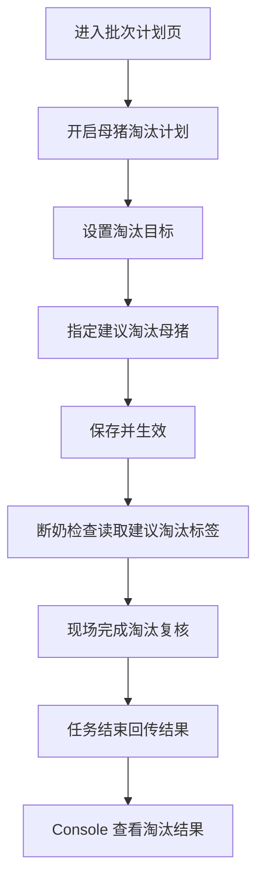
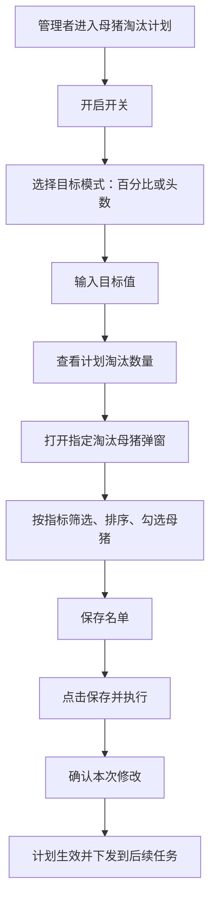

# PRD：Console 母猪淘汰计划

## 背景

在批次开始前，管理者需要先判断这一批生产母猪里，预计有多少需要淘汰，以及哪些母猪需要在现场被重点复核。这个动作的重点，不是立即决定“已经淘汰”，而是先把管理关注点和目标量定下来，让后续断奶检查时，现场人员知道该重点看谁。

因此，Console 端的母猪淘汰计划承担的是“提前计划”和“下发关注对象”的职责；真正的逐头确认，发生在 Mobile 端的断奶检查里。

## 目标

- 让管理者在批次开始前设定本批次的淘汰目标。
- 让管理者手动指定需要现场重点复核的母猪。
- 让 Mobile 断奶检查中能看到 `建议淘汰` 标签，并完成最终复核。
- 让任务结束后，管理者能看到 `需淘汰 / 计划淘汰` 与 `已淘汰` 两层结果，区分“已确认需淘汰”和“已完成淘汰处理”。

## 对象

| 用户角色 | 说明 | 关注点 |
|---|---|---|
| Console 用户 | 负责制定本批次淘汰计划并查看结果的人 | 目标该设多少、哪些母猪要重点关注 |
| Mobile 用户 | 在现场读取计划标签并完成复核的人 | 哪些母猪是管理者提前点名关注的 |

## 价值

- 对管理者：先把淘汰目标和重点对象定下来，减少现场完全凭经验临时判断的波动。
- 对现场操作员：在列表里直接看到 `建议淘汰` 标签，知道哪些对象需要优先复核。
- 对复盘工作：任务结束后能回看“原计划想淘多少、最后确认需淘汰多少、最终真正已淘汰多少”。

## 程序流程图

## 操作流程图

## 功能说明

### 1. 页面定位

- 该模块是批次计划的一部分，不负责现场执行。
- 页面只解决两个问题：
  - 这一批预计要淘多少。
  - 哪些母猪要被现场重点复核。
- 页面底部保留 `任务详情` 入口，用于在任务执行后查看淘汰结果。

### 2. 母猪淘汰计划开关

- 开关打开后，展开淘汰目标和 `指定淘汰母猪` 相关配置。
- 开关关闭后，不再向未开始的任务下发建议淘汰标签。
- 关闭不会清空已填的目标值和名单；再次打开时恢复上次内容，但仍需重新保存后才再次生效。

### 3. 淘汰目标设置

- 支持两种模式：
  - `百分比`
  - `头数`
- 当选择 `百分比` 时：
  - 用户输入一个百分比值。
  - 页面根据当前批次可参与计划的母猪数量，实时换算出计划淘汰数量。
- 当选择 `头数` 时：
  - 用户直接输入计划淘汰几头母猪。
- 页面需要始终把“用户输入值”和“折算后的计划淘汰数量”展示清楚，避免用户只改了参数却不知道最后影响多少头。

### 4. 指定淘汰母猪

- 通过弹窗进行选择，避免页面平铺过长。
- 弹窗内展示与淘汰决策直接相关的母猪属性，至少包括：
  - 耳标号
  - 胎次
  - 历史难产次数
  - 窝均产仔
  - 窝均活仔
  - 乳头数量
  - 返情次数
  - 疾病标签
- 有值的关键字段支持排序，便于管理者快速筛选。
- 指标异常时要标红，帮助用户更快识别风险对象。
- 弹窗外部按钮需要有选中反馈，例如：`已选 2 头`。

### 5. Mobile 联动结果

- 被选中的母猪，在断奶检查列表和操作抽屉里展示 `建议淘汰` 标签。
- `建议淘汰` 只是管理者提前圈定的关注对象，不等于已经淘汰。
- 现场最终在 Mobile 里选择 `淘汰` 或 `不淘汰`，形成 `需淘汰` 复核结果，而不是直接形成 `已淘汰`。
- 如果现场对 `建议淘汰` 选择了 `不淘汰`，需要填写原因，供 Console 后续复盘。

### 6. 结果查看

任务执行后，Console 端需要能查看以下淘汰结果：

- `需淘汰 / 计划淘汰`：表示现场已经确认需要淘汰多少头
- `已淘汰`：表示其中已经完成出售、死亡、转移到其他场等后续处理的数量
- 哪些建议淘汰对象最后被确认为 `需淘汰`
- 哪些建议淘汰对象最后没有被确认需淘汰，以及原因
- 是否存在明显的计划偏差，例如计划淘汰不足

这些结果可以通过批次里的 `任务详情` 入口查看，但淘汰相关的口径和解释，应在本模块 PRD 中定义清楚。

### 7. 核心规则

- `建议淘汰` 是计划标签，不是结果标签。
- 同一头母猪允许同时带有 `建议淘汰` 和 `重点留种来源` 两个标签，系统不自动冲突消解。
- 现场未达到计划淘汰数量时，不强制阻断任务结束；是否阻断由对应 Mobile 任务规则决定。
- 只要管理者改了淘汰开关、目标值或建议淘汰名单，都属于正式变更，需要重新 `保存并执行`。

### 8. 验收重点

- 用户能清楚完成淘汰目标设置，并看到折算后的计划数量。
- 用户能在弹窗中筛选和勾选建议淘汰母猪。
- 按钮能准确反馈当前已选数量。
- Mobile 能读取建议淘汰标签。
- 任务结束后，管理者能回看计划值与执行值之间的差异。

## 边际情况 / 异常情况

| 场景 | 处理方式 |
|---|---|
| 当前批次没有可选母猪 | 目标仍可编辑，但名单弹窗显示空状态，并提示当前无可选对象 |
| 计划淘汰数量为 0，但仍手动选择了母猪 | 允许保存，表示只下发建议淘汰关注，不设置数量目标 |
| 某头母猪在保存前已离场 | 不允许继续纳入建议淘汰名单，提示刷新后重试 |
| 现场没有按建议淘汰执行 | 允许，但需要在任务结果里保留不淘汰原因，供管理者复盘 |
