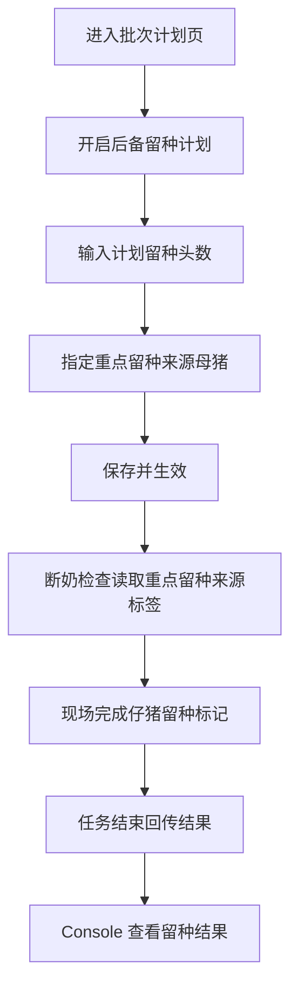
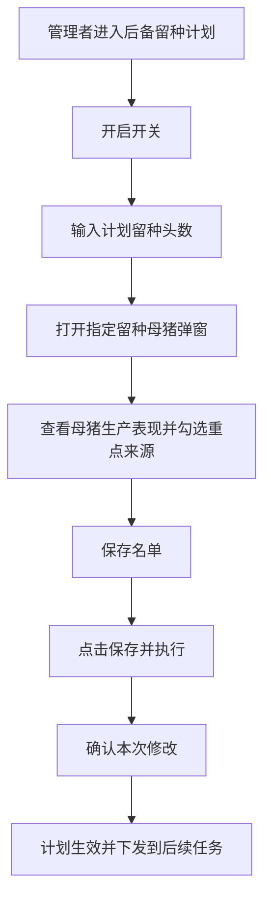

# PRD：Console 后备留种计划

## 背景

后备留种计划的核心，不是让管理者在批次开始前直接选仔猪，而是先确定这一批未来大概要留下多少头后备母猪，以及哪些母猪的后代更值得在断奶时被重点关注。

因为计划配置发生在批次开始前，此时还没有断奶结果，也无法真正确定哪头仔猪最终会被留下。所以 Console 端的留种计划，本质上是“目标设定 + 来源关注”，真正的留种动作在 Mobile 的断奶检查里完成。

## 目标

- 让管理者提前设定本批次计划留种的后备母猪数量。
- 让管理者圈定值得重点关注其后代的母猪。
- 让现场操作员在断奶时，能优先关注这些母猪的后代并完成留种标记。
- 让管理者在任务结束后，能看到 `标记留种 / 计划留种` 的结果对比，以及最终留下来的育种仔猪名单。

## 对象

| 用户角色 | 说明 | 关注点 |
|---|---|---|
| Console 用户 | 负责规划后备储备并查看结果的人 | 这一批应该留多少，留种来源是否够稳 |
| Mobile 用户 | 在断奶时根据提示完成仔猪留种标记的人 | 哪些母猪的后代需要被优先筛选 |

## 价值

- 对管理者：把本批次要补多少后备、重点看哪些来源先定下来，避免断奶时完全临时决定。
- 对现场操作员：在任务里直接知道该优先关注哪些母猪的后代，减少遗漏优良来源。
- 对后续培养：最终的留种结果能直接沉淀为育种公猪 / 育种母猪名单，方便后续管理。

## 程序流程图

## 操作流程图

## 功能说明

### 1. 页面定位

- 该模块解决的是“这一批要留多少”和“优先关注哪些母猪的后代”，不在 Console 端直接选择仔猪，也不在这里完成最终留种。

### 2. 后备留种计划开关

- 开关打开后，展开计划留种头数和 `指定留种母猪` 配置。
- 开关关闭后，不再向未开始任务下发 `重点留种来源` 标签。
- 关闭时不清空目标值和名单；再次打开时恢复上次内容，但需重新保存后才生效。

### 3. 留种目标设置

- 留种目标只支持 `头数`，不支持百分比。
- 目标含义是：本批次计划从断奶仔猪中留下多少头作为后备母猪来源。
- 页面文案需要明确告诉用户：
  - 这是计划目标。
  - 现场断奶时会结合仔猪实际情况完成最终留种标记。

### 4. 指定留种母猪

- 选择对象是“母猪”，不是“仔猪”。
- 目的不是直接定留种名单，而是圈定值得重点关注其后代的来源母猪。
- 弹窗展示字段与淘汰名单保持尽量一致，便于用户在同一批次里用统一标准做计划判断。
- 弹窗外部按钮需要有选中反馈，例如：`已选 3 头`。

### 5. Mobile 联动结果

- 被选中的母猪，在断奶检查列表和操作页中展示 `重点留种来源` 标签。
- 该标签不会因为任务完成与否改变文案；它始终表示“这头母猪的后代值得重点关注”。
- 现场最终从仔猪中做留种标记，形成真正的留种结果。

### 6. 结果查看

任务执行后，Console 端需要能查看以下留种结果：

- `标记留种 / 计划留种`
- 最终被标记出来的育种公猪名单
- 最终被标记出来的育种母猪名单
- 这些仔猪分别来自哪些重点留种来源母猪

### 7. 核心规则

- `重点留种来源` 是计划标签，不是结果标签。
- 计划留种数量不足时，系统要能清楚展示差距，但是否阻断结束任务，由对应 Mobile 规则决定。
- 同一头母猪允许同时被设置为 `建议淘汰` 和 `重点留种来源`，因为前者针对母猪去留，后者针对其后代价值。
- 只要改了留种开关、目标值或重点来源名单，都属于正式变更，需要重新 `保存并执行`。

### 8. 验收重点

- 用户能设置计划留种头数。
- 用户能在弹窗中圈定重点留种来源母猪。
- Mobile 能读取 `重点留种来源` 标签。
- 任务结束后，Console 能查看 `育种公猪 / 育种母猪` 两类结果名单。

## 边际情况 / 异常情况

| 场景 | 处理方式 |
|---|---|
| 留种目标为 0，但用户仍圈定了重点来源母猪 | 允许保存，表示只下发关注提示，不设置数量目标 |
| 当前批次没有可作为重点来源的母猪 | 目标可编辑，但名单弹窗显示空状态 |
| 现场最终没有从重点来源母猪后代中留下足够仔猪 | 允许结束任务，但结果页需要清楚展示不足情况 |
| 现场从非重点来源母猪后代中标记了留种仔猪 | 允许，最终以后现场实际标记结果为准 |
