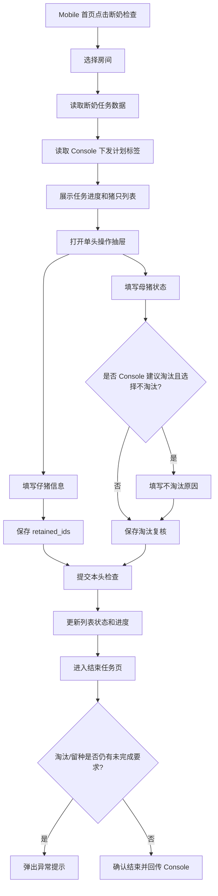
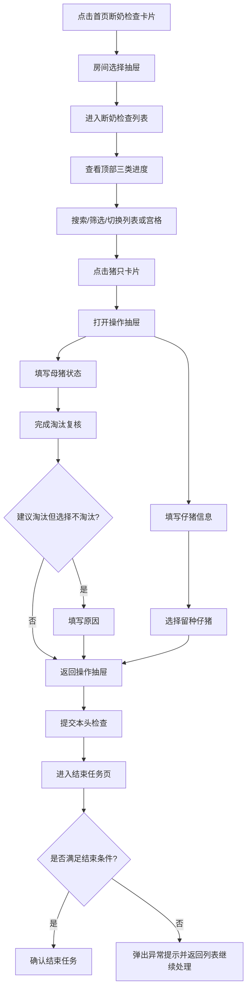

# PRD：Mobile 断奶检查任务

## 背景

在移动端任务执行过程中，系统需要支持饲养员对猪只进行淘汰标记与留种标记（后备母猪选留），把管理者在 Console 端制定的批次计划落实到具体猪只层级。

在真实生产中，淘汰与留种并不是在单一时间点完成：

- 管理者会先在 Console 端设定本批次的淘汰目标与留种目标。
- 但具体“淘谁 / 留谁”的判断，往往发生在一线执行任务的过程中。
- 一线人员会在检查、观察、断奶等任务中，基于现场状态对个体做最终判断。

当前问题在于：

- Console 端的淘汰与留种只停留在计划层，缺少 Mobile 执行入口。
- 一线饲养员的判断无法被结构化记录，后续很难复盘。
- Console 与 Mobile 之间缺少闭环，管理目标无法自然沉淀为执行结果。

因此，Mobile 端需要在生产任务内提供标准化的淘汰与留种操作，让一线人员在执行任务时同步完成标记与回传。

## 目标

- 让饲养员在执行断奶检查任务时，可以同步完成淘汰复核与留种标记。
- 让管理者在 Console 端制定的批次计划，能够在 Mobile 端以标签、进度和操作提示的方式被一线人员看到并执行。
- 让所有淘汰与留种标记结果实时回传系统，支撑后续出售、转出、死亡记录、后备母猪建群等动作。
- 让 Mobile 页面在一个任务内完成“检查 + 淘汰复核 + 留种标记”的闭环，减少跨任务切换。
- 让任务结束前，系统能明确提示当前是否仍存在未完成的淘汰或留种选择。

## 对象

| 对象 | 说明 | 核心诉求 |
|---|---|---|
| 饲养员 / 一线操作人员 | 在 Mobile 端执行断奶检查、填写检查结果、完成淘汰与留种标记 | 操作简单、信息明确、不漏选、不误选 |
| 场长 / 生产主管 | 在 Console 端制定目标并查看执行结果 | 计划能被执行，偏差可追溯 |
| 断奶检查任务 | 当前 V1 承载淘汰复核与留种标记的主任务 | 一个任务内完成现场判断与结果回传 |
| 母猪 | 接受母猪状态检查和淘汰复核的对象 | 明确是否建议淘汰、是否最终淘汰 |
| 仔猪 | 接受健康录入与留种标记的对象 | 明确哪些仔猪被标记留种 |
| 房间 / 栏位 | Mobile 执行任务的空间维度 | 支持房间选择、按栏位逐头检查 |

## 价值

- 对一线人员：在执行任务时就能直接处理淘汰和留种，不需要额外记忆或线下记录。
- 对管理者：在 Console 设定的目标，可以通过 Mobile 任务稳定落地，不再停留在计划层。
- 对业务：淘汰结果可直接进入出售、转出、死亡等后续处理；留种结果可直接进入后备母猪池建设。
- 对系统：形成“计划 → 执行 → 结果 → 后续处理”的完整链路，减少数据断层和人工沟通成本。

## 程序流程图

## 操作流程图

## 功能说明（精细化颗粒度）

### 1. 功能范围

| 模块范围 | 说明 | 本期要求 |
|---|---|---|
| V1 承载任务 | 断奶检查 | 必做，当前样机完整展示 |
| 后续可复用留种能力的任务 | 断奶检查、结束保育检查、结束育肥检查 | 本文定义通用规则，V1 先在断奶检查落地 |
| 后续可复用淘汰能力的任务 | 母猪产后检查、断奶检查 | 本文定义通用规则，V1 先在断奶检查落地 |
| 巡检任务补充能力 | 记录中增加标记淘汰入口 | 先记入需求池，不纳入当前页面样机 |

### 2. 核心规则

| 规则项 | 规则说明 |
|---|---|
| 淘汰与留种来源 | 管理者在 Console 端设定计划目标与关注对象；Mobile 端负责执行时标记 |
| 建议淘汰标签 | 仅表示该母猪被 Console 端纳入建议淘汰范围，不等于已经淘汰 |
| 需淘汰标签 | 表示 Mobile 端在任务中确认该母猪需要淘汰 |
| 已淘汰标签 | 表示该猪只已进入死亡、出售、离场等后续处理结果 |
| 重点留种来源标签 | 表示该母猪被 Console 端标记为重点关注其后代的母猪 |
| 标签是否互斥 | `建议淘汰`、`需淘汰/已淘汰`、`重点留种来源` 不互斥，可同时存在 |
| 不淘汰原因 | 若该母猪为 Console 建议淘汰对象，现场选择 `不淘汰` 时必须填写原因 |
| 结束任务限制 | 当前版本中，若仍有必须完成的淘汰选择或留种选择，则结束任务时弹出异常提示 |

### 3. 页面与模块说明

| 模块 | 前端展示/交互 | 后端处理 |
|---|---|---|
| 首页任务卡 | 首页同时展示 `接种任务` 与 `断奶检查`；断奶检查卡点击整卡进入，不展示单独进入按钮；接种任务卡点击后进入现有房间/单元选择流程 | 返回任务标题、批次、天数、完成进度 |
| 房间选择抽屉 | 屏内吸底；选择房间后进入任务列表 | 返回房间列表及房间维度进度 |
| 任务列表进度看板 | 三条紧凑进度上下排列：`已检查 / 需检查`、`需淘汰 / 计划淘汰`、`标记留种 / 计划留种`；已检查进度不展示单位，淘汰和留种展示 `头` | 返回 `checked_count / total_count / confirmed_cull_count / planned_cull_count / retained_count / retain_target_count` |
| 猪只列表 | 支持搜索、筛选、列表/宫格切换；整卡点击进入操作抽屉 | 返回栏位、耳标、状态、计划标签、完成摘要 |
| 列表标签 | 耳标旁展示 `建议淘汰 / 需淘汰 / 已淘汰 / 重点留种来源`；`需淘汰` 与 `已淘汰` 使用不同颜色 | 根据 `cull_planned / cull_done / offsite_status / retain_planned` 计算 |
| 操作抽屉 | 展示耳标、标签、仔猪信息、母猪状态；不再展示单独“本头任务进度”卡片 | 汇总本头草稿和已保存数据 |
| 仔猪信息页 | 录入健康/弱仔/畸形数量、体重、公母数量；可进入二级弹窗选择留种仔猪 | 写入 `piglet_info` 和 `retained_ids[]` |
| 留种仔猪二级弹窗 | 屏内吸底、独立滚动、支持多选 | 更新 `retained_count = retained_ids.length` |
| 母猪状态页 | 录入体况评分、乳房炎、乳汁产能、分泌物、采食、活动、背膘等字段 | 写入 `sow_status` |
| 淘汰复核 | 标题为 `淘汰复核`；选项为 `淘汰 / 不淘汰`；若为 Console 建议淘汰对象，标题旁展示 `建议淘汰` 标签 | 写入 `cull_review` |
| 不淘汰原因弹窗 | 当 `cull_planned=true` 且选择 `不淘汰` 时弹出；原因必填；取消则回退为 `淘汰` | 写入 `cull_reject_reason` |
| 任务详情页 | 进度看板与任务列表页保持同样样式；状态说明解释 `建议淘汰 / 需淘汰 / 已淘汰` | 读取任务聚合数据 |
| 结束任务页 | 独立页面，展示达标/未达标状态、三类进度、执行详情、底部确认栏 | 回传任务结束状态和汇总结果 |
| 结束任务异常弹窗 | 当淘汰选择或留种选择未满足结束要求时弹出阻断提示 | 返回未完成数量并阻止结束 |

### 4. 筛选规则

| 筛选项 | 展示范围 | 规则 |
|---|---|---|
| 全部母猪 | 全部任务对象 | 不过滤 |
| 待检查猪只 | 尚未完成本头检查 | `row_status != done` |
| 建议淘汰猪只 | Console 下发或需要重点复核淘汰的对象 | `cull_planned = true` |
| 推荐留种母猪 | 需要重点关注其后代的母猪 | `retain_planned = true` |
| 交叉关注猪只 | 同时具备淘汰关注和留种关注 | `cull_planned = true && retain_planned = true` |

### 5. 字段字典

| 字段 | 类型 | 必填 | 校验/枚举 | 默认值 |
|---|---|---|---|---|
| `task_id` | string | yes | 断奶任务唯一 ID | - |
| `room_id` | string | yes | 当前任务有效房间 | - |
| `row_id` | string | yes | 栏位/母猪记录 ID | - |
| `sow_id` | string | yes | 母猪 ID 或耳标 | - |
| `row_status` | enum | yes | `pending/editing/done` | `pending` |
| `healthy_count` | number | yes | `>=0` | `0` |
| `weak_count` | number | yes | `>=0` | `0` |
| `malformed_count` | number | yes | `>=0` | `0` |
| `weight_kg` | number | no | `>=0`，支持 1 位小数 | `0` |
| `male_count` | number | no | `>=0` | `0` |
| `female_count` | number | no | `>=0` | `0` |
| `retained_ids` | string[] | no | 仔猪 ID 去重 | `[]` |
| `retained_count` | number | no | `retained_ids.length` | `0` |
| `body_score` | enum | yes | `1/2/3/4/5` | `3` |
| `mastitis` | enum | yes | `无/轻微/中度/重度` | `无` |
| `milk` | enum | yes | `差/中/佳` | `中` |
| `lochia` | enum | yes | `正常/异常` | `正常` |
| `appetite` | enum | yes | `正常/进食减少/拒食` | `正常` |
| `activity` | enum | yes | `正常/病/不愿意动` | `正常` |
| `backfat` | enum | yes | `薄/适中/厚` | `适中` |
| `cull_planned` | boolean | yes | 是否 Console 建议淘汰 | `false` |
| `cull_done` | boolean | yes | 是否已确认淘汰 | `false` |
| `cull_review` | enum | yes | `淘汰/不淘汰` | Console 建议淘汰默认 `淘汰`；其他默认 `不淘汰` |
| `cull_reject_reason` | string | conditional | `cull_planned=true && cull_review=不淘汰` 时必填，长度 `1-120` | - |
| `retain_planned` | boolean | yes | 是否重点留种来源 | `false` |
| `retain_done` | boolean | yes | 是否已完成留种标记 | `false` |
| `offsite_status` | enum | no | `none/sold/dead/transferred/offsite` | `none` |

### 6. 状态机

#### 栏位检查状态

- `pending`
- `editing`
- `done`

#### 状态流转

- `pending + 打开操作抽屉 = editing`
- `editing + 仔猪信息完成 + 母猪状态完成 + 提交本头检查 = done`
- `editing + 关闭抽屉未提交 = pending`

#### 淘汰复核状态

- `PENDING_REVIEW`
- `CONFIRMED_CULL`
- `REJECTED_CULL_WITH_REASON`

#### 状态流转

- `PENDING_REVIEW + 选择 淘汰 = CONFIRMED_CULL`
- `PENDING_REVIEW + 选择 不淘汰 + 填写原因 = REJECTED_CULL_WITH_REASON`
- `Console 建议淘汰对象 + 选择 不淘汰 + 未填写原因 = 不允许确认`

#### 留种状态

- `UNMARKED`
- `MARKED`

#### 状态流转

- `UNMARKED + 选择留种仔猪 = MARKED`
- `MARKED + 清空 retained_ids = UNMARKED`

#### 淘汰标签展示状态

- `PLANNED_CULL`
- `NEED_CULL`
- `CULLED`

#### 状态流转

- `cull_planned = true && cull_done = false = PLANNED_CULL`
- `cull_done = true && offsite_status = none = NEED_CULL`
- `cull_done = true && offsite_status in sold/dead/transferred/offsite = CULLED`

### 7. 计算示例

| 指标 | 示例 |
|---|---|
| 已检查/需检查 | 任务共 200 栏，已检查 50 栏，显示 `50 / 200` |
| 需淘汰/计划淘汰 | 计划淘汰 6 头，现场确认淘汰 2 头，显示 `2 / 6 头` |
| 标记留种/计划留种 | 计划留种 6 头，现场标记 5 头，显示 `5 / 6 头` |
| 已淘汰标签 | 某母猪已确认需淘汰，后续被记录为出售，则列表标签由 `需淘汰` 变为 `已淘汰` |
| 建议淘汰但不淘汰 | 某母猪 `cull_planned=true`，现场选择 `不淘汰` 并填写原因，则不计入 `需淘汰` 数量 |

### 8. UX 说明

- 作为饲养员，我进入任务后，必须第一眼看到还差多少头需要淘汰、还差多少头需要留种，这样我知道当前任务重点是什么。
- 作为饲养员，我在看到 `建议淘汰` 标签时，系统必须告诉我这是管理者重点关注的猪只；如果我选择 `不淘汰`，系统必须要求我说明原因。
- 作为饲养员，我在抽屉或二级弹窗里操作时，外层列表必须锁住，避免滑动穿透导致误操作。
- 作为场长，我在任务结束后查看结果时，必须能看到计划与实际之间的差异，而不是只看到最终结果。

## 边际情况 / 异常情况

| 场景 | 处理方式 |
|---|---|
| 弹窗打开后滑动页面 | 底层列表必须锁死，只允许当前弹窗内容滚动 |
| 仔猪信息未填 | 不允许提交本头检查，按钮置灰或提示填写 |
| 母猪状态未填 | 不允许提交本头检查，按钮置灰或提示填写 |
| Console 建议淘汰但现场选择不淘汰 | 必须填写原因；取消原因弹窗时回退为 `淘汰` |
| 同一母猪同时有淘汰和留种标签 | 允许同时展示，不互斥 |
| 留种数量低于计划 | 若当前任务对留种标记设为结束前必做，则结束任务时弹出异常提示；否则允许结束并显示进度不足 |
| 淘汰数量低于计划 | 若当前任务对淘汰复核设为结束前必做，则结束任务时弹出异常提示；否则允许结束并显示进度不足 |
| 结束任务时仍需淘汰 xx 头 | 弹出异常弹窗：`当前仍需淘汰 xx 头猪，无法结束断奶任务。请先完成淘汰选择后再继续。` |
| 结束任务时仍需留种 xx 头 | 弹出异常弹窗：`还需完成 xx 头猪的留种选择，请完成后再结束断奶任务。` |
| 网络提交失败 | 保留本地草稿，后端必须支持重试与幂等提交 |
| 筛选结果为空 | 展示空状态，不改变原始任务数据 |
| Console 未下发任何计划标签 | 任务可正常执行；只展示已检查进度，不展示带计划含义的关注标签 |
