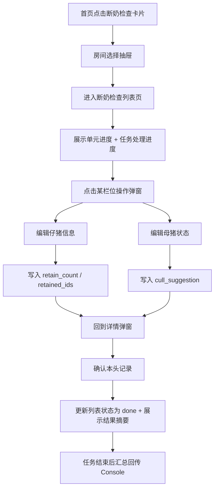

# Mobile PRD：断奶检查任务展示（淘汰建议 + 后备留种）

## 1. Stakeholders, Context & Objectives

### Roles
- 现场操作员：在断奶检查中录入仔猪信息、母猪状态，并标记 `留种` / `淘汰建议`。
- 管理员：在 Console 查看断奶任务回传的留种与淘汰建议结果。
- 系统：承接断奶检查录入，并把结果回传到 Console、单猪档案、后续任务筛选。

### Background
- Mobile 只保留断奶任务作为展示样机，因为断奶任务同时覆盖 `后备留种` 与 `淘汰建议` 两条业务线。
- 不再做独立淘汰任务页，不再做单独已淘汰列表页。

### Goals
- Mobile 首页只展示断奶检查任务卡片。
- 进入断奶检查后，操作员必须能完成两类录入：`仔猪信息`、`母猪状态`。
- 在断奶检查主页面直接看到当前任务对 `淘汰` 与 `留种` 的处理进度，知道自己还差多少头需要继续处理。
- 在断奶检查主页面直接看到“今天还要处理什么”，避免操作员进入页面后还要自己判断优先级。
- 仔猪信息里必须支持 `选择留种仔猪`。
- 母猪状态里必须支持 `淘汰建议` 标记。
- 所有操作抽屉/弹窗必须限制在 mobile 预览屏内部，且打开时锁住底层列表滚动。

## 2. Process Visualization

### Business Flow
1. 操作员在 Mobile 首页点击断奶检查任务卡片。
2. 进入房间选择底部抽屉。
3. 选择房间后进入断奶检查页面。
4. 页面上方先展示 `单元进度` 与 `任务处理进度`，明确当前已完成多少检查、已处理多少淘汰/留种目标。
5. 在猪只列表中点开某一栏位/母猪的操作弹窗。
6. 操作员进入 `仔猪信息` 页：录入数量、体重、性别，并选择留种仔猪。
7. 操作员进入 `母猪状态` 页：录入体况、断奶检查项，并标记 `淘汰建议`。
8. 返回详情弹窗，确认本头记录。
9. 该栏位状态更新为 `已完成`，列表同步展示本头断奶结果摘要。
10. 任务完成后，留种与淘汰建议结果回传 Console。

### System Flow

## 3. Detailed Specifications

### Logic Matrix
| Module | Frontend Interaction/UI Logic | Backend Processing/Calculation |
|---|---|---|
| 首页任务卡 | 仅展示断奶检查卡片；点击整卡进入，不展示额外进入按钮 | 返回任务标题、批次、状态天数、已检查/需检查数量 |
| 房间选择抽屉 | 屏内吸底展示；只能选择房间，不允许滚动穿透到底层首页 | 返回当前任务下各房间进度 |
| 顶部进度总览卡 | 将 `单元进度`、`待检查/待淘汰确认/待留种标记`、`淘汰/留种处理进度` 合并进同一张卡，减少首屏占高，同时保留任务全貌 | 返回 `completed_count / total_count / progress_pct / task_day_label / pending_check_count / pending_cull_count / pending_retain_count / planned_cull_count / confirmed_cull_count / planned_retain_count / confirmed_retain_count` |
| 断奶检查列表 | 列表页支持搜索、筛选、列表/宫格切换；整行可点击进入详情弹窗；列表行需要直接体现当前计划关注点 | 返回栏位、耳标、状态、胎次、日龄、计划标签、完成摘要 |
| 筛选底部弹窗 | 点击筛选按钮后，以屏内吸底方式展示筛选项；支持 `全部/仅看未完成/仅看需淘汰/仅看重点留种/仅看交叉关注` | 前端基于任务下发字段即时筛选，无需单独接口 |
| 列表/宫格视图 | 列表视图适合批量扫读；宫格视图适合快速定位重点对象；两种视图使用同一批数据源 | 同一数据集按前端不同布局渲染 |
| 仔猪信息编辑 | 支持录入数量、总体现重、公母数量、留种仔猪选择 | 写入 `healthy_count/weak_count/malformed_count/weight_kg/retained_ids` |
| 留种仔猪二级弹窗 | 必须为屏内吸底弹窗；独立滚动，不得形成双层抽屉穿透 | 写入 `retained_ids[]`、回填 `retained_count` |
| 母猪状态编辑 | 断奶检查项使用胶囊选择组；底部确认栏固定吸底 | 写入 `body_score/mastitis/milk/appetite/activity/backfat/cull_suggestion` |
| 详情弹窗 | 只允许弹窗内容滚动，底层列表锁死；首屏先展示“这头猪还差哪项没完成” | 汇总展示本头已录入数据与计划关注标签 |

### List Row Display Rules
| Row Scenario | UI Display Logic | Data Dependency |
|---|---|---|
| 待检查 | 右上使用灰色状态 icon 表示 `待断奶检查`，不再使用长文字胶囊；不展示结果摘要 | `row_status = pending` |
| 已完成 | 右上使用绿色状态 icon 表示 `已完成`；`共：X \| 留种：Y` 与母猪基础信息同行展示在右侧，减少列表纵向占高 | `row_status = done` + `piglet_total` + `retained_count` |
| 列表辅助信息 | 在耳标下方补充 `胎次 \| 日龄`，帮助操作员快速确认对象，无需进入详情页再核对 | `sow_parity / sow_age_days` |
| 被计划淘汰 | 在耳标号右侧展示更紧凑的橙色标签；未处理时显示 `需淘汰`，已处理后显示 `已淘汰` | `cull_planned / cull_done` |
| 被计划留种关注 | 在耳标号右侧展示更紧凑的绿色标签 `重点留种来源`，不随任务完成与否改变文案 | `retain_planned / retain_done` |
| 同时存在淘汰与留种关注 | 两个标签可同时出现，不视为报错；补充解释文案说明“该母猪在淘汰范围内，但其后代仍需重点关注留种价值” | `cull_planned = true` + `retain_planned = true` |

### Filter Rules
| Filter Value | Display Scope | Rule |
|---|---|---|
| `all` | 全部猪只 | 不过滤 |
| `pending` | 仅看未完成 | `row_status != done` |
| `cull` | 仅看需淘汰 | `cull_planned = true` |
| `retain` | 仅看重点留种 | `retain_planned = true` |
| `overlap` | 仅看交叉关注 | `cull_planned = true && retain_planned = true` |

### Data Dictionary
| Field Name | Type | Required | Validation/Enums | Default Value |
|---|---|---|---|---|
| `room_id` | string | yes | 断奶任务下有效房间 | - |
| `row_id` | string | yes | 栏位/猪只记录 ID | - |
| `healthy_count` | number | yes | `>=0` | `0` |
| `weak_count` | number | yes | `>=0` | `0` |
| `malformed_count` | number | yes | `>=0` | `0` |
| `weight_kg` | number | no | `>=0`，支持 1 位小数 | `0` |
| `male_count` | number | no | `>=0` | `0` |
| `female_count` | number | no | `>=0` | `0` |
| `retained_ids` | string[] | no | 可重复打开二级弹窗编辑 | `[]` |
| `retained_count` | number | no | `= retained_ids.length` | `0` |
| `body_score` | enum | yes | `1|2|3|4|5` | `3` |
| `mastitis` | enum | yes | `无/轻微/中度/重度` | `无` |
| `milk` | enum | yes | `差/中/佳` | `中` |
| `appetite` | enum | yes | `正常/进食减少/拒食` | `正常` |
| `activity` | enum | yes | `正常/病/不愿意动` | `正常` |
| `backfat` | enum | yes | `薄/适中/厚` | `适中` |
| `cull_suggestion` | enum | yes | `不建议淘汰/建议淘汰` | `不建议淘汰` |
| `row_status` | enum | yes | `pending/done` | `pending` |
| `piglet_total` | number | no | `>=0`，仅完成态展示 | `0` |
| `cull_planned` | boolean | yes | 是否属于 Console 下发的淘汰关注对象 | `false` |
| `cull_done` | boolean | yes | 是否已在当前任务中完成淘汰确认 | `false` |
| `retain_planned` | boolean | yes | 是否属于 Console 下发的留种关注对象 | `false` |
| `retain_done` | boolean | yes | 是否已在当前任务中完成留种标记 | `false` |

### State Machine
#### State: 栏位检查状态
- `pending`
- `editing`
- `done`

#### Transition Rules
- `pending + 打开详情弹窗 = editing`
- `editing + 仔猪信息与母猪状态均填写完成 + 确认 = done`
- `editing + 关闭弹窗未确认 = pending`

#### State: 留种记录状态
- `UNMARKED`
- `MARKED`

#### Transition Rules
- `UNMARKED + 选择留种仔猪 = MARKED`
- `MARKED + 清空 retained_ids = UNMARKED`

#### State: 淘汰建议状态
- `NO_SUGGESTION`
- `SUGGESTED`

#### Transition Rules
- `NO_SUGGESTION + 选择 建议淘汰 = SUGGESTED`
- `SUGGESTED + 选择 不建议淘汰 = NO_SUGGESTION`

### UX Narrative
- 作为现场操作员，我必须能在一个断奶检查任务里同时完成留种与淘汰建议，不希望在多个任务之间跳转。
- 作为现场操作员，我打开页面时先看到“还差多少头要淘汰、多少头要留种”，这样我知道当前任务重点，不用自己再翻列表统计。
- 作为现场操作员，我在列表里一眼就要看出哪头是待检查、哪头已完成，以及这头母猪是否属于淘汰或留种重点关注对象。
- 作为现场操作员，我希望顶部进度区尽量紧凑，不要一进入页面就被多张大卡片占掉大半屏。
- 作为现场操作员，我希望猪只列表一屏能多看几头，所以单行高度要克制，操作按钮也要尽量贴近右边缘。
- 作为现场操作员，我希望整行都可以直接点开，而不是只点一个很小的进入按钮，这样在移动端更稳。
- 作为现场操作员，我在详情弹窗里需要被明确提醒“还缺哪一项没填完”，提交按钮不能给我误提交。
- 作为现场操作员，我需要快速切到“只看需淘汰”或“只看重点留种”，而不是在长列表里手动找。
- 作为展示样机，界面必须优先体现“表单清晰、滚动稳定、屏内弹窗一致”这三个质量点。

## 4. Robustness & Edge Cases

### Empty States
- 房间无数据：显示“当前房间暂无待检查栏位”。
- 未选择留种仔猪：显示“尚未标记留种”。
- 母猪状态未填写完整：确认时提示“请先完成仔猪信息与母猪状态填写”。
- 当前无淘汰/留种计划：`任务处理进度` 仍展示，但数字为 `0 / 0`，不隐藏整个模块，避免页面结构跳动。

### Constraints
- 弹窗/抽屉打开时，底层列表页面必须锁死滚动。
- 所有弹窗、抽屉、二级弹窗都必须挂载到 mobile 屏幕容器，不允许挂到 `document.body`。
- 底部确认栏必须吸底，不允许悬浮在中间。
- 同一头母猪允许同时带有 `淘汰关注` 与 `留种关注`，前端不得自动互斥或自动消除其一。
- 详情弹窗内，只有 `仔猪信息` 与 `母猪状态` 都已填写时，提交按钮才允许点击。
- 列表筛选与视图切换不得改变任务数据本身，只改变当前前端展示方式。

### Error Handling
- 弹窗关闭：未确认数据只保存在当前前端草稿，不改列表状态。
- 网络失败场景：前端展示用样机中保留本地状态，后端实现时必须支持重试提交。
- 二级弹窗关闭：不应影响外层编辑页草稿状态。
