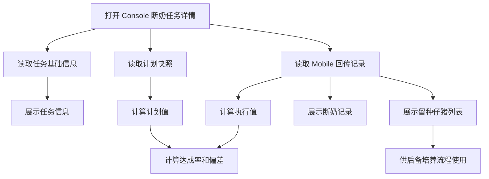
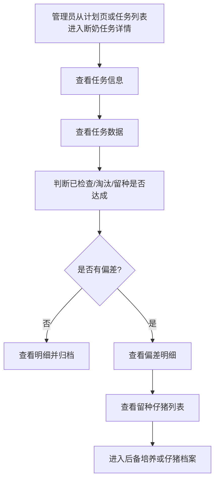

# PRD：Console 断奶任务详情

## 背景

Console 断奶任务详情是管理者查看 Mobile 断奶检查执行结果的页面。它不负责配置淘汰与留种计划，也不负责现场录入，而是把计划值、执行值、达成率、偏差和明细结果集中展示出来，帮助管理者判断本批次淘汰与留种目标是否落地。

该页面承接三个来源的数据：

- Console 计划配置快照：计划淘汰头数、计划留种头数、建议淘汰母猪、重点留种来源母猪。
- Mobile 断奶检查回传：已检查记录、淘汰复核结果、留种仔猪标记。
- 后续处理任务状态：售卖、转舍、死亡/离场等淘汰处理结果。

## 目标

- 管理者可以查看断奶任务是否完成，以及关键生产数据是否异常。
- 管理者可以比较淘汰和留种的计划值、执行值、达成率和偏差。
- 管理者可以查看断奶记录和留种仔猪列表两类明细。
- 管理者可以识别留种仔猪来自哪些母猪、性别如何、体重是否满足后续培养要求。
- 页面不展示 Mobile 状态说明卡；状态说明属于 Mobile 操作员的现场辅助信息。

## 对象

| 角色/对象 | 说明 | 使用场景 |
|---|---|---|
| 场长 | 关注任务是否完成、淘汰/留种目标是否达成 | 任务结束后复盘批次结果 |
| 生产经理 | 关注具体未达成原因和后续处理对象 | 安排售卖、转舍、补充检查或后备培养 |
| 繁育负责人/线长 | 关注母猪检查记录和仔猪留种结果 | 判断现场执行质量和个体异常 |
| 断奶任务 | 结果展示页面的主对象 | 展示任务状态、数据、记录和列表 |
| 留种仔猪列表 | 被现场标记为留种的仔猪集合 | 支撑后备培养和后续档案管理 |

## 价值

- 管理者不用逐条翻 Mobile 记录，就能看到计划是否达成。
- 留种仔猪被按性别和来源母猪管理后，可以更容易进入后备培养流程。
- 结果页提供偏差口径，有利于通知与决策模块判断是否需要管理者介入。

## 适用范围

| 范围项 | 规则 |
|---|---|
| 适用任务 | 仅适用于已生成的断奶检查任务 |
| 可查看阶段 | 任务未开始、进行中、已结束均可查看；未开始时明细为空，进行中时展示实时进度，已结束时展示最终结果 |
| 可操作范围 | V1 仅查看和搜索，不在本页直接修改 Mobile 回传结果 |
| 后续处理 | 本页不直接完成售卖/转舍；淘汰后续处理由对应任务模块承接 |
| 不展示内容 | 不展示 Mobile 状态说明；不展示计划配置编辑控件 |

## 程序流程图

## 操作流程图

## 功能说明（精细化颗粒度）

### 1. 页面模块

| 模块 | 展示/交互 | 数据来源 |
|---|---|---|
| 顶部导航 | 返回按钮、标题 `断奶`、面包屑、任务动作按钮 | 路由和任务状态 |
| 任务信息卡 | 任务 ID、任务状态、批次号、猪只数量、预计/实际日期、猪舍、执行人 | 任务主表 |
| 任务数据卡 | 断奶平均体重、断奶存活率、已检查/需检查、淘汰进度、留种进度 | 计划快照 + Mobile 回传聚合 |
| 断奶记录 | 展示母猪维度检查结果，支持搜索和分页 | `sow_records[]` |
| 留种仔猪 | 单独列表，按 `留种公猪/留种母猪` tab 展示 | `retained_piglet_lines[]` |

### 2. 结果定义

| 结果项 | 定义 | 展示规则 | 偏差含义 |
|---|---|---|---|
| 已检查/需检查 | 已提交本头检查记录数 / 当前任务应检查记录数 | 展示为 `checked_done / checked_total` | 未达成表示任务仍有对象未检查 |
| 断奶平均体重 | 所有录入断奶体重的仔猪平均值 | 展示 kg，保留 1 位小数 | 低于场区阈值时可触发风险提示 |
| 断奶存活率 | 断奶存活仔猪数 / 出生活仔数 | 展示百分比 | 低于阈值时提示断奶质量风险 |
| 计划淘汰头数 | Console 计划快照中的 `planned_cull_count` | 作为淘汰进度分母 | 无 |
| 实际确认淘汰头数 | Mobile `cull_review=淘汰` 的母猪数量 | 作为淘汰进度分子 | 小于计划表示淘汰不足，大于计划表示超额淘汰 |
| 淘汰达成率 | `实际确认淘汰头数 / 计划淘汰头数` | 计划为 0 时显示 `-` | 用于复盘，不阻断任务完成 |
| 计划留种头数 | Console 输入的 `retain_target_count` | 作为留种进度分母 | 无 |
| 实际标记留种头数 | Mobile 标记留种的仔猪数量 | 作为留种进度分子 | 小于计划表示留种不足，大于计划表示超额留种 |
| 留种达成率 | `实际标记留种头数 / 计划留种头数` | 计划为 0 时显示 `-` | 用于复盘，不阻断任务完成 |

### 3. 断奶记录表

| 字段 | 说明 | 规则 |
|---|---|---|
| 猪只 ID | 母猪 ID 或耳标 | 支持搜索 |
| 位置 | 当前栏位或猪舍位置 | 支持排序 |
| 任务状态 | 已检查/未检查 | 用标签展示 |
| 体况评分 | Mobile 录入体况评分 | 支持排序 |
| 检查异常 | 异常项数量 | 异常时突出展示 |
| 其他观察 | 现场补充观察 | 无内容显示 `-` |
| 淘汰复核 | `淘汰/不淘汰` 及原因 | Console 建议淘汰但选择不淘汰时展示原因入口或摘要 |

### 4. 留种仔猪列表

| 字段 | 说明 | 规则 |
|---|---|---|
| 仔猪 ID | 被标记留种的仔猪 ID | 支持搜索 |
| 来源母猪 ID | 仔猪对应母猪 | 支持搜索 |
| 批次 | 所属断奶批次 | 默认当前批次 |
| 位置 | 当前或预留栏位 | 可为空 |
| 日龄 | 仔猪日龄 | 支持排序 |
| 断奶体重 | 断奶时录入体重 | 支持排序 |

### 6. 字段字典

| 字段 | 类型 | 必填 | 校验/枚举 | 默认值 |
|---|---|---|---|---|
| `task_id` | string | yes | 任务唯一 ID | - |
| `task_status` | enum | yes | `not_started/in_progress/done/cancelled` | - |
| `batch_id` | string | yes | 批次 ID | - |
| `plan_snapshot_id` | string | no | 关联计划快照 | - |
| `checked_done` | number | yes | `>=0` | `0` |
| `checked_total` | number | yes | `>=0` | `0` |
| `planned_cull_count` | number | yes | `>=0` | `0` |
| `confirmed_cull_count` | number | yes | `>=0` | `0` |
| `retain_target_count` | number | yes | `>=0` | `0` |
| `retained_piglet_count` | number | yes | `>=0` | `0` |
| `cull_achievement_rate` | number | no | `0-100` 或 `null` | `null` |
| `retain_achievement_rate` | number | no | `0-100` 或 `null` | `null` |
| `sow_records[]` | array | no | 断奶记录 | `[]` |
| `retained_piglet_lines[]` | array | no | 留种仔猪列表 | `[]` |

### 7. 状态机

#### 页面数据状态

- `LOADING`
- `READY`
- `EMPTY`
- `ERROR`

#### 状态流转

- `LOADING + 数据加载成功且存在任务 = READY`
- `LOADING + 数据加载成功但无任务 = EMPTY`
- `LOADING + 数据加载失败 = ERROR`
- `ERROR + 点击重试 = LOADING`

#### 淘汰结果状态

- `PENDING_CONFIRM`
- `CONFIRMED`
- `REJECTED_WITH_REASON`
- `PROCESSED`

#### 状态流转

- `PENDING_CONFIRM + Mobile 选择淘汰 = CONFIRMED`
- `PENDING_CONFIRM + Mobile 选择不淘汰并填写原因 = REJECTED_WITH_REASON`
- `CONFIRMED + 售卖/转舍/离场处理完成 = PROCESSED`

## 边际情况 / 异常情况

| 场景 | 处理方式 |
|---|---|
| 任务未开始 | 展示任务信息和计划值，明细列表为空 |
| 任务进行中 | 展示实时进度，并标注数据可能继续变化 |
| 任务已结束 | 展示最终结果，作为复盘口径 |
| 计划值为 0 | 达成率显示 `-`，不显示 0% 误导用户 |
| 淘汰不足 | 显示偏差：实际确认淘汰小于计划淘汰；触发通知与决策模块规则 |
| 淘汰超额 | 显示偏差：实际确认淘汰大于计划淘汰；触发通知与决策模块规则 |
| 留种不足 | 显示偏差：实际标记留种小于计划留种；触发通知与决策模块规则 |
| 留种超额 | 显示偏差：实际标记留种大于计划留种；触发通知与决策模块规则 |
| 留种公猪/母猪 tab 为空 | 当前 tab 显示空状态，另一个 tab 不受影响 |
| 数据加载失败 | 显示错误状态和重试入口，不展示旧数据冒充新结果 |

## 验收标准

| 编号 | 验收场景 | 预期结果 |
|---|---|---|
| AC-01 | 任务有关联计划快照 | 任务数据卡展示计划淘汰和计划留种口径 |
| AC-02 | Mobile 已完成部分检查 | 已检查/需检查展示正确分子和分母 |
| AC-03 | 计划淘汰 6 头，实际确认 3 头 | 淘汰进度显示 `3/6`，并可识别为未达成 |
| AC-04 | 计划留种 6 头，实际标记 8 头 | 留种进度显示 `8/6`，并可识别为超额 |
| AC-05 | 有现场选择不淘汰并填写原因 | 断奶记录保留原因，且不计入已确认淘汰 |
| AC-06 | 留种仔猪列表存在公母两类 | Tab 能正确切换并显示对应数量 |
| AC-07 | 搜索母猪 ID | 断奶记录只展示匹配数据 |
| AC-08 | 搜索仔猪 ID 或来源母猪 ID | 留种仔猪列表只展示匹配数据 |
| AC-09 | 任务进行中进入详情 | 页面提示数据仍在变化，允许查看实时进度 |
| AC-10 | 任务数据接口失败 | 页面显示错误和重试入口，不展示半截数据 |

## 版本规划

| 版本 | 范围 |
|---|---|
| V1 | 展示任务信息、任务数据、断奶记录、留种仔猪列表；支持搜索、分页、性别 tab |
| V2 | 增加偏差原因汇总、通知与决策入口、后续售卖/转舍任务快捷入口 |
| V3 | 增加多批次对比、达成率趋势、异常原因自动归类 |
