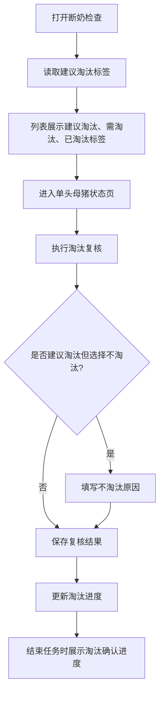
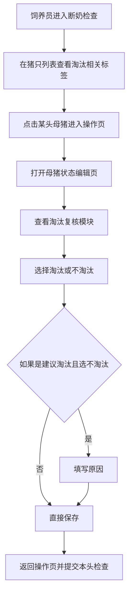

# PRD：Mobile 淘汰复核

## 背景

淘汰计划在 Console 端只是提前设定目标和关注对象，真正决定一头母猪在当前任务里是否进入淘汰流程，仍然要由现场人员在执行任务时复核。Mobile 端的淘汰复核模块，就是把这一步从口头判断变成结构化记录。

它不是一个独立任务，而是嵌入在断奶检查这样的现场任务中，帮助现场人员一边做检查，一边对需要淘汰的母猪做最终判断。

## 目标

- 让现场操作员在断奶检查中完成逐头淘汰复核。
- 让管理者在 Console 指定的 `建议淘汰` 对象，在 Mobile 中被明确展示出来。
- 让现场对 `建议淘汰` 选择 `不淘汰` 时，必须留下原因，方便后续复盘。
- 让任务进度和结束页中，都能清楚展示当前淘汰确认进度，并与后续真正 `已淘汰` 的结果区分开。

## 对象

| 用户角色 | 说明 | 关注点 |
|---|---|---|
| Mobile 用户 | 在现场复核每头母猪是否需要淘汰 | 操作要快、标签要明确、异常要能解释 |
| Console 用户 | 在结果页复盘淘汰执行情况 | 计划是否落地、未淘汰的原因是什么 |

## 价值

- 对现场操作员：不需要另外记淘汰名单，任务里就能直接完成判断。
- 对管理者：能知道现场到底有没有按计划去复核关键对象。
- 对复盘工作：建议淘汰、需淘汰、已淘汰之间的差异都能被追踪，不再把“确认需淘汰”和“实际已淘汰”混为一谈。

## 程序流程图

## 操作流程图

## 涉及到的任务

淘汰复核不是独立任务，而是嵌入在现有生产任务中的一部分操作。Mobile 用户只会在这些任务里，顺带完成淘汰相关判断。

当前与淘汰复核相关的任务包括：

- `断奶检查`
  - 用于在断奶阶段，结合母猪状态和本批次计划，确认哪些母猪需要进入后续淘汰流程。
- `母猪产后检查`
  - 用于在产后阶段，结合母猪恢复情况、健康情况和生产表现，提前判断是否需要淘汰。
- `巡检任务`
  - 用于在日常巡栏过程中，发现明显异常或不再适合继续留群的母猪，并补充淘汰标记。

## 功能说明

### 1. 列表页中的淘汰展示

- 猪只卡片中，耳标旁可以展示与淘汰相关的标签。
- 标签口径包括：
  - `建议淘汰`：Console 端提前圈定的关注对象。
  - `需淘汰`：现场已确认该母猪需要淘汰。
  - `已淘汰`：后续处理已完成，表示该母猪已经完成离场或对应淘汰处置。
- `需淘汰` 与 `已淘汰` 要使用不同颜色，便于现场区分“待后续处理”和“已经处理完”。

### 2. 任务进度中的淘汰进度

- 任务进度看板中，需要单独展示淘汰进度。
- 当前任务里，淘汰进度本质上表示“已确认需淘汰多少头 / 计划淘汰多少头”。
- 这个口径在 Mobile 与 Console 都必须一致，避免用户在两个端看到完全不同的说法。
- 当计划淘汰为 0 时，也保留模块，只显示 `0 / 0`，避免页面结构跳动。

### 3. 母猪状态编辑页

- 淘汰模块标题为 `淘汰复核`。
- 如果该母猪是 Console 端指定的对象，标题旁展示 `建议淘汰` 标签。
- 选项只有两个：
  - `淘汰`
  - `不淘汰`
- 如果该母猪带有 `建议淘汰` 标签，且现场选择 `不淘汰`：
  - 系统必须弹出原因填写框。
  - 用户必须填写原因后才能确认。
  - 取消填写时，回退为 `淘汰`。

### 4. 与本头检查的关系

- 淘汰复核不是独立提交，而是作为本头检查的一部分提交。
- 只有当本头需要填写的内容都完成后，才能一起提交。
- 用户完成提交后，列表与进度同步刷新。

### 5. 结束任务页中的淘汰信息

- 结束任务页的数据展示区中，需要继续展示淘汰确认进度。
- 如果本任务对淘汰复核配置了结束前校验，而当前仍未达到要求：
  - 弹出异常提示。
  - 文案需明确告诉用户还差多少头需要完成淘汰选择。
- 如果业务上允许结束，则在结束页清楚展示进度不足，由管理者后续复盘。

### 6. Console 结果联动

- 现场选择 `淘汰` 后，这头母猪进入 `需淘汰` 结果口径，表示已经确认后续需要淘汰。
- 现场选择 `不淘汰` 且填写了原因后，Console 端可以在结果页看到这条复核记录。
- 后续出售、死亡、转移到其他场等处理完成后，这头母猪的状态才会变成 `已淘汰`。

## 边际情况 / 异常情况

| 场景 | 处理方式 |
|---|---|
| 该母猪不是建议淘汰对象 | 仍允许现场直接选择 `淘汰` |
| 建议淘汰对象被现场判断为不淘汰 | 必须填写原因 |
| 同一头母猪同时带有重点留种来源标签 | 允许同时展示，不互斥 |
| 任务结束时淘汰进度不足 | 按任务规则决定阻断或允许结束，但必须把差额提示清楚 |
| 网络失败导致本头提交失败 | 保留当前填写内容，避免现场重复录入 |
