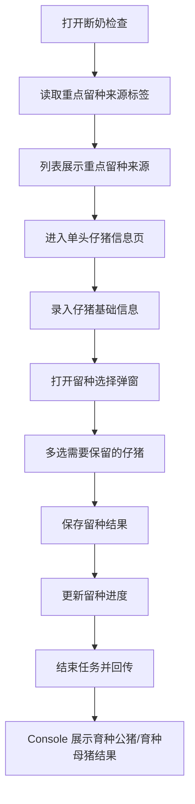
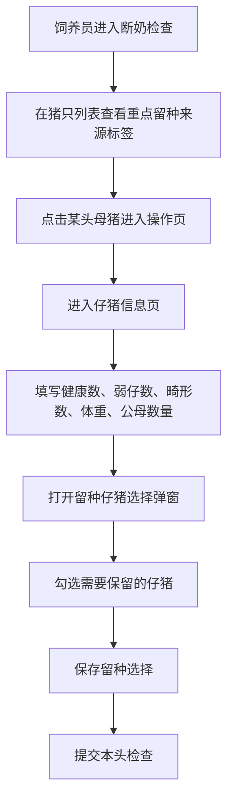

# PRD：Mobile 留种标记

## 背景

Console 端的后备留种计划，只是先设定本批次计划留多少，以及哪些母猪的后代值得重点关注。真正决定哪些仔猪被留下，发生在现场断奶检查时。

因此，Mobile 端需要提供一套清晰的留种标记能力，让现场在录入仔猪信息的同时，完成留种选择，并把结果回传给 Console。

## 目标

- 让现场操作员在断奶检查中完成仔猪留种标记。
- 让 Console 端指定的 `重点留种来源` 母猪，在 Mobile 中被明确提示。
- 让任务进度和结束页中，都能清楚展示 `标记留种 / 计划留种` 的完成情况。
- 让 Console 在任务结束后能看到最终的育种公猪 / 育种母猪名单。

## 对象

| 用户角色 | 说明 | 关注点 |
|---|---|---|
| Mobile 用户 | 在断奶检查中填写仔猪信息并标记留种 | 哪些来源要重点关注、哪些仔猪被留下 |
| Console 用户 | 在结果页查看最终留种结果 | 留种数量是否够、来源是否符合预期 |

## 价值

- 对现场操作员：录入仔猪信息时就能完成留种，不需要再做第二次选择。
- 对管理者：计划目标和现场结果能连起来看，知道这批后备储备是否够用。
- 对后续培养：结果可以直接沉淀为育种公猪 / 育种母猪名单，减少后续整理工作。

## 程序流程图

## 操作流程图

## 涉及到的任务

留种标记不是独立任务，而是嵌入在现有生产任务中的一部分操作。Mobile 用户会在合适的生产节点里，顺带完成留种相关判断。

当前与留种标记相关的任务包括：

- `断奶检查`
- `巡检任务`
- `结束保育检查`
- `结束育肥检查`

## 功能说明

### 1. 列表页中的留种展示

- 当某头母猪被 Console 端圈定为重点来源时，在猪只卡片耳标旁展示 `重点留种来源` 标签。
- 该标签表示“这头母猪的后代值得现场优先关注”，不是说这头母猪本身已完成任何留种动作。
- 标签文案在任务过程中保持稳定，不随着任务完成状态改变。

### 2. 任务进度中的留种进度

- 任务进度看板中，需要单独展示留种进度。
- 统一口径为：`标记留种 / 计划留种`。
- `标记留种` 指现场在仔猪中已实际标记出来的数量。
- `计划留种` 指 Console 端提前设定的目标值。

### 3. 仔猪信息页

- 仔猪信息页负责承载留种相关动作。
- 现场需要先完成基础信息录入，再进入留种选择弹窗。
- 基础信息至少包括：
  - 健康仔猪数量
  - 弱仔数量
  - 畸形数量
  - 体重
  - 公猪数量
  - 母猪数量
- 页面里仔猪信息与母猪状态要分模块展示，便于用户按逻辑逐步完成。

### 4. 留种仔猪选择弹窗

- 采用屏内吸底弹窗，避免跳出当前任务上下文。
- 支持多选。
- 用户保存后，返回本头操作页，而不是直接回到列表页。
- `标记留种` 数量应与当前已勾选的仔猪数量实时关联。

### 5. 结束任务页中的留种信息

- 结束任务页的数据展示区中，继续展示 `标记留种 / 计划留种`。
- 如果本任务对留种选择配置了结束前校验，而当前仍未达到要求：
  - 弹出异常提示。
  - 文案需明确告诉用户还差多少头需要完成留种选择。
- 如果业务上允许结束，则在结束页清楚展示不足情况，由 Console 端复盘。

### 6. Console 结果联动

- 现场保存的留种结果，会进入 Console 的结果页。
- Console 需要按 `育种公猪` 和 `育种母猪` 分开查看。
- 结果页还需要能看到这些仔猪分别来自哪些母猪，以便后续跟踪来源质量。

## 边际情况 / 异常情况

| 场景 | 处理方式 |
|---|---|
| 当前母猪没有重点留种来源标签 | 仍允许现场正常标记留种 |
| 重点留种来源母猪的后代最终没有被标记留种 | 允许，最终以后现场实际选择为准 |
| 标记留种数量低于计划留种 | 按任务规则决定阻断或允许结束，但必须清楚展示差额 |
| 用户保存留种仔猪后返回 | 应回到当前母猪的操作页，而不是直接回到外层列表页 |
| 弹窗打开时外层列表滚动 | 必须锁定外层，只允许当前弹窗内容滚动 |
