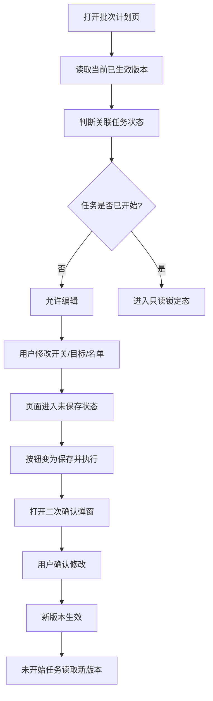
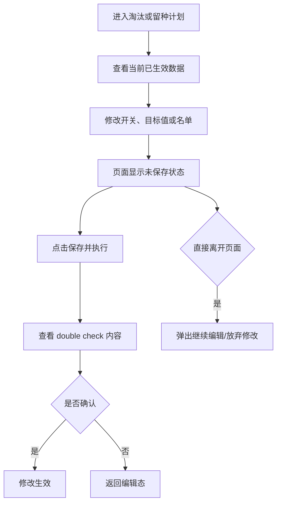

# PRD：Console 淘汰&留种计划编辑与生效规则补充说明

## 背景

淘汰计划和留种计划都属于批次计划的一部分。用户第一次完成配置后，这些数据并不是永远不变的：管理者可能会调整目标值，也可能会增删建议猪只。

如果不把“什么时候能改、什么时候不能改、改完何时生效”说清楚，就会出现三个问题：

- Console 用户不知道当前修改只是临时编辑，还是已经正式生效。
- Mobile 现场可能正在按旧版本执行，但 Console 已经改成了新版本。
- 用户会产生“我明明改了，为什么任务没变”或“我只是点开看一下，怎么就生效了”的困惑。

## 目标

- 让用户清楚知道当前页面展示的是“已生效版本”还是“未保存修改”。
- 让所有计划修改都通过统一的 `保存并执行` 动作生效。
- 让未开始任务可以读取新版本，让已开始任务始终保持稳定口径。
- 让用户在离开页面前，有机会处理未保存修改，避免误操作。

## 对象

| 用户角色 | 说明 | 关注点 |
|---|---|---|
| Console 用户 | 负责修改批次计划的人 | 现在能不能改、改完什么时候生效 |
| Mobile 用户 | 读取已生效计划并现场执行的人 | 现场永远只能看到一个清晰稳定的版本 |

## 价值

- 对用户：计划的修改和生效过程更可预期，不容易误以为系统已经自动保存。
- 对现场：任务开始后不会因为 Console 临时改计划而前后打架。

## 程序流程图

## 操作流程图

## 功能说明

### 1. 开关行为

#### 1.1 从关到开

- 用户把开关从关切到开时：
  - 立即展开对应配置区。
  - 页面进入“已修改但未保存”状态。
  - 此时不立即生效。
  - 右下角按钮变为 `保存并执行`。

#### 1.2 从开到关

- 用户把已启用计划从开切到关时：
  - 只标记为“待停用”。
  - 目标值和名单不清空。
  - 页面进入“已修改但未保存”状态。
  - 只有点击 `保存并执行` 后，停用才正式生效。
- 停用生效后：
  - 新任务不再读取对应标签。
  - 历史配置保留。
  - 再次开启时恢复上次内容，但仍要重新保存才生效。

#### 1.3 未保存离开页面

- 只要用户改过开关、目标值或名单，就视为存在未保存修改。
- 此时离开页面、切换批次或关闭页面时：
  - 弹出拦截确认。
  - 选项为：
    - `继续编辑`
    - `放弃修改`

### 2. 数据修改行为

#### 2.1 哪些操作都算正式变更

以下任一动作都统一算正式变更：

- 打开或关闭淘汰计划开关
- 打开或关闭留种计划开关
- 修改淘汰目标模式或目标值
- 修改留种目标值
- 增加或删除建议淘汰母猪
- 增加或删除重点留种来源母猪

只要发生以上任一操作：

- 页面就进入未保存状态。
- 右下角按钮统一变为 `保存并执行`。

#### 2.2 什么时候允许改

- 当关联任务还没有创建，允许修改。
- 当关联任务已经创建但尚未开始，仍允许修改。
- 当关联任务已经开始执行后：
  - 整块计划区域进入只读态。
  - 不允许再修改目标值、名单或开关。

### 3. 保存并执行

#### 3.1 按钮状态

- 页面无修改时，不提示保存。
- 一旦存在未保存变更，主按钮统一显示为 `保存并执行`。
- 按钮高亮，用来明确告诉用户“现在页面内容还没正式生效”。

#### 3.2 Double check

- 点击 `保存并执行` 后，不直接提交，而是先弹出二次确认。
- 弹窗里要让用户看到这次修改会带来什么：
  - 母猪淘汰计划是否启用
  - 淘汰目标模式、目标值、计划淘汰数量
  - 当前已选建议淘汰母猪数量
  - 后备留种计划是否启用
  - 计划留种头数
  - 当前已选重点留种来源母猪数量
  - 本次修改会影响哪些未开始任务
- 操作按钮：
  - `取消`
  - `确认修改`

### 4. 生效规则

#### 4.1 生效时机

- 只有用户点击 `保存并执行`，并在二次确认中点了 `确认修改`，新版本才正式生效。
- 任何未确认的页面改动都只是临时编辑内容。

#### 4.2 生效范围

- 新版本会立即成为当前批次唯一有效版本。
- 所有关联但尚未开始的任务，读取新版本。
- 已经开始执行的任务，不受影响。

#### 4.3 版本理解

- 前端不一定要显式展示版本号，但业务上要按“最后一次确认保存的内容，就是当前有效版本”来理解。
- 页面重新进入时，只展示最近一次已生效版本，不展示用户上次未保存的临时编辑。

### 5. 页面状态定义

#### 5.1 正常查看态

- 展示当前已生效计划。
- 页面无未保存修改。
- 主按钮不显示 `保存并执行`。

#### 5.2 编辑未保存态

- 用户已改动任一配置。
- 主按钮显示 `保存并执行`。
- 离开页面会触发拦截。

#### 5.3 只读锁定态

- 当关联任务已开始执行时进入。
- 页面展示当前已生效版本。
- 所有输入、开关和名单编辑都禁用。
- 页面需明确提示：`关联任务已开始执行，当前计划已锁定，不可再修改。`

## 边际情况 / 异常情况

| 场景 | 处理方式 |
|---|---|
| 用户打开开关后未保存就离开 | 弹出离开拦截；放弃修改后恢复到原状态 |
| 用户改了名单但没改目标 | 仍然视为正式变更，需重新保存 |
| 用户改了目标但没改名单 | 仍然视为正式变更，需重新保存 |
| 用户在二次确认里取消 | 不生效，返回编辑态 |
| 页面打开时可编辑，但保存前任务状态变成进行中 | 后端拒绝写入，前端提示计划已锁定 |
| 关闭后再次打开 | 恢复上次已保存内容，但需重新保存后才重新生效 |
