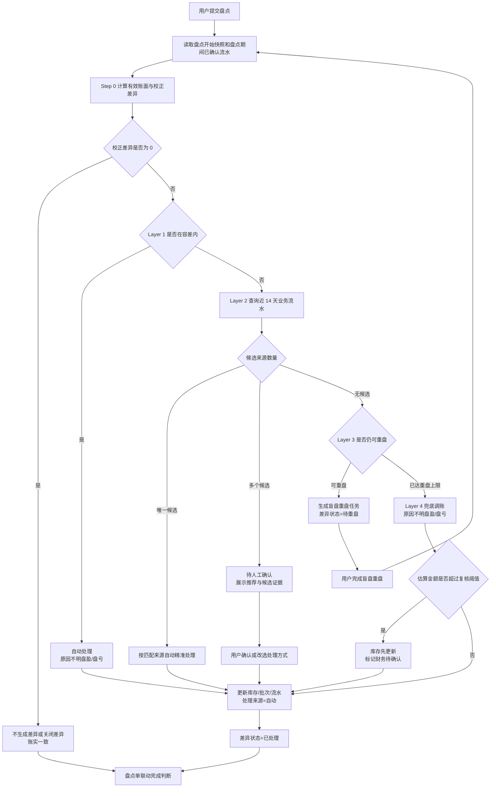
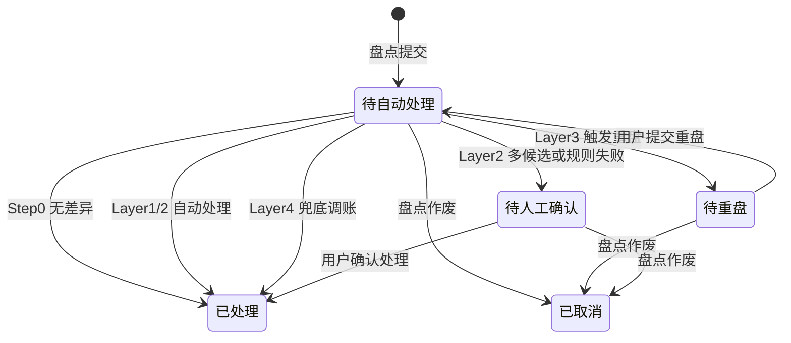

# 盘点差异自动处理规则

## 背景

当前 Console 库存盘点提交后，系统会为每条账实差异生成 `待处理` 记录，库管用户需要进入「盘点差异处理」页，逐条打开抽屉并选择差异来源，库存与批次才会更新。

这种做法能保留业务归因，但日常操作成本偏高，也不符合 Oracle WMS、SAP EWM 等主流 WMS 的处理思路。行业成熟系统通常不是让用户一开始就判断所有差异，而是按可信度分层处理：

1. 先剔除盘点期间出入库造成的假差异。
2. 小差异按容差自动调账。
3. 大差异先查近期业务流水，能唯一对上就按真实业务纠正。
4. 查不到明确业务时，让用户盲盘重数。
5. 重盘后仍无法确定原因时，先让账和实物一致，再把大额事项交给财务复核。

Sentri 盘点口径仍为 **按物料总数盘点、不按批次行盘点**。差异处理最终仍需要落到批次、库存流水与现有处理方式上；本 PRD 不新增新的差异处理方式，而是在现有处理方式之上增加一层 **系统自动判定与分流规则**。

**与现有方案的关系：**

- 原有差异处理方式、库存流水类型、批次落点规则继续复用，不新增新的业务原因。
- 原「盘点差异处理」页保留，但从「全量差异待办」调整为「待重盘 + 待人工确认」异常队列。
- `盘点差异` 角标只显示仍需用户处理的数量，即 `待重盘` + `待人工确认`，不统计已自动处理的差异。
- 财务模块暂未实现；涉及大额或金额口径不确定的差异，库存可以先更新，差异与流水标记 `财务待确认`，后续由财务异步复核。

## 目标

1. 用户提交盘点后，系统自动运行分层规则，尽可能完成差异闭环，减少逐条人工点选。
2. 盘点期间发生出入库时，系统使用「盘点开始快照 + 盘点期间已确认出入库」计算有效账面，避免把正常业务变动误判为差异。
3. 容差范围内的小差异自动按 `原因不明盘盈/盘亏` 调整库存。
4. 超容差的大差异优先匹配近期业务流水；能唯一匹配时，按入库更正、任务多扣、漏记出库、过期报废等精确方式处理。
5. 查不到唯一业务来源时，系统自动生成盲盘重盘任务；重盘仍无法收敛时，兜底按 `原因不明盘盈/盘亏` 调账，保证账实一致。
6. 只有系统无法唯一判断、需要业务人员选择原因时，才进入 `待人工确认`。

**非目标（本期不做）：**

- 不新增现有处理方式之外的差异原因码。
- 不自动区分「供应商赠品」与「入库少录」这类需要业务判断的场景；没有明确单据证据时，走人工确认或兜底盘盈 + 财务待确认。
- 不支持一条差异拆分成多种处理方式分别处理。
- 不做容差、匹配优先级、重盘次数的后台配置 UI；本期先按规则常量实现。
- 不做差异处理回退 / 红冲。
- 不做盘点冻结仓库或冻结物料的完整 WMS 能力。

## 对象

**Console 库管用户**

- 发起盘点、录入实盘数量、提交盘点。
- 正常情况下提交后无需逐条处理差异，只关注系统提示的待重盘或待人工确认事项。
- 收到待重盘任务时，按盲盘方式重新录入实盘数量。
- 收到待人工确认事项时，查看系统推荐与证据，确认或改选处理方式。

**系统（规则引擎）**

- 盘点提交后自动执行：假差异剔除 → 容差判断 → 近期流水匹配 → 盲盘重盘 → 兜底调账。
- 为每条差异输出处理结果：自动处理、待重盘、待人工确认、已取消。
- 记录自动处理依据、关联事务、财务状态与库存流水。

## 价值

- **省事**：小差异、常见录错、任务多扣、漏记消耗等场景由系统自动闭环，不再要求库管逐条点击。
- **账更快对齐**：大多数盘点提交后库存立即更新，减少「有差异未处理导致账面不准」的时间。
- **归因更准确**：能匹配到业务流水的差异仍走精确处理方式，不把所有问题都粗暴归成 `原因不明盘盈/盘亏`。
- **异常更聚焦**：用户只处理真正需要判断的重盘和人工确认事项。
- **更接近主流 WMS**：小差异自动过、大差异重盘、能匹配流水则精确纠正、实在无法确定则兜底调账。

## 程序流程图



## 操作流程图

### Console 用户 — 常规路径

1. 库管用户按现有流程发起盘点、确认范围、录入实盘、提交盘点。
2. 系统提示 `盘点已提交，正在自动处理差异`。
3. 如果全部差异被系统自动处理，完成页展示 `盘点已完成，库存已更新`。
4. 用户返回库存首页；不再强制进入「盘点差异处理」页。
5. `盘点差异` 角标为 0。

### Console 用户 — 待重盘路径

1. 提交盘点后，某物料差异超容差，且系统查不到唯一可解释的业务流水。
2. 系统生成盲盘重盘任务，差异状态置为 `待重盘`，库存暂不更新。
3. 用户从盘点完成页、库存首页提示条或异常差异队列进入重盘页。
4. 重盘页不展示账面库存、盘点结果、历史实盘或系统建议，只展示物料信息和实盘录入框。
5. 用户提交重盘结果后，系统重新从 Step 0 开始跑规则。
6. 同一物料在同一盘点单下最多重盘 2 次；仍无法收敛时进入兜底调账。

### Console 用户 — 待人工确认路径

1. 系统查到多个可能业务来源，或自动规则执行失败，差异进入 `待人工确认`。
2. 用户进入「盘点差异处理」页，默认只看 `待重盘` 与 `待人工确认`。
3. 打开处理抽屉后，系统展示推荐处理方式、推荐原因、候选事务证据。
4. 用户可以点击 `采用系统推荐`，也可以改选其他既有处理方式。
5. 确认后库存更新，处理来源记为 `人工`。

## 功能说明

### 8.1 差异处理主线

系统处理每条盘点差异时，必须按以下顺序执行，不允许跳过前置判断：

| 顺序 | 名称 | 系统判断 | 输出 |
|---|---|---|---|
| Step 0 | 假差异剔除 | 用快照与盘点期间已确认流水计算有效账面 | 无差异 / 校正差异 |
| Layer 1 | 小差异自动调账 | 校正差异是否在物料容差内 | 自动 `原因不明盘盈/盘亏` |
| Layer 2 | 业务流水匹配 | 近 14 天内是否有唯一业务来源可解释差异 | 自动精确处理 / 待人工确认 / 进入重盘 |
| Layer 3 | 盲盘重盘 | 查不到唯一来源且未达重盘上限 | 生成待重盘任务 |
| Layer 4 | 兜底调账 | 重盘后仍无唯一来源 | 自动 `原因不明盘盈/盘亏`，必要时财务待确认 |

**处理原则：**

- 能不生成差异，就不生成差异。
- 能自动精确归因，就不走原因不明。
- 能唯一判断，系统自动处理。
- 多个原因都能解释时，不自动猜，进入人工确认。
- 重盘后仍无法解释时，库存先和实物一致，财务与审计后置。

### 8.2 Step 0 — 假差异剔除

**目的：** 避免把盘点期间正常发生的入库、出库、任务消耗、报废等业务误算成盘点差异。

**计算规则：**

1. 创建盘点范围时，系统记录盘点开始时的账面快照。
2. 提交盘点时，统计从盘点开始时刻到提交时刻之间，该物料已确认的库存变动：
   - `期间入库`：采购入库、入库更正等入库类流水。
   - `期间出库`：业务消耗、手工出库、报废等出库类流水；消耗冲销按库存增加方向抵减出库。
3. 有效账面库存：

```text
有效账面库存 = 盘点开始快照 + 期间入库 - 期间出库
```

4. 校正差异：

```text
校正差异 = 实盘数量 - 有效账面库存
```

5. 后续 Layer 1-4 一律使用 `校正差异` 判断，不再使用提交瞬间的普通账面差异。
6. 如果校正差异为 0，该物料视为账实一致，不进入待处理队列。

**例子：**

| 快照 | 盘点期间入库 | 有效账面 | 实盘 | 结论 |
|---:|---:|---:|---:|---|
| 100 | +20 | 120 | 120 | 无差异，不处理 |
| 100 | +20 | 120 | 100 | 实盘少 20，继续进入后续规则 |

**前端提示：**

- 盘点差异确认页如存在期间变动，该行展示浅色提示：`盘点期间库存已变动，系统已按期间流水校正比对基准`。
- 自动处理详情中展示快照、期间入库、期间出库、有效账面与校正差异，便于审计。

### 8.3 Layer 1 — 小差异自动调账

**目的：** 处理差 1 盒、差 2%、包装换算尾差等低价值、低风险差异，避免用户逐条确认。

**容差分组（本期写死，后续可配置）：**

| 分组 | 适用物料 | 数量容差 | 财务复核阈值 |
|---|---|---|---|
| A | 疫苗、兽药 | ±2% 或 ±1 最小包装单位，取较大者 | 100 元 |
| B | 饲料、消毒用品、保健品 | ±5% | 200 元 |
| C | 工具、其他 | ±5% 或 ±1 最小包装单位，取较大者 | 50 元 |

未配置分组的物料，默认按 B 类容差。

**判定规则：**

```text
数量容差上限 = max(有效账面库存 × 容差百分比, 最小包装单位绝对值)
abs(校正差异) <= 数量容差上限 时，视为容差内
```

金额不阻塞库存自动处理，只决定是否标记 `财务待确认`：

```text
估算调整金额 = abs(校正差异) × 物料估算单位成本
```

若估算调整金额超过财务复核阈值，库存仍自动更新，但财务状态记为 `财务待确认`。

**自动动作：**

| 盘点结果 | 自动处理方式 | 库存动作 |
|---|---|---|
| 盘盈 | 原因不明盘盈 | 增加库存，按现有盘盈批次规则落批次 |
| 盘亏 | 原因不明盘亏 | 减少库存，按现有 FEFO 规则扣减 |

**例子：**

| 场景 | 账面 | 实盘 | 差异 | 判断 | 处理 |
|---|---:|---:|---:|---|---|
| 疫苗 A 类 | 50 盒 | 51 盒 | +1 盒 | 在 ±2% 或 ±1 盒内 | 自动盘盈 +1 盒 |
| 饲料 B 类 | 1000 kg | 1040 kg | +40 kg | 4%，在 ±5% 内 | 自动盘盈 +40 kg |

### 8.4 Layer 2 — 大差异业务流水匹配

**目的：** 对超容差差异先查业务原因。能对上具体入库、任务、出库或报废时，按真实业务处理，不笼统记为盘盈盘亏。

**匹配时间窗：**

- 默认查询盘点开始快照前 14 天至本次提交时刻之间的业务流水。
- 重盘提交后，时间窗终点延伸到重盘提交时刻。

**通用规则：**

1. 只在存在唯一候选时自动处理。
2. 候选数量为 0：进入 Layer 3 盲盘重盘。
3. 候选数量大于 1：进入 `待人工确认`，不先重盘，不自动猜。
4. 数量匹配允许极小尾差：

```text
匹配容差 = max(abs(校正差异) × 1%, 1 最小包装单位)
```

5. 候选事务必须未被其他差异占用；同一业务流水不能重复解释多条差异。
6. 自动匹配成功后，关联批次优先取匹配事务上的批次；没有明确批次时，复用现有处理方式的批次落点规则。

#### 8.4.1 盘盈

| 优先级 | 可解释原因 | 匹配条件 | 自动处理方式 |
|---|---|---|---|
| P1 | 入库少录 | 存在唯一已确认入库单，实际收货证据或验收记录显示应多入 `校正差异` 数量 | 入库数量更正 |
| P2 | 任务出库多扣 | 存在唯一已完成任务或消耗流水，系统扣减量比实际/理论用量多 `校正差异` 数量 | 任务出库多扣 |

**例子：**

- 账面 80，实盘 100，差 +20；系统查到 3 天前入库单只录 80，实际收 100 → 自动 `入库数量更正 +20`。
- 账面 30，实盘 35，差 +5；系统查到昨天疫苗任务扣 10，实际只用 5 → 自动 `任务出库多扣 +5`，并冲减消耗统计。

**不自动猜的场景：**

- 可能是供应商赠品，也可能是入库少录，但没有明确单据证据。
- 多笔任务或多张入库单都能解释同一差额。

这些场景进入 `待人工确认`，或在重盘后仍无业务来源时由 Layer 4 兜底 `原因不明盘盈`。

#### 8.4.2 盘亏

| 优先级 | 可解释原因 | 匹配条件 | 自动处理方式 |
|---|---|---|---|
| P1 | 入库多录 | 存在唯一已确认入库单，录入数量比合理收货量多 `abs(校正差异)` | 入库多录 |
| P2 | 用了没记账 | 存在唯一已完成疫苗/治疗/饲喂等任务，理论用量与差额一致，但没有生成消耗流水 | 漏记任务出库 |
| P3 | 过期/破损/污染未报废 | 存在唯一可解释差额的过期、破损或污染批次，且批次可用库存覆盖差额 | 破损污染过期报废 |

**例子：**

- 账面 50，实盘 45，差 -5；系统发现前天有已完成接种任务，理论用 5，但没有消耗流水 → 自动 `漏记任务出库 -5`。
- 账面 20，实盘 15，差 -5；系统发现某批次已过期且剩余 5，一直未报废 → 自动 `破损污染过期报废 -5`。

#### 8.4.3 多解与推荐

当多个业务原因都能解释同一差异时，系统不自动处理，差异置为 `待人工确认`。

系统仍需要给出推荐，帮助用户判断：

- 推荐优先级：匹配优先级更高 > 数量更接近 > 时间更近。
- 抽屉展示：推荐处理方式、推荐原因、候选事务列表、每个候选能解释的数量。
- 用户可采用推荐，也可改选其他既有处理方式。

**例子：**

差 -10，同时存在一张可能多录的入库单，也存在一笔可能漏记的出库任务。系统不自动选择，进入 `待人工确认`，默认推荐数量更接近、时间更近的一项。

### 8.5 Layer 3 — 盲盘重盘

**触发条件：**

- 校正差异超出容差。
- Layer 2 查不到任何唯一业务来源。
- 当前重盘次数未达到上限。

**规则：**

1. 系统为该物料生成重盘任务，关联原盘点单与物料。
2. 差异状态置为 `待重盘`。
3. 库存暂不更新。
4. 重盘页必须盲盘，不展示账面数、差异数、盘点结果、历史实盘、系统推荐。
5. 同一物料在同一盘点单下最多重盘 2 次，即初盘 + 2 次重盘。
6. 重盘提交后，用新的实盘数量重新执行 Step 0 至 Layer 4。

**例子：**

| 阶段 | 有效账面 | 实盘 | 系统处理 |
|---|---:|---:|---|
| 初盘 | 200 | 150 | 差 -50，超容差且查不到来源，生成盲盘重盘 |
| 重盘 1 | 200 | 198 | 差 -2，进入容差，自动 `原因不明盘亏 -2` |

如果重盘 2 次后仍差异较大且查不到唯一来源，进入 Layer 4。

### 8.6 Layer 4 — 兜底调账

**触发条件：**

- 已达到重盘上限。
- 校正差异仍不为 0。
- Layer 2 仍没有唯一业务来源。

**处理原则：**

- 库存必须先与实物一致。
- 不再继续阻塞在待办中。
- 原因记为 `原因不明盘盈/盘亏`。
- 金额较大或估算成本缺失时，标记 `财务待确认`。

| 盘点结果 | 自动处理方式 | 库存动作 |
|---|---|---|
| 盘盈 | 原因不明盘盈 | 增加库存，按现有盘盈批次规则落批次 |
| 盘亏 | 原因不明盘亏 | 减少库存，按现有 FEFO 规则扣减 |

**财务复核：**

- 估算调整金额超过物料分组财务复核阈值 → `财务待确认`。
- 估算单位成本缺失 → `财务待确认`。
- 未超过阈值 → `无需确认`。

**例子：**

重盘 2 次后仍差 -30，系统查不到唯一业务来源 → 自动 `原因不明盘亏 -30`。如果估算金额超过阈值，库存已更新，同时标记 `财务待确认`。

### 8.7 差异记录状态

| 状态 | 含义 | 用户可见操作 |
|---|---|---|
| 待自动处理 | 盘点已提交，规则引擎尚未完成处理 | 无 |
| 待重盘 | 系统要求盲盘重数 | 去重盘 |
| 待人工确认 | 系统无法唯一判断，需要用户确认 | 处理差异 |
| 已处理 | 库存、批次、流水已更新，或校正后无差异 | 查看详情 |
| 已取消 | 盘点作废或差异被取消 | 无 |

原 `待处理` 不再作为统一待办状态使用；它在产品上拆分为 `待重盘` 与 `待人工确认`。

每条差异需要记录以下业务信息，供列表、详情与审计展示：

| 业务信息 | 说明 |
|---|---|
| 处理来源 | `自动` / `人工`；自动处理时操作人展示为 `系统` |
| 自动处理依据 | 如 `容差内自动过账`、`匹配入库单 IN-20260301，差额一致` |
| 推荐处理方式 | 待人工确认时，系统推荐的处理方式 |
| 匹配关联事务 | 入库单号、任务 ID、批次号等 |
| 重盘次数 | 初盘为 0，第一次重盘为 1，第二次重盘为 2 |
| 有效账面库存 | Step 0 计算后的账面 |
| 校正差异数量 | 后续规则使用的差异数量 |
| 财务状态 | `无需确认` / `财务待确认` |

### 8.8 盘点单状态联动

| 盘点单状态 | 条件 |
|---|---|
| 待确认 | 提交后仍存在 `待自动处理`、`待重盘` 或 `待人工确认` 差异 |
| 已完成 | 全部差异均为 `已处理` / `已取消`，或本次盘点无差异 |
| 已取消 | 用户作废盘点 |

完成页文案：

- 无差异：`盘点已完成，账实一致。`
- 全部自动：`盘点已完成，X 条差异已由系统自动处理，库存已更新。`
- 部分异常：`盘点已提交，Y 条已自动处理，Z 条待重盘 / 待确认，请处理异常差异。`

### 8.9 异常差异队列（原盘点差异处理页）

**页面标题：** `盘点差异处理`。

**页面定位：** 只处理还需要人的异常事项，不再默认展示全部差异。

**默认筛选：**

- `待重盘`
- `待人工确认`

**顶部汇总：** 不展示独立统计卡。该页面本身只承载待处理事项，数量通过列表行数与入口角标表达即可。

**列表字段：**

- 物料名称、分类、有效账面、实盘数量、校正差异。
- 盘点结果、处理方式、操作。
- 不展示 `处理状态`：进入该页的记录均为待处理，已处理记录通过库存流水追溯。
- 不展示 `财务状态`：财务模块当前未实现，不在差异处理主列表暴露该列。
- 操作列：
  - `待重盘` → `去重盘`
  - `待人工确认` → `处理差异`

**处理抽屉：**

- `待人工确认` 打开后默认选中系统推荐处理方式。
- 展示候选事务证据，包括事务类型、时间、数量、关联单号或任务 ID。
- 主按钮为 `采用系统推荐`；用户改选后按钮为 `确认处理`。
- 确认处理后，该记录从待处理列表移除，并生成库存流水；用户后续在库存流水中查看处理结果。

**首页与角标：**

- 仅存在 `待重盘` 或 `待人工确认` 时，库存首页展示提示条：

```text
存在 N 条盘点异常待处理（含重盘 M 条），请尽快确认以免影响账实一致。
```

- `盘点差异` 角标数字 = `待重盘` + `待人工确认`。
- 已自动处理、财务待确认但无需库管操作的差异，不计入角标。

**物料详情 / 库存列表：**

- `含未处理差异` 标签仅在该物料存在 `待重盘` 或 `待人工确认` 时展示。
- 已全部自动处理的物料不展示该标签。

### 8.10 库存流水与业务统计

- 自动处理生成的流水，操作人记为 `系统`。
- 流水备注前缀为 `自动差异处理`，并附处理依据摘要。
- `任务出库多扣` 生成消耗冲销，冲减任务消耗统计。
- `漏记任务出库` 生成业务消耗，计入消耗趋势与 Top 物料统计。
- `入库数量更正`、`入库多录` 影响对应入库批次与入库流水备注。
- `原因不明盘盈/盘亏` 只影响库存调账，不反推任务消耗或采购入库。

### 8.11 与现有处理方式的关系

规则引擎只是在既有处理方式中自动选择，不新增新的处理类型。

| 既有处理方式 | 自动规则输出场景 |
|---|---|
| 任务出库多扣 | 盘盈，唯一匹配任务/消耗多扣 |
| 入库数量更正 | 盘盈，唯一匹配入库少录 |
| 入库少录补金额 | 本期不自动选择；仅人工在有业务判断时使用 |
| 供应商多送赠品 | 本期不自动选择；仅人工在确认赠品时使用 |
| 原因不明盘盈 | Layer 1 容差内盘盈；Layer 4 兜底盘盈 |
| 漏记任务出库 | 盘亏，唯一匹配已完成但未记账任务 |
| 入库多录 | 盘亏，唯一匹配入库多录 |
| 破损污染过期报废 | 盘亏，唯一匹配过期/破损/污染批次 |
| 原因不明盘亏 | Layer 1 容差内盘亏；Layer 4 兜底盘亏 |

### 8.12 重盘任务入口

| 入口 | 行为 |
|---|---|
| 盘点完成页 | 存在待重盘时展示 `去完成重盘 (N)` |
| 库存首页提示条 | 跳转异常差异队列，并筛选 `待重盘` |
| 盘点差异处理页 | 行操作 `去重盘` 进入盲盘重盘页 |

重盘页展示内容：

- 物料名称
- 分类
- 规格 / 单位
- 实盘数量录入框
- 提交按钮

重盘页不展示账面数量、差异数量、盘点结果、历史实盘和系统推荐。

## 状态机

### 差异记录状态机



### 盘点单状态机

| 当前状态 | 触发 | 下一状态 |
|---|---|---|
| 进行中 | 用户提交盘点且无差异 | 已完成 |
| 进行中 | 用户提交盘点且存在差异 | 待确认 |
| 待确认 | 全部差异已处理或取消 | 已完成 |
| 待确认 | 仍存在待自动处理 / 待重盘 / 待人工确认 | 待确认 |
| 任意状态 | 用户作废盘点 | 已取消 |

## 边际情况 / 异常情况

| 场景 | 系统行为 |
|---|---|
| 规则引擎单条差异执行失败 | 该条置为 `待人工确认`，备注失败原因；其他差异继续自动处理 |
| 校正差异为 0 | 不进入异常队列；如已生成差异则置为 `已处理` |
| 容差边界恰好等于阈值 | 视为容差内 |
| 同一物料同一盘点单出现多条差异 | 视为数据异常，系统合并为一条后再跑规则 |
| 候选事务已被其他差异占用 | 剔除该候选后重新判断候选数量 |
| 候选事务数量大于 1 | 进入 `待人工确认`，不自动处理 |
| 候选事务数量为 0 | 进入盲盘重盘；达上限后兜底调账 |
| 重盘期间又发生新出入库 | 重盘提交时 Step 0 重新计算期间变动 |
| 过期批次库存小于盘亏量 | 不视为唯一匹配，进入重盘或待人工确认 |
| 供应商赠品与入库少录都可能成立 | 不自动猜；进入人工确认，或重盘后无来源时兜底盘盈 + 财务待确认 |
| 差异金额超过财务复核阈值 | 库存仍先更新；差异和流水标记 `财务待确认` |
| 估算单位成本缺失 | 库存仍按数量更新；财务状态记 `财务待确认` |
| 负库存物料盘盈 | 允许自动处理，按现有库存调整逻辑回正库存 |
| 用户人工改选与推荐不同 | 以人工选择为准，处理来源记 `人工`，保留推荐记录 |
| 全部差异自动成功 | 不展示强制跳转「盘点差异处理」；角标为 0 |

## 验收标准

1. 提交盘点后，系统按 Step 0 使用快照与期间流水计算有效账面；校正差异为 0 的物料不进入异常队列。
2. 容差内差异自动生成 `原因不明盘盈/盘亏`，库存、批次、流水更新，操作人记 `系统`。
3. 超容差且能唯一匹配入库、任务、漏记消耗或过期报废的差异，自动按对应既有处理方式更新库存。
4. 多个业务来源都能解释的差异进入 `待人工确认`，抽屉展示系统推荐与候选证据。
5. 查不到业务来源的超容差差异生成盲盘重盘任务，重盘页不展示账面数、差异数或历史实盘。
6. 同一物料重盘 2 次后仍无法匹配时，系统兜底按 `原因不明盘盈/盘亏` 调账；大额或成本缺失时标记 `财务待确认`。
7. `盘点差异` 角标、首页提示条、物料详情 `含未处理差异` 标签只统计 `待重盘` + `待人工确认`。
8. 已自动处理的差异可查看详情，但不提供修改入口。
9. Mock 数据后续开发时需覆盖：假差异剔除、容差内自动处理、入库更正、任务多扣、漏记任务出库、过期报废、多候选待人工确认、盲盘重盘、重盘后兜底、财务待确认、全自动闭环。

## 后续迭代（不在本期）

- 容差、匹配优先级、重盘次数的后台配置页。
- 供应商赠品识别与采购单赠品标记联动。
- 差异处理红冲与审计反冲。
- 按仓库、库区、物料冻结的完整盘点冻结能力。
- 财务模块对接后的采购金额、应付、库存估值联动。
