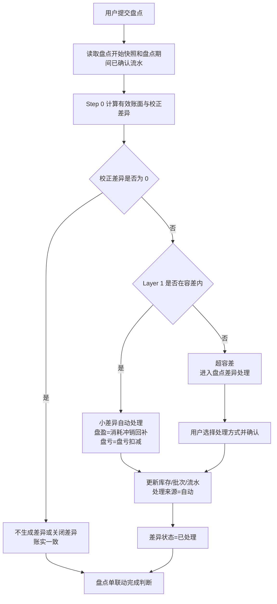
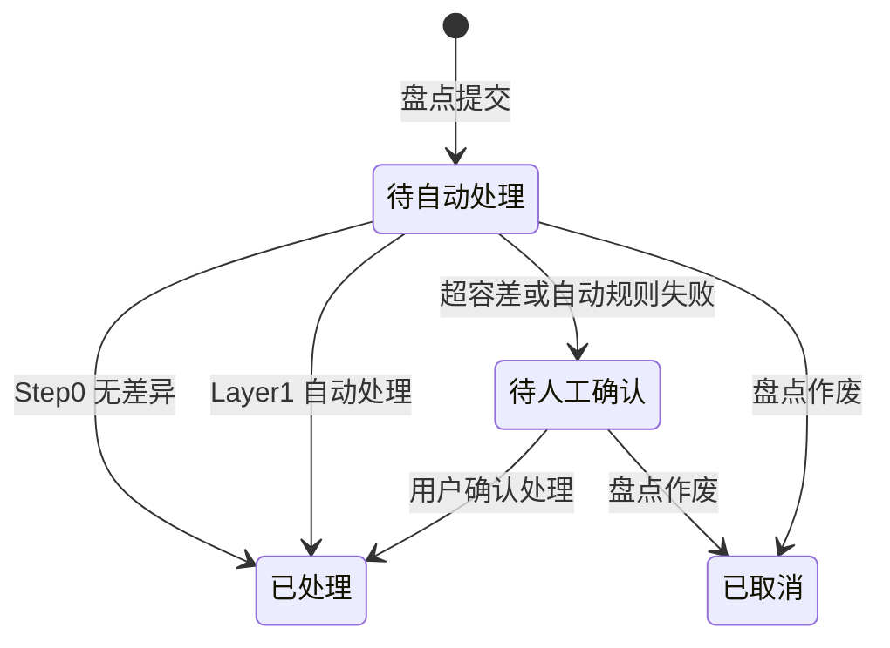

# 盘点差异自动处理规则

## 背景

当前 Console 库存盘点提交后，系统会为每条账实差异生成 `待处理` 记录，库管用户需要进入「盘点差异处理」页，逐条打开抽屉并选择差异来源，库存与批次才会更新。

这种做法能保留业务归因，但日常操作成本偏高，也不符合 Oracle WMS、SAP EWM 等主流 WMS 的处理思路。行业成熟系统通常不是让用户一开始就判断所有差异，而是按可信度分层处理：

1. 先剔除盘点期间出入库造成的假差异。
2. 小差异按容差自动调账。
3. 超出容差的大差异不自动猜原因，直接进入人工确认。

Sentri 的盘点口径为 **按物料总数盘点、不按批次行盘点**。库管用户只录入物料的实盘总量，系统在提交后自动完成差异判断、批次落点和库存流水生成。

当前方案可以理解为：

- 用户负责提交盘点结果，以及处理系统无法判断的人工确认事项。
- 系统先用盘点开始快照和盘点期间出入库流水计算有效账面，避免把盘点期间的正常库存变化误当成差异。
- 容差内小盘亏直接扣减批次库存；容差内小盘盈只有在能唯一定位前期多扣的原消耗批次时，才回补该既有批次并生成消耗冲销流水。
- 超出容差的大差异直接进入「盘点差异处理」，由用户结合现场情况选择处理方式。
- 用户如果认为本次实盘结果不可信，可以按普通盘点入口重新发起一次盘点。

## 目标

1. 用户提交盘点后，系统自动运行分层规则，尽可能完成差异闭环，减少逐条人工点选。
2. 盘点期间发生出入库时，系统使用「盘点开始快照 + 盘点期间已确认出入库」计算有效账面，避免把正常业务变动误判为差异。
3. 容差范围内的小盘亏自动按 `原因不明盘亏` 扣减库存；容差范围内的小盘盈默认按「前期出库 / 消耗多扣」理解，只有能唯一定位原消耗批次时，才自动回补该既有批次并生成消耗冲销流水，不新增批次，不产生采购支出或应付。
4. 超容差的大差异不做系统自动业务流水匹配，直接进入 `待人工确认`，由库管用户选择处理结果。
5. 容差内小盘盈找不到唯一原消耗批次、自动规则执行失败时，也进入 `待人工确认`，由库管用户选择处理结果。
6. 用户需要重新确认实物数量时，重新发起盘点。

## 对象

**Console 库管用户**

- 发起盘点、录入实盘数量、提交盘点。
- 正常情况下提交后无需逐条处理差异，只关注系统提示的待人工确认事项。
- 认为本次实盘结果不可信时，重新发起一次盘点。
- 收到待人工确认事项时，查看差异信息，选择处理方式并确认。

**系统（规则引擎）**

- 盘点提交后自动执行：假差异剔除 → 容差判断 → 自动处理或进入盘点差异处理。
- 为每条差异输出处理结果：自动处理、待人工确认、已取消。
- 记录自动处理依据、关联批次与库存流水。

## 价值

- **省事**：容差内可闭环的小差异由系统自动处理，不再要求库管逐条点击。
- **账更快对齐**：大多数盘点提交后库存立即更新，减少「有差异未处理导致账面不准」的时间。
- **风险更可控**：超容差差异不让系统自动猜原因，必须由人结合现场情况确认，避免错误自动调账。
- **成本口径更稳**：小盘盈不被当成凭空采购，而是冲回前期多记的消耗，避免库存多了、成本也像新采购一样增加。
- **异常更聚焦**：用户只处理真正需要业务判断的人工确认事项。
- **更接近当前业务需要**：小差异自动过，超容差大差异交给人工确认，不把风险判断交给规则引擎。

## 程序流程图



## 操作流程图

### Console 用户 — 常规路径

1. 库管用户按现有流程发起盘点、确认范围、录入实盘、提交盘点。
2. 系统提示 `盘点已提交，正在自动处理差异`。
3. 如果全部差异被系统自动处理，完成页展示 `盘点已完成，库存已更新`。
4. 用户返回库存首页；不再强制进入「盘点差异处理」页。
5. `盘点差异` 角标为 0。

### Console 用户 — 重新盘点路径

1. 提交盘点后，如果用户认为本次实盘结果不可信，重新发起一次盘点。
2. 用户从盘点入口重新发起一次盘点，重新选择盘点范围并录入实盘数量。
3. 新盘点单提交后，系统按新的盘点开始快照和新的期间流水重新计算差异。
4. 原盘点单已经自动处理或待人工确认的差异，不会被新盘点单自动覆盖；如需修正，用户按库存流水和人工确认结果处理。

### Console 用户 — 盘点差异处理路径

1. 差异超出容差，或自动规则执行失败，差异进入「盘点差异处理」。
2. 用户进入「盘点差异处理」页，处理状态为 `待人工确认` 的差异。
3. 打开处理抽屉后，系统展示账面库存、实盘库存、差异方向和差异数量。
4. 用户选择处理方式，必要时选择关联批次。
5. 确认后库存更新，处理来源记为 `人工`。

## 功能说明

### 8.1 差异处理主线

系统处理每条盘点差异时，必须按以下顺序执行，不允许跳过前置判断：

| 顺序 | 名称 | 系统判断 | 输出 |
|---|---|---|---|
| Step 0 | 假差异剔除 | 用快照与盘点期间已确认流水计算有效账面 | 无差异 / 校正差异 |
| Layer 1 | 小差异自动处理 | 校正差异是否在物料容差内 | 盘盈：回补唯一原消耗批次；盘亏：自动 `原因不明盘亏` |
| Layer 2 | 大差异人工处理 | 校正差异超出容差，或容差内小盘盈无法唯一定位原消耗批次 | 进入「盘点差异处理」 |

**处理原则：**

- 能不生成差异，就不生成差异。
- 容差内小盘盈不默认走原因不明盘盈，也不新建盘盈批次；只有能唯一定位原消耗批次时，才按前期消耗多扣回补。
- 容差内小盘亏自动扣减；容差内小盘盈能唯一定位原消耗批次时自动回补。
- 超容差差异不做系统自动匹配，直接进入人工确认。
- 人工确认时，用户选择现有处理方式，系统按该处理方式生成批次与库存流水。

### 8.2 Step 0 — 假差异剔除

**目的：** 避免把盘点期间正常发生的入库、出库、任务消耗、报废等业务误算成盘点差异。

**计算规则：**

1. 创建盘点范围时，系统记录盘点开始时的账面快照。
2. 提交盘点时，统计从盘点开始时刻到提交时刻之间，该物料已确认的库存变动：
   - `期间入库`：采购入库、入库更正等入库类流水。
   - `期间出库`：业务消耗、手工出库、报废等出库类流水；消耗冲销按库存增加方向抵减出库。
3. 有效账面库存：

```text
有效账面库存 = 盘点开始快照 + 期间入库 - 期间出库
```

4. 校正差异：

```text
校正差异 = 实盘数量 - 有效账面库存
```

5. 后续 Layer 1-2 一律使用 `校正差异` 判断，不再使用提交瞬间的普通账面差异。
6. 如果校正差异为 0，该物料视为账实一致，不进入「盘点差异处理」。

**例子：**

| 快照 | 盘点期间入库 | 有效账面 | 实盘 | 结论 |
|---:|---:|---:|---:|---|
| 100 | +20 | 120 | 120 | 无差异，不处理 |
| 100 | +20 | 120 | 100 | 实盘少 20，继续进入后续规则 |

**前端提示：**

- 盘点差异确认页如存在期间变动，该行展示浅色提示：`盘点期间库存已变动，系统已按期间流水校正比对基准`。
- 自动处理详情中展示快照、期间入库、期间出库、有效账面与校正差异，便于审计。

### 8.3 Layer 1 — 小差异自动处理

**目的：** 处理差 1 盒、差 2%、包装换算尾差等低价值、低风险差异，避免用户逐条确认。

这一层要先分清两个概念：

- **小盘亏**：实物比账面少一点，通常就是少量损耗、计量尾差或盘点误差。系统可以直接扣库存。
- **小盘盈**：实物比账面多一点，不能默认理解为「又买了一批货」。更常见的原因是之前出库或任务消耗多扣了，系统账面少扣过头了，现在盘点发现实物还在。

所以小盘盈的默认口径是：**把之前多记的消耗冲回来，让库存数量和消耗成本都回到合理状态**。

**容差分组（当前按规则常量执行）：**

| 分组 | 适用物料 | 数量容差 |
|---|---|---|
| A | 疫苗、兽药 | ±2% 或 ±1 最小包装单位，取较大者 |
| B | 饲料、消毒用品、保健品 | ±5% |
| C | 工具、其他 | ±5% 或 ±1 最小包装单位，取较大者 |

未配置分组的物料，默认按 B 类容差。

**判定规则：**

```text
数量容差上限 = max(有效账面库存 × 容差百分比, 最小包装单位绝对值)
abs(校正差异) <= 数量容差上限 时，视为容差内
```

**小盘盈的成本口径：**

- 不生成采购入库。
- 不生成供应商应付。
- 不生成任何新批次。
- 必须找到唯一一个能解释这次小盘盈的原消耗批次。
- 找到后，直接把数量加回这个既有批次。
- 生成一笔消耗冲销，让之前多记的消耗成本减少。
- 后续再消耗这部分库存时，仍沿用原批次的成本价。
- 如果找不到唯一原批次，系统不能自动处理，进入「盘点差异处理」。

**自动动作：**

| 盘点结果 | 自动处理方式 | 库存动作 |
|---|---|---|
| 盘盈 | 小差异消耗冲销回补 | 只回补唯一原消耗批次，不新建批次；同时生成消耗冲销流水，冲减前期多记的消耗成本 |
| 盘亏 | 原因不明盘亏 | 减少库存，按现有 FEFO 规则扣减 |

**为什么不能新建批次：**

如果系统给小盘盈创建一个新批次，财务系统很容易把它理解成一批新的库存价值来源，类似「又入库了一批货」。但小盘盈最常见的业务含义并不是新采购，而是前面某次出库或任务消耗多扣了。

所以自动小盘盈必须回到原批次上处理：

- 原批次以前被多扣了多少，就把多少加回原批次。
- 这不是新增采购，也不是供应商赠品。
- 财务上不是新增库存成本，而是冲减前期多记的消耗成本。
- 找不到唯一原批次时，系统不能靠估算成本自动创建批次，只能进入「盘点差异处理」让用户确认。

**例子 1：小盘亏，正常扣库存**

| 场景 | 账面 | 实盘 | 差异 | 判断 | 处理 |
|---|---:|---:|---:|---|---|
| 疫苗 A 类 | 50 盒 | 49 盒 | -1 盒 | 在 ±2% 或 ±1 盒内 | 自动 `原因不明盘亏 -1 盒`，按 FEFO 扣对应批次 |
| 饲料 B 类 | 1000 kg | 960 kg | -40 kg | 4%，在 ±5% 内 | 自动 `原因不明盘亏 -40 kg` |

**例子 2：小盘盈，回补原消耗批次**

假设氟苯尼考采购时的成本是 `1 元 / ml`：

1. 系统之前从批次 `FL-202606-B` 记录某次用药消耗了 `100 ml`，消耗成本也按 `100 元` 记录。
2. 实际现场只用了 `98 ml`，也就是系统多扣了 `2 ml`。
3. 盘点时发现账面 `1850 ml`，实盘 `1852 ml`，差异 `+2 ml`，且在 A 类容差内。
4. 系统能唯一确认这 `+2 ml` 来自批次 `FL-202606-B` 的前期多扣。
5. 系统把批次 `FL-202606-B` 的剩余库存加回 `2 ml`。
6. 同时生成消耗冲销流水：冲回 `2 ml`、冲减前期消耗成本 `2 元`。

这时库存多了 `2 ml`，但不是多了一笔 `2 元` 的采购支出，而是把之前多记的 `2 元消耗` 改回来。

**例子 3：回补后的库存以后被消耗，金额怎么算**

沿用上面的 `+2 ml`：

1. 盘点结束后，批次 `FL-202606-B` 的剩余库存多回来了 `2 ml`。
2. 后续任务真正领用了批次 `FL-202606-B` 的这 `2 ml`。
3. 出库时仍按批次 `FL-202606-B` 的原成本计算：消耗数量 `2 ml`，消耗金额 `2 元`。
4. 因为盘点时已经先冲回了之前多记的 `2 元消耗`，所以后面再消耗 `2 元`不会重复计费。

用一句话理解：**盘点时先把「以前多扣的钱」退回来；以后真的用掉时，再把钱计到真实发生的那次消耗上。**

**例子 4：小盘盈但找不到唯一原批次**

连续注射器账面 `60 个`，实盘 `62 个`，差异 `+2 个`，在 C 类容差内。

但系统查不到是哪一批、哪一次出库多扣了这 `2 个`。这时不能自动新建批次，也不能自动估一个成本入账，差异进入「盘点差异处理」，由用户结合实际情况选择处理结果。

### 8.4 Layer 2 — 大差异人工处理

**目的：** 超出容差的差异风险较高，系统不再自动查流水、自动匹配业务来源或自动选择处理方式。差异直接进入「盘点差异处理」，由用户结合现场盘点、单据和业务事实判断原因。

**触发条件：**

| 场景 | 系统行为 |
|---|---|
| 校正差异超出物料容差 | 进入「盘点差异处理」，状态为 `待人工确认` |
| 容差内小盘盈，但无法唯一定位原消耗批次 | 进入「盘点差异处理」，状态为 `待人工确认` |
| 容差内自动处理失败 | 进入「盘点差异处理」，状态为 `待人工确认` |

**系统不做的事：**

- 不查询近 14 天业务流水来自动匹配差异原因。
- 不因为存在某一张可能相关的入库单、任务单或报废记录，就自动更正库存。
- 不输出系统推荐处理方式。
- 不展示候选事务证据列表。

**用户怎么处理：**

1. 用户进入「盘点差异处理」页。
2. 打开差异处理抽屉，查看物料、账面库存、实盘库存、差异方向和差异数量。
3. 用户结合现场情况和业务单据，选择现有处理方式。
4. 如果所选处理方式需要关联批次，用户选择库存批次。
5. 用户确认后，系统按所选处理方式更新库存、批次和库存流水，处理来源记为 `人工`。

**例子 1：超容差盘盈**

氟苯尼考账面 `80 ml`，实盘 `100 ml`，差异 `+20 ml`，已经超过 A 类容差。

系统不自动判断这是入库少录、任务多扣、供应商赠品还是原因不明盘盈，直接进入「盘点差异处理」。用户确认原因后，再选择对应处理方式。

**例子 2：超容差盘亏**

某疫苗账面 `50 盒`，实盘 `40 盒`，差异 `-10 盒`，已经超过 A 类容差。

系统不自动判断这是漏记出库、入库多录、过期报废还是原因不明盘亏，直接进入「盘点差异处理」。用户确认原因后，再选择对应处理方式。

### 8.5 差异记录状态

| 状态 | 含义 | 用户可见操作 |
|---|---|---|
| 待自动处理 | 盘点已提交，规则引擎尚未完成处理 | 无 |
| 待人工确认 | 系统无法唯一判断，需要用户确认 | 处理差异 |
| 已处理 | 库存、批次、流水已更新，或校正后无差异 | 查看详情 |
| 已取消 | 盘点作废或差异被取消 | 无 |

当前只有需要用户判断的记录会进入「盘点差异处理」，状态为 `待人工确认`。

每条差异需要记录以下业务信息，供列表、详情与审计展示：

| 业务信息 | 说明 |
|---|---|
| 处理来源 | `自动` / `人工`；自动处理时操作人展示为 `系统` |
| 自动处理依据 | 如 `容差内小盘亏自动扣减`、`容差内小盘盈回补原批次` |
| 人工处理方式 | 用户在「盘点差异处理」中选择的处理方式 |
| 关联批次 | 人工处理方式需要批次时，由用户选择的库存批次 |
| 有效账面库存 | Step 0 计算后的账面 |
| 校正差异数量 | 后续规则使用的差异数量 |

### 8.6 盘点单状态联动

| 盘点单状态 | 条件 |
|---|---|
| 待确认 | 提交后仍存在 `待自动处理` 或 `待人工确认` 差异 |
| 已完成 | 全部差异均为 `已处理` / `已取消`，或本次盘点无差异 |
| 已取消 | 用户作废盘点 |

完成页文案：

- 无差异：`盘点已完成，账实一致。`
- 全部自动：`盘点已完成，X 条差异已由系统自动处理，库存已更新。`
- 部分异常：`盘点已提交，Y 条已自动处理，Z 条待确认，请处理异常差异。`

### 8.7 盘点差异处理

**页面标题：** `盘点差异处理`。

**页面定位：** 只处理还需要人工判断的盘点差异，不再默认展示全部差异。

**默认筛选：**

- `待人工确认`

**顶部汇总：** 不展示独立统计卡。该页面本身只承载需人工处理的差异，数量通过列表行数与入口角标表达即可。

**列表字段：**

- 物料名称、分类、有效账面、实盘数量、校正差异。
- 盘点结果、处理方式、操作。
- 不展示 `处理状态`：进入该页的记录均为 `待人工确认`，已处理记录通过库存流水追溯。
- 操作列：
  - `待人工确认` → `处理差异`

**处理抽屉：**

- `待人工确认` 打开后不默认选中处理方式，避免用户误以为系统已经判断原因。
- 展示账面库存、实盘库存、差异方向、差异数量和来源盘点单。
- 用户选择处理方式；如果该处理方式需要关联批次，则展示批次选择控件。
- 主按钮为 `确认处理`。
- 确认处理后，该记录从「盘点差异处理」移除，并生成库存流水；用户后续在库存流水中查看处理结果。

**首页与角标：**

- 仅存在 `待人工确认` 时，库存首页展示提示条：

```text
存在 N 条盘点差异待处理，请尽快确认以免影响账实一致。
```

- `盘点差异` 角标数字 = `待人工确认`。
- 已自动处理的差异，不计入角标。

**物料详情 / 库存列表：**

- `含未处理差异` 标签仅在该物料存在 `待人工确认` 时展示。
- 已全部自动处理的物料不展示该标签。

### 8.8 库存流水、业务统计与成本口径

- 自动处理生成的流水，操作人记为 `系统`。
- 流水备注前缀为 `自动差异处理`，并附处理依据摘要。
- Layer 1 容差内小盘盈如果能唯一定位原消耗批次，生成消耗冲销流水，冲减前期多记的消耗成本，并把数量加回该既有批次。
- 回补后的数量后续被任务或手工出库消耗时，按原批次成本正常生成消耗金额；因为盘点时已经先冲回了前期多记成本，后续真实消耗不会造成重复计费。
- 容差内小盘盈如果无法唯一定位原消耗批次，进入「盘点差异处理」，不得自动新建批次。
- `任务出库多扣` 生成消耗冲销，冲减任务消耗统计。
- `漏记任务出库` 生成业务消耗，计入消耗趋势与 Top 物料统计。
- `入库数量更正`、`入库多录` 影响对应入库批次与入库流水备注。
- 人工确认的 `原因不明盘盈/盘亏` 只影响库存调账，不自动反推任务消耗或采购入库。

### 8.9 自动处理结果口径

系统自动处理差异时，需要输出清晰的处理结果、批次动作和业务影响。用户只在 `待人工确认` 场景下选择处理方式；自动场景由系统直接生成库存流水。

| 处理结果 | 适用场景 |
|---|---|
| 小差异消耗冲销回补 | 容差内小盘盈，且能唯一定位原消耗批次；回补该既有批次并生成消耗冲销流水 |
| 原因不明盘亏 | 容差内小盘亏；按 FEFO 扣减库存批次 |
| 入库数量更正 | 人工确认盘盈来自入库少录 |
| 任务出库多扣 | 人工确认盘盈来自任务或消耗多扣 |
| 漏记任务出库 | 人工确认盘亏来自已完成但未记账任务 |
| 入库多录 | 人工确认盘亏来自入库多录 |
| 破损污染过期报废 | 人工确认盘亏来自过期、破损或污染批次 |
| 原因不明盘盈 | 人工确认无法归因的盘盈 |
| 原因不明盘亏 | 人工确认无法归因的盘亏 |
| 待人工确认 | 超容差、容差内小盘盈无法定位原批次，或自动处理失败，需要用户判断 |

## 状态机

### 差异记录状态机



### 盘点单状态机

| 当前状态 | 触发 | 下一状态 |
|---|---|---|
| 进行中 | 用户提交盘点且无差异 | 已完成 |
| 进行中 | 用户提交盘点且存在差异 | 待确认 |
| 待确认 | 全部差异已处理或取消 | 已完成 |
| 待确认 | 仍存在待自动处理 / 待人工确认 | 待确认 |
| 任意状态 | 用户作废盘点 | 已取消 |

## 边际情况 / 异常情况

| 场景 | 系统行为 |
|---|---|
| 规则引擎单条差异执行失败 | 该条置为 `待人工确认`，备注失败原因；其他差异继续自动处理 |
| 校正差异为 0 | 不进入「盘点差异处理」；如已生成差异则置为 `已处理` |
| 容差边界恰好等于阈值 | 视为容差内 |
| 同一物料同一盘点单出现多条差异 | 视为数据异常，系统合并为一条后再跑规则 |
| 校正差异超出容差 | 进入「盘点差异处理」，不自动查业务流水 |
| 用户想重新确认实物数量 | 用户重新发起盘点单 |
| 小盘盈能唯一定位原消耗批次 | 回补该既有批次并生成消耗冲销流水，不生成采购入库、供应商应付或新批次 |
| 小盘盈无法唯一定位原消耗批次 | 不自动回补，进入「盘点差异处理」；不得自动估算成本并新建批次 |
| 原批次成本缺失或异常 | 不自动回补，进入「盘点差异处理」 |
| 负库存物料盘盈 | 先回正负库存；仍有剩余盘盈时，只有能唯一定位原消耗批次才自动回补，否则进入「盘点差异处理」 |
| 用户人工选择处理方式 | 以人工选择为准，处理来源记 `人工` |
| 全部差异自动成功 | 不展示强制跳转「盘点差异处理」；角标为 0 |

## 验收标准

1. 提交盘点后，系统按 Step 0 使用快照与期间流水计算有效账面；校正差异为 0 的物料不进入「盘点差异处理」。
2. 容差内小盘盈只有在唯一原消耗批次可定位时，自动回补该既有批次并生成消耗冲销流水，不新增批次，不生成采购入库或供应商应付；后续出库按原批次成本正常计算消耗金额。
3. 容差内小盘亏自动生成 `原因不明盘亏`，按 FEFO 扣减库存批次，库存、批次、流水更新，操作人记 `系统`。
4. 超容差差异不做系统自动业务流水匹配，直接进入「盘点差异处理」，由用户选择处理方式。
5. 自动规则执行失败、容差内小盘盈找不到唯一原消耗批次，或原批次成本异常的差异进入 `待人工确认`，抽屉展示账面、实盘、差异方向和差异数量。
6. 用户需要重新确认实物数量时，重新发起盘点。
7. `盘点差异` 角标、首页提示条、物料详情 `含未处理差异` 标签只统计 `待人工确认`。
8. 已自动处理的差异可查看详情，但不提供修改入口。
9. Mock 数据后续开发时需覆盖：假差异剔除、容差内小盘盈回补原批次、容差内小盘盈无法定位原批次进入「盘点差异处理」、容差内小盘亏扣减、超容差盘盈进入「盘点差异处理」、超容差盘亏进入「盘点差异处理」、人工选择入库更正、人工选择任务多扣、人工选择漏记任务出库、人工选择过期报废、全自动闭环。
