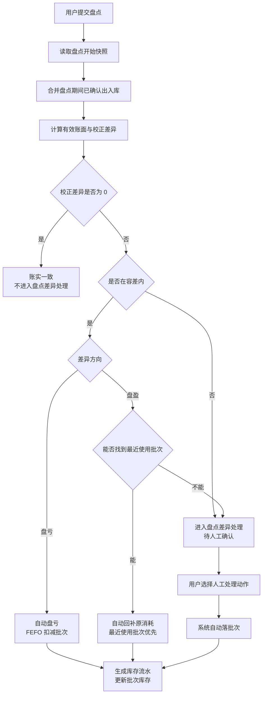

# 盘点差异自动处理规则

## 背景

Sentri 盘点按 **物料总数** 盘点，不要求用户逐个批次录入实盘数量。用户提交盘点后，系统需要先判断哪些差异可以自动闭环，哪些差异需要进入「盘点差异处理」由用户确认。

当前规则的核心是：

1. 先用盘点开始快照和盘点期间已发生的出入库，剔除账面变化造成的假差异。
2. 容差内的小差异尽量自动处理。
3. 超容差差异直接进入「盘点差异处理」，由用户选择处理动作。
4. 差异处理最终必须落到批次和库存流水；涉及批次时由系统自动选择批次，不让用户手动选批次。

## 目标

1. 用户提交盘点后，系统自动处理可闭环的小差异，减少逐条人工操作。
2. 小盘盈不默认新增盘盈批次，避免被误解为凭空产生采购成本。
3. 人工处理差异时，动作选项收敛为盘盈 3 类、盘亏 3 类，减少重复选项。
4. 批次落点由系统自动完成：盘盈优先补最近使用批次，盘亏按 FEFO 扣减。
5. 「盘点差异处理」页只承载需要人工确认的差异；已处理记录可查看处理结果。

## 对象

**Console 库管用户**

- 发起盘点、录入物料总实盘数、提交盘点。
- 对系统无法自动处理的差异选择处理动作和处理原因。
- 不需要在差异处理时选择具体批次。

**系统**

- 计算有效账面和校正差异。
- 判断容差内小差异是否可以自动闭环。
- 根据处理动作自动分配批次并生成库存流水。

## 价值

- **少点错**：用户只判断业务原因，不再手选批次。
- **成本更稳**：小盘盈优先理解为前期消耗多扣后的回补，而不是新采购。
- **账实更快一致**：小差异可自动更新库存，超容差差异集中人工处理。
- **页面更清楚**：人工动作从重复来源选项收敛成 6 个可理解的处理动作。

## 程序流程图



## 操作流程图

### 常规自动处理

1. 用户发起盘点并录入物料实盘总数。
2. 用户点击 `提交盘点`。
3. 系统计算校正差异。
4. 小盘亏自动扣减库存；小盘盈能找到最近使用批次时自动回补。
5. 自动处理完成后生成库存流水，差异进入 `已处理`。

### 人工处理

1. 超容差差异，或无法自动回补的小盘盈，进入「盘点差异处理」。
2. 用户打开 `处理差异` 抽屉。
3. 用户选择处理动作和处理原因。
4. 用户点击确认后，系统自动选择批次并生成库存流水。
5. 差异从 `待处理` 进入 `已处理`。

## 功能说明

### 8.1 差异计算

系统提交盘点时，不直接用提交瞬间账面和实盘比较，而是先计算有效账面。

```text
有效账面 = 盘点开始快照 + 盘点期间入库 - 盘点期间出库
校正差异 = 实盘数量 - 有效账面
```

如果校正差异为 0，说明账实一致，不进入「盘点差异处理」。

**例子：盘点期间发生入库**

- 开始盘点时账面：100 盒
- 盘点期间入库：20 盒
- 有效账面：120 盒
- 用户实盘：120 盒
- 结论：无差异，不需要处理

### 8.2 容差内小差异自动处理

容差用于处理低风险的小尾差。当前容差口径：

| 分组 | 适用物料 | 数量容差 |
|---|---|---|
| A | 疫苗、兽药 | ±2% 或 ±1 最小包装单位，取较大者 |
| B | 饲料、消毒用品、保健品 | ±5% |
| C | 工具、其他 | ±5% 或 ±1 最小包装单位，取较大者 |

#### 小盘亏

小盘亏自动处理为库存减少，系统按 FEFO 规则扣减批次。

**例子：饲料小盘亏**

- 有效账面：1000 kg
- 实盘：960 kg
- 差异：-40 kg，差异比例 4%
- 饲料容差：±5%
- 结论：在容差内，系统自动扣减 40 kg
- 批次：按 FEFO 从最早到期批次开始扣

#### 小盘盈

小盘盈默认按「前期消耗或出库多扣」理解。系统会查该物料最近使用过的批次，优先把库存补回最近使用批次；如果最近批次可回补数量不够，继续补更早使用的批次。

小盘盈不会默认新增盘盈批次。

**例子：氟苯尼考小盘盈**

- 有效账面：1850 ml
- 实盘：1852 ml
- 差异：+2 ml
- 最近使用批次：`FL-202606-B`
- 结论：系统自动回补 `FL-202606-B` 2 ml
- 库存流水：生成 `消耗冲销 +2 ml`

这样做的含义是：之前系统可能多记了 2 ml 消耗，现在把多记的消耗冲回来。它不是新采购，也不会新增一个盘盈批次。

如果系统找不到最近使用批次，该差异进入「盘点差异处理」，由用户确认原因。

### 8.3 超容差差异

超容差差异风险更高，不由系统猜原因，直接进入「盘点差异处理」。

**例子：大盘盈**

- 有效账面：80 ml
- 实盘：120 ml
- 差异：+40 ml
- 已超过容差
- 结论：进入「盘点差异处理」，由用户选择是回补原消耗、入库数量更正，还是补录入库数量与金额

### 8.4 人工处理动作

人工处理动作按盘盈、盘亏分为 6 类。

| 差异方向 | 处理动作 | 适用场景 | 库存流水 | 批次落点 |
|---|---|---|---|---|
| 盘盈 | 回补原消耗 | 前期任务、出库或手工领用多扣 | 消耗冲销（+） | 最近使用批次优先，不够继续补上一个使用批次 |
| 盘盈 | 更正入库数量（金额不变） | 原采购金额没错，但数量录少 | 入库更正（+） | 系统自动补到相关可用批次 |
| 盘盈 | 补录入库数量和金额 | 到货和金额都漏记，需要补数量和金额 | 入库更正（+） | 系统补到自动选中的既有批次 |
| 盘亏 | 补记业务消耗 / 出库 | 实物已用掉，系统漏扣 | 业务消耗（-） | FEFO 自动扣减 |
| 盘亏 | 更正入库多录 | 前期入库数量录多 | 入库更正（-） | FEFO 自动扣减 |
| 盘亏 | 报废 / 损耗处理 | 破损、污染、过期、变质、保存异常 | 报废（-） | FEFO 自动扣减 |

用户只选择处理动作和处理原因，不选择批次。

处理抽屉中的处理动作卡片使用更偏现场用户理解的三段说明，不展示内部流水、成本重算等专业表达：

| 差异方向 | 处理动作 | 适用于 | 库存处理 | 账务处理 |
|---|---|---|---|---|
| 盘亏 | 补记业务消耗 / 出库 | 实物已经领用、使用或发出，只是之前没有登记。 | 按库存先进先出的顺序扣减对应批次库存。 | 按实际领用记录成本，补齐本次业务消耗。 |
| 盘亏 | 更正入库多录 | 之前入库数量录多了，需要改回实际数量。 | 按库存先进先出的顺序扣减对应批次库存。 | 修正库存数量，不补记历史领用记录。 |
| 盘亏 | 报废 / 损耗处理 | 实物已经损坏、过期或无法继续使用。 | 按库存先进先出的顺序扣减对应批次库存。 | 按损耗记录本次成本，作为报废或损耗处理。 |
| 盘盈 | 回补原消耗 | 之前领用或出库数量记多了，需要冲回。 | 优先回补最近扣减的批次，不足时继续回补更早批次。 | 冲减之前记录的消耗成本。 |
| 盘盈 | 更正入库数量（金额不变） | 实际入库数量更多，只需修正库存数量。 | 补回对应批次库存；无法确定时补到最早可用批次。 | 只调整库存数量，不影响采购金额。 |
| 盘盈 | 补录入库数量和金额 | 有一批货未登记，需要补录入库。 | 新增对应批次库存。 | 补记本次采购金额，形成完整入库记录。 |

### 8.5 批次自动落点规则

#### 盘盈批次落点

盘盈类处理优先按最近使用批次回补。

规则：

1. 找该物料最近一笔业务消耗或出库流水对应的批次。
2. 先把盘盈数量补到该批次。
3. 如果该批次可回补数量不够，继续找上一笔使用批次。
4. 补录入库数量和金额时，系统补到自动选中的既有批次，不需要用户选批次。

**例子：跨批次回补**

- 盘盈：+15 ml
- 最近使用批次 `B` 可回补 10 ml
- 上一个使用批次 `A` 可回补 20 ml
- 系统处理：
  - `B` 回补 10 ml
  - `A` 回补 5 ml

#### 盘亏批次落点

盘亏类处理统一按 FEFO 扣减，即优先扣最早到期、仍可用的批次。

**例子：FEFO 扣减**

- 盘亏：-12 kg
- 批次 `A` 到期更早，剩余 8 kg
- 批次 `B` 到期更晚，剩余 20 kg
- 系统处理：
  - 先扣 `A` 8 kg
  - 再扣 `B` 4 kg

### 8.6 盘点差异分析 + 处理页

页面标题为 `盘点差异处理`。处理抽屉标题为 `盘点差异分析 + 处理`，分析应发生在处理动作选择之前。

差异处理抽屉中，物料差异信息下方必须展示 `库存变动（近30天）` 区域：

- 展示当前库存。
- 展示最近一次盘点结果与日期；如果无盘点记录，展示暂无记录。
- 展示该物料近 30 天最近 5 条库存流水，包含日期、流水类型、来源和库存变化数量。
- 右上角提供 `查看更多`，跳转到该物料详情页的 `库存流水` tab，查看完整流水。
- 库存流水列表只作为分析线索，不改变处理动作、原因、金额补录和批次自动落点规则。

**待处理 tab 字段：**

- 物料、分类、有效账面库存、实盘库存、差异数量、盘点结果、盘点人/时间、操作。
- 操作为 `处理差异`。

**已处理 tab 字段：**

- 物料、分类、有效账面库存、实盘库存、差异数量、盘点结果、盘点人/时间、处理方式、处理人/时间。
- 已处理记录只读展示，不提供再次处理入口。

**字段说明：**

- `盘点结果` 展示 `盘盈` 或 `盘亏`。
- `盘点人/时间` 展示本次盘点提交人和提交时间。
- `处理方式` 展示用户选择的处理动作。
- `处理人/时间` 展示完成处理的用户和处理完成时间；自动处理记录处理人为 `系统`。

### 8.7 库存流水

每次自动处理或人工确认后，都必须生成库存流水。

| 处理动作 | 库存流水类型 | 数量方向 |
|---|---|---|
| 回补原消耗 | 消耗冲销 | 增加 |
| 更正入库数量（金额不变） | 入库更正 | 增加 |
| 补录入库数量和金额 | 入库更正 | 增加 |
| 补记业务消耗 / 出库 | 业务消耗 | 减少 |
| 更正入库多录 | 入库更正 | 减少 |
| 报废 / 损耗处理 | 报废 | 减少 |
| 容差内小盘亏自动处理 | 盘亏 | 减少 |

流水备注需要记录来源盘点单、处理动作、处理原因和系统自动落到的批次。

## 边际情况 / 异常情况

| 场景 | 系统行为 |
|---|---|
| 校正差异为 0 | 不进入「盘点差异处理」 |
| 容差边界恰好等于阈值 | 视为容差内 |
| 小盘盈找不到最近使用批次 | 进入「盘点差异处理」 |
| 盘盈跨多个最近使用批次 | 按最近使用顺序依次回补 |
| 盘亏可用批次不足 | 先扣完可用批次，剩余部分按负库存口径记录 |
| 用户选择其他原因 | 必填原因备注 |
| 处理失败 | 不更新库存，保留在待处理列表并提示失败原因 |

## 验收标准

1. 待处理和已处理 tab 均展示 `盘点人/时间`。
2. 人工处理盘盈只展示 `回补原消耗`、`更正入库数量（金额不变）`、`补录入库数量和金额`。
3. 人工处理盘亏只展示 `补记业务消耗 / 出库`、`更正入库多录`、`报废 / 损耗处理`。
4. 人工处理抽屉不出现批次选择器。
5. 盘盈回补按最近使用批次自动落点；数量不够时继续回补上一个使用批次。
6. 盘亏按 FEFO 自动扣减批次。
7. 处理完成后生成正确库存流水，并把差异移动到已处理。
8. `npx tsx src/components/inventory/inventoryUtils.test.ts` 和 `npm run build` 通过。
