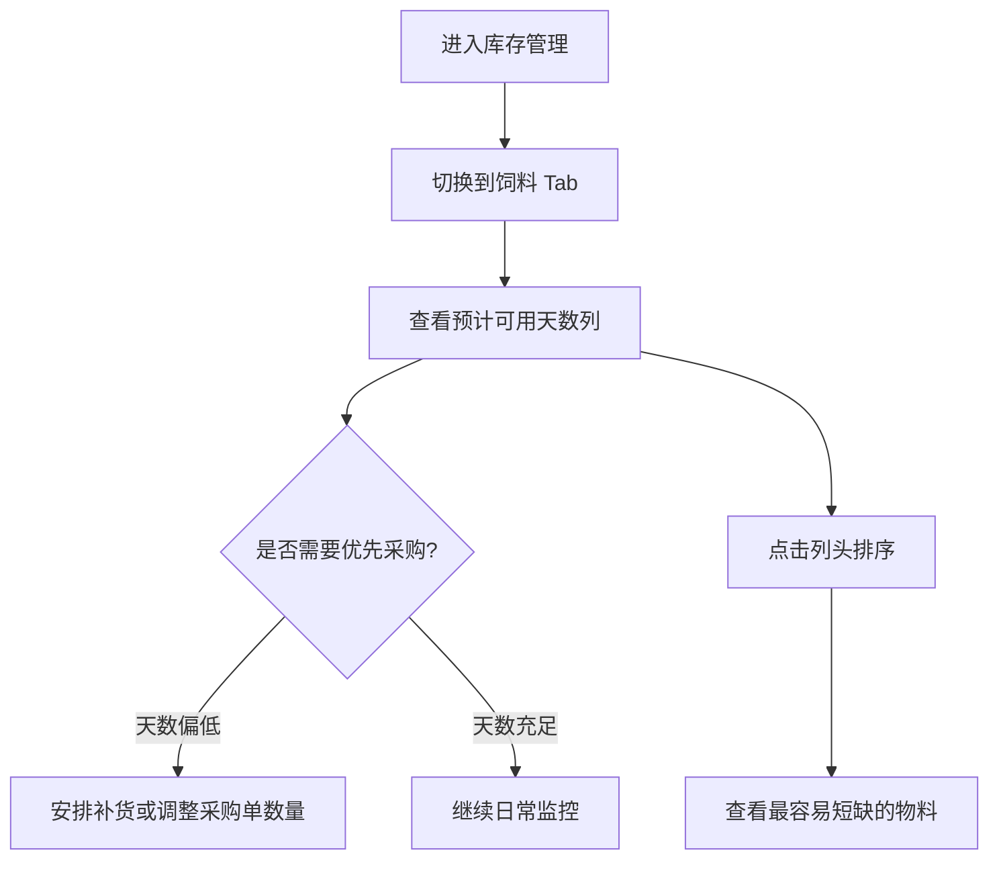

# 饲料预计可用天数

## 背景

饲料是猪场日常生产中的高频、连续消耗物料。仓库管理员查看库存列表时，除了当前库存余量，还需要判断「还能支撑几天」，以便优先安排采购、补货或现场核对。

药品消耗受疾病、治疗方案、免疫批次和临时处置影响较大，缺少稳定日均消耗口径，当前阶段不在库存首页药品 Tab 展示「预计可用天数」。

## 目标

在**饲料**分类库存列表中展示「预计可用天数」字段，根据当前库存余量与近 7 天平均日消耗自动计算，帮助管理者评估断料风险。

- 仅饲料展示该字段；药品、消耗品、工具、其他不展示。
- 计算结果仅供库存管理和采购判断参考，不作为自动采购计划。

## 对象

**Console 用户（仓库管理员 / 场长）**

在库存管理首页切换到「饲料」分类 Tab 后，查看物料列表，结合当前库存、预计可用天数、最近到期日和库存状态判断是否需要采购、优先使用或发起盘点。

## 价值

- 无需手工估算「还能用几天」，降低断料遗漏概率。
- 药品列表不展示预计可用天数，避免用不稳定消耗数据误导库存判断。
- 与现有库存余量、风险模块和采购单编辑页形成一致口径，支撑采购数量判断。

## 程序流程图

```mermaid
flowchart LR
  A[读取饲料当前库存] --> B[汇总近7天业务消耗流水]
  B --> C{7天平均日消耗 > 0?}
  C -- 否 --> D[展示 —]
  C -- 是 --> E[可用天数 = floor(当前库存 ÷ 日均消耗)]
  E --> F[映射文字颜色等级]
  F --> G[列表展示并支持排序]
  G --> H[生成采购单时复用同一字段]
```

## 操作流程图



## 功能说明

### 展示位置

- 库存管理首页 → 物料列表 → **饲料** Tab。
- 列位于「当前库存」之后、「最近到期日」之前。
- 药品、消耗品、工具、其他 Tab 不展示该列。
- 生成采购单编辑页、采购单详情和导出文件仅对饲料复用同一「预计可用天数」字段。

### 字段：预计可用天数

按照近 7 天平均日消耗计算，表示当前库存预计还能满足正常生产使用的天数。

**计算公式**

```text
预计可用天数 = 当前库存 ÷ 日均消耗量
日均消耗量 = 近7天业务消耗总量 ÷ 7
```

结果向下取整，展示为 `N天`。

**示例**

| 物料 | 当前库存 | 近7天平均消耗 | 预计可用天数 |
|---|---:|---:|---:|
| 哺乳母猪料 | 14,000kg | 7,000kg/天 | 2天 |

### 特殊情况

| 场景 | 展示 | 说明 |
|---|---|---|
| 近 7 天无消耗记录 | — | 不在单元格上展示 Tooltip |
| 库存为 0 | 0天（红色） | 表示已经无可用库存 |
| 库存小于 0 | — | 负库存先通过盘点或修正处理 |

### 颜色提示

| 预计可用天数 | 颜色 | 状态 |
|---|---|---|
| ≤3 天 | 红色 | 紧急 |
| 4~7 天 | 橙色 | 偏低 |
| 8~15 天 | 黄色 | 关注 |
| ＞15 天 | 绿色 | 正常 |
| 无法计算 | 灰色 | — |

列表中只展示纯文本天数，例如 `2天`、`13天`、`—`。不展示 Tooltip、健康条、圆点、图标或额外状态文案。

### 排序

- 「预计可用天数」列支持排序。
- 饲料 Tab 默认按预计可用天数从小到大排序，无数据（—）排在末尾。

## 边际情况 / 异常情况

- 近 7 天仅有零星消耗：仍按 7 个自然日平均，可能出现天数偏高，需结合业务判断。
- 新入库饲料尚无消耗流水：显示 `—`。
- 药品 Tab 不展示该字段，避免因消耗场景不稳定导致计算结果误导。
- 消耗流水含冲销：当前原型仅统计 `业务消耗` 类型；后续若需扣减冲销量，需产品确认口径。
- 多单位物料统一按核算单位计算，与当前库存口径一致。
