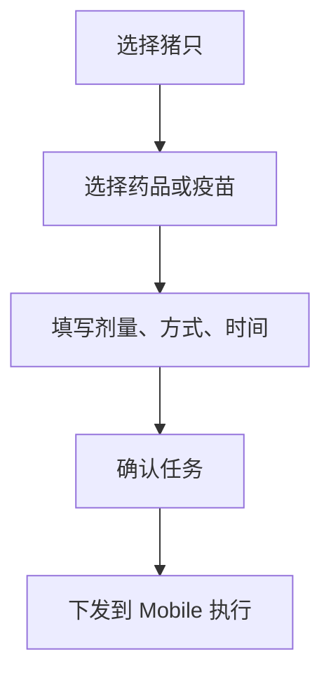
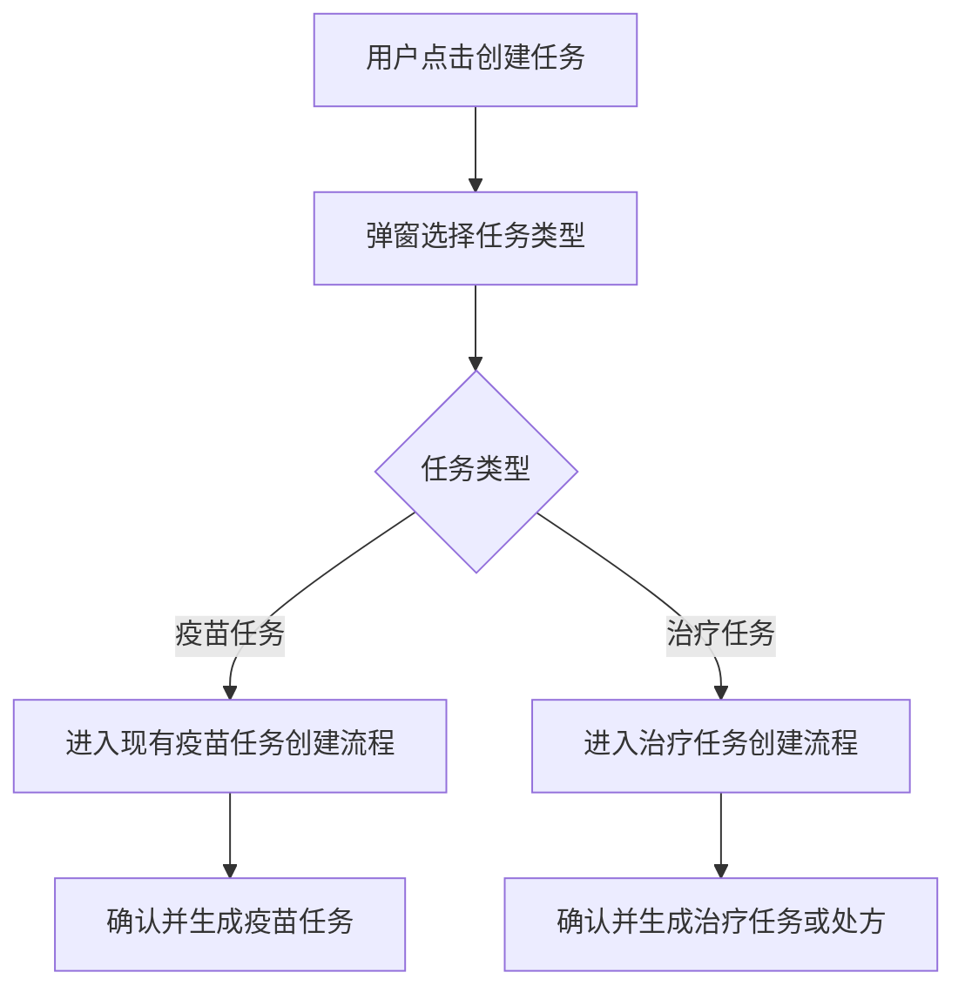
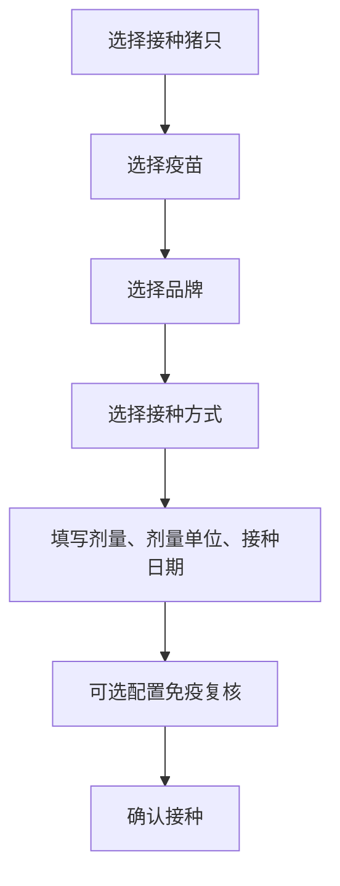
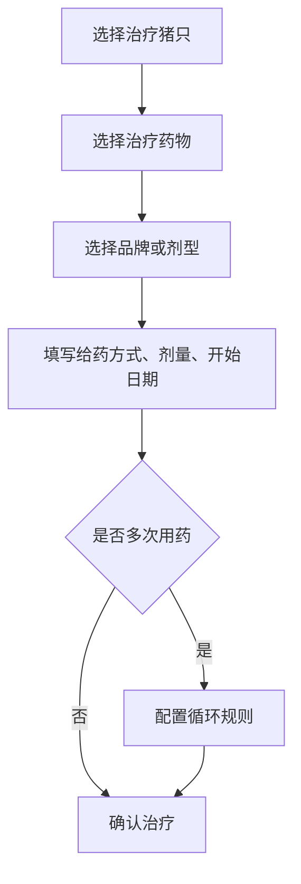
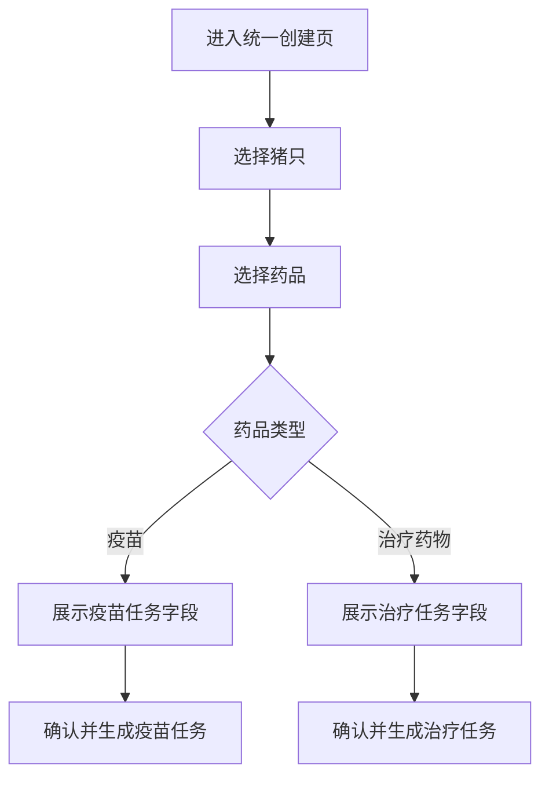
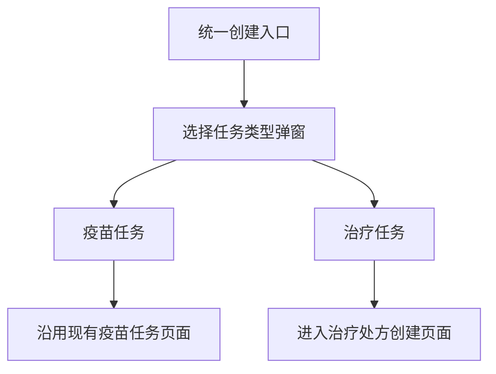
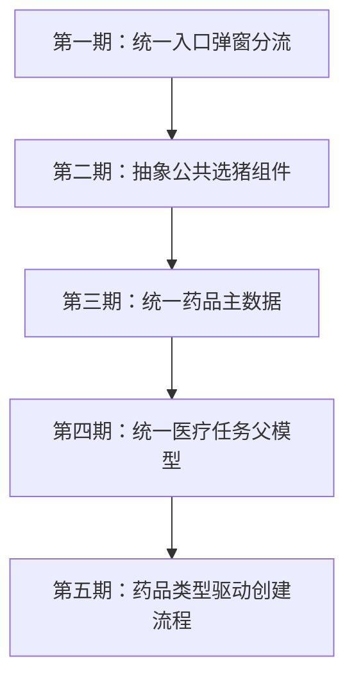

# PRD：疫苗任务与治疗任务统一入口方案

## 背景

当前系统中，疫苗任务和治疗处方在宏观操作上有相似链路：

但两者业务语义不同：

- 疫苗任务偏预防性接种，核心是接种、免疫复核、补打、重新接种。
- 治疗任务偏疾病处理，核心是治疗原因、用药方案、多次用药、疗程执行。

因此本方案不建议在第一阶段强行融合两个创建流程，而是先统一入口，保留现有业务页面，降低开发风险并避免用户认知混乱。

## 目标

- 让用户从一个统一入口发起“医疗类任务”创建。
- 保留疫苗任务和治疗任务各自清晰的业务语言与页面流程。
- 为后续统一药品主数据、统一任务模型、统一 Mobile 执行框架预留空间。
- 避免第一期改动破坏当前已经完成的疫苗任务闭环。

## 非目标

- 第一阶段不重构现有疫苗任务创建页。
- 第一阶段不把疫苗任务和治疗处方合并成同一个大表单。
- 第一阶段不恢复疫苗任务中的多次接种、间隔时间、间隔单位字段。
- 第一阶段不要求治疗任务复用疫苗的免疫复核逻辑。

## 方案 A：入口分流型（MVP 推荐）

### 操作流程

### 用户体验

用户点击统一按钮，例如“创建任务”或“创建医疗任务”。系统弹出选择弹窗：

| 选项 | 说明 | 进入页面 |
|---|---|---|
| 创建疫苗任务 | 用于预防性接种、补打、重新接种等接种场景 | 现有疫苗任务创建页 |
| 创建治疗任务 | 用于疾病、症状、异常猪只的治疗用药 | 治疗处方/治疗任务创建页 |

### 疫苗任务流程

沿用现有疫苗任务流程：

现有核心字段：

| 字段 | 是否必填 | 说明 |
|---|---|---|
| 接种猪只 | 是 | 从猪只列表勾选 |
| 疫苗 | 是 | 选择疫苗类药品 |
| 品牌 | 否/按业务配置 | 选择后可带出接种方式 |
| 接种方式 | 是 | 例如肌内注射、皮下注射、滴鼻、饮水、喷雾 |
| 剂量 | 是 | 数值 |
| 剂量单位 | 是 | 毫克或毫升 |
| 接种日期 | 是 | 本次任务执行日期 |
| 免疫复核 | 否 | 开启后配置采样与合格率阈值 |

### 治疗任务流程

治疗任务保留独立业务流程：

治疗任务核心字段：

| 字段 | 是否必填 | 说明 |
|---|---|---|
| 治疗猪只 | 是 | 可按疾病标签批量选择，也可手动选择 |
| 疾病/症状标签 | 视入口而定 | 按疾病创建时自动带入 |
| 治疗药物 | 是 | 选择治疗药品 |
| 品牌/剂型 | 否/按业务配置 | 用于明确实际用药 |
| 给药方式 | 是 | 例如注射、饮水、拌料、口服等 |
| 剂量 | 是 | 数值 |
| 剂量单位 | 是 | 由药品类型决定 |
| 治疗开始日期 | 是 | 第一次治疗时间 |
| 多次用药 | 否 | 默认关闭，关闭时系统按 1 次治疗处理，不展示剂次字段 |
| 剂次 | 多次用药时必填 | 仅打开多次用药后展示并选择 |
| 循环规则 | 多次用药时必填 | 打开多次用药后展示剂次、间隔时间、间隔时间单位 |
| 处方备注 | 否 | 记录治疗说明 |

### Console 选猪筛选规则

- 健康诊疗页初次进入时不直接展示猪只列表。
- 用户必须先使用结构化条件缩小范围后，系统才展示对应猪只。
- 结构化条件包括栏位/舍、疾病标签、症状标签、健康诊疗状态。
- 猪只 ID 通过搜索实现，不作为结构化筛选入口。
- ID 搜索只在已有结构化筛选结果内继续缩小范围；仅输入 ID 时不展示猪只列表。
- 筛选出猪只但用户尚未勾选时，不展示绿色批量选择条和创建任务按钮。
- 用户至少勾选一头猪后，才展示绿色批量选择条、已选数量和创建任务按钮。
- 进入任务配置页后，顶部创建对象摘要只展示创建方式、目标猪只数量和来源/筛选条件，不展示猪只耳标号。
- 这样设计是为了适配实际场景中可能存在十万级猪只的规模，避免用户从全量列表中查找。

### 任务配置页面一致性

- 疫苗、兽药、保健品进入任务配置后应使用一致的页面骨架。
- 页面结构保持为：创建对象摘要、药品/任务信息表单、底部操作。
- 不在表单前额外展示缺少业务信息的说明卡片。
- 不同任务类型只改变字段内容，不改变主要布局。
- 保健品按治疗用药任务体系创建，但需要在页面中明确显示药品类型为保健品。

### 优点

- 开发风险最低。
- 疫苗任务现有页面、字段、Mobile 下发逻辑不需要重构。
- 用户一开始就知道自己在创建“疫苗任务”还是“治疗任务”。
- 两条业务线后续可以独立演进。
- 后续仍可在组件层逐步复用选猪、药品选择、确认页等能力。

### 风险

| 风险 | 处理方式 |
|---|---|
| 只是入口统一，没有真正合并业务模型 | 第一阶段接受该限制，先保证用户心智清晰 |
| 两套流程可能重复开发选猪能力 | 第二阶段抽象公共选猪组件 |
| 药品主数据仍可能分散 | 后续独立做药品主数据统一 |
| 用户误选任务类型 | 弹窗文案明确说明疫苗任务和治疗任务的适用场景 |

## 方案 B：药品类型驱动型（长期演进）

### 操作流程

### 设计思路

药品主数据统一为一个药品库，疫苗是药品类型之一。

| 药品类型 | 对应创建内容 |
|---|---|
| 疫苗 | 接种日期、接种方式、剂量、免疫复核等 |
| 治疗药物 | 治疗开始日期、给药方式、剂量、多次用药、循环规则等 |

### 优点

- 更接近长期统一的医疗任务模型。
- 药品主数据可以统一治理。
- 选猪、选药、剂量、时间、确认页可以逐步组件化。
- 未来可扩展驱虫、保健、营养补充等更多药品类型。

### 风险

| 风险 | 说明 |
|---|---|
| 用户心智不清 | 用户先选药品，可能不知道自己正在创建哪类任务 |
| 页面跳变复杂 | 选择不同药品类型后，字段大幅变化 |
| 数据保留规则复杂 | 切换药品类型时，已填写字段哪些保留、哪些清空需要明确 |
| 开发改造范围大 | 需要改造现有疫苗任务页面与数据流 |
| 业务边界容易混淆 | 疫苗的免疫复核和治疗的循环用药不能混成一套字段 |

### 适用阶段

方案 B 不建议作为第一期开发目标。它适合在以下条件具备后推进：

- 药品主数据已经统一。
- 疫苗任务和治疗任务的后端模型已经有统一父级。
- Mobile 执行端已经支持通用医疗任务框架。
- 用户已经接受“医疗任务”这个统一概念。

## 推荐结论

第一期采用方案 A：入口分流型。

产品形态：

长期演进保留方案 B，但不在第一期实现。

## 关键问题清单

### 前端开发视角

1. 统一入口放在哪个页面，是疫苗任务页、健康诊疗页，还是新的医疗任务页？
2. 弹窗选择后是否跳转到现有路由，还是在当前页面内切换组件？
3. 疫苗任务是否完全复用现有页面，不做字段调整？
4. 治疗任务是否也采用三步流程：选猪、添加药物、确认治疗？
5. 选择猪只组件是否第一期复用，还是先各自实现？
6. 弹窗关闭后是否保留用户已选猪只上下文？
7. 从疾病标签进入治疗任务时，是否跳过部分选猪步骤？
8. 确认页是否各自独立，还是使用统一壳层？
9. Mobile 端任务卡是否第一期区分疫苗和治疗两种卡片？
10. 后续方案 B 是否需要提前预留药品类型字段？

### 后端开发视角

1. 第一阶段是否保持疫苗任务和治疗任务两套后端接口？
2. 是否需要新增统一任务入口 API，还是前端直接路由分流？
3. 疫苗任务和治疗任务是否需要统一任务编号规则？
4. 治疗处方创建后，是生成一个处方对象，还是直接生成多个治疗执行任务？
5. 多次用药规则由创建时展开，还是由调度服务按时间展开？
6. 治疗任务是否需要记录疾病标签、开方人、备注等处方信息？
7. 药品主数据第一期是否区分疫苗库和治疗药品库？
8. Mobile 执行记录是否统一存储，还是疫苗和治疗分表？
9. 历史疫苗任务是否完全不迁移？
10. 方案 B 所需的 drugType、taskType 是否第一期就写入数据？

### 资深用户视角

1. 我能不能一眼看懂应该选择疫苗任务还是治疗任务？
2. 如果我是按疾病标签进入，系统是否应该默认推荐治疗任务？
3. 如果我是从疫苗任务页进入，是否还需要看到治疗任务选项？
4. 创建疫苗任务会不会因为统一入口变得更慢？
5. 创建治疗任务时，能不能一次选多头猪？
6. 治疗任务是否支持一次添加多个药物？
7. 多次用药的规则能不能表达真实疗程？
8. Mobile 上现场人员能不能清楚区分接种和治疗？
9. 历史疫苗记录和治疗记录能不能分开追溯？
10. 如果选错任务类型，是否可以返回重新选择？

### 产品经理视角

1. 统一入口的核心目标是降低用户寻找成本，还是统一医疗任务心智？
2. 第一阶段是否只做入口分流，不承诺底层模型统一？
3. 疫苗任务和治疗任务是否仍在导航中保留独立入口？
4. 治疗任务是否定义为任务，还是定义为处方加执行任务？
5. 是否需要在文案上统一叫“医疗任务”，还是继续叫“疫苗任务/治疗任务”？
6. 哪些字段必须第一期完成，哪些放到后续？
7. 治疗任务是否需要审核、休药期、禁忌提醒？
8. 方案 B 的触发条件是什么，什么时候才值得做？
9. 报表是否第一期合并展示疫苗和治疗？
10. 如何确保统一入口不会影响现有疫苗任务的稳定性？

## 第一阶段开发边界

### 必做

- 在合适入口增加“创建任务”按钮。
- 点击后展示任务类型选择弹窗。
- 弹窗包含“创建疫苗任务”和“创建治疗任务”两个选项。
- 选择疫苗任务后进入现有疫苗任务创建流程。
- 选择治疗任务后进入治疗任务/处方创建流程。
- 两条流程最终各自生成对应业务任务。

### 暂不做

- 不做统一大表单。
- 不做药品类型驱动页面切换。
- 不迁移历史疫苗任务数据。
- 不改造现有疫苗任务字段。
- 不把疫苗的免疫复核迁移到治疗任务。

## 状态与数据建议

第一阶段前端可以先通过路由和页面状态分流：

| 字段 | 建议值 | 说明 |
|---|---|---|
| taskCategory | medical | 表示医疗类任务，可选 |
| taskType | vaccination / treatment | 明确业务类型 |
| source | vaccine_task / health_diagnosis / unified_create | 记录入口来源 |

如果后端第一期不做统一任务表，也建议在各自业务对象中保留 `taskType`，便于后续演进。

## 验收标准

- 用户点击统一创建入口后，能明确选择创建疫苗任务或治疗任务。
- 选择疫苗任务后，现有疫苗任务创建流程不受影响。
- 选择治疗任务后，进入治疗处方/治疗任务创建流程。
- 两类任务在确认页、列表页、Mobile 执行端均能保持业务语义清晰。
- 疫苗任务不重新暴露多次接种、间隔时间、间隔单位。
- Console 选猪页初始不展示猪只，仅在使用结构化筛选条件后展示匹配猪只。
- 猪只 ID 搜索只作用于筛选结果，不作为全量查找入口。
- 绿色批量选择条仅在用户已勾选猪只后展示。
- 任务配置页顶部摘要不展示选中猪只耳标号，避免大量选中时造成信息拥挤。
- 疫苗、兽药、保健品任务配置页保持一致页面骨架。
- 文档中已明确方案 B 为长期演进，不进入第一期开发范围。

## 后续演进路线

## 结论

第一阶段采用“入口统一、流程分开”的方式最稳妥。它可以让产品先获得统一医疗任务入口，同时最大限度复用现有疫苗任务能力，并给治疗任务保留独立业务表达。

方案 B 作为长期演进方向保留，但必须等药品主数据、任务模型、Mobile 执行框架都具备统一基础后再推进。
