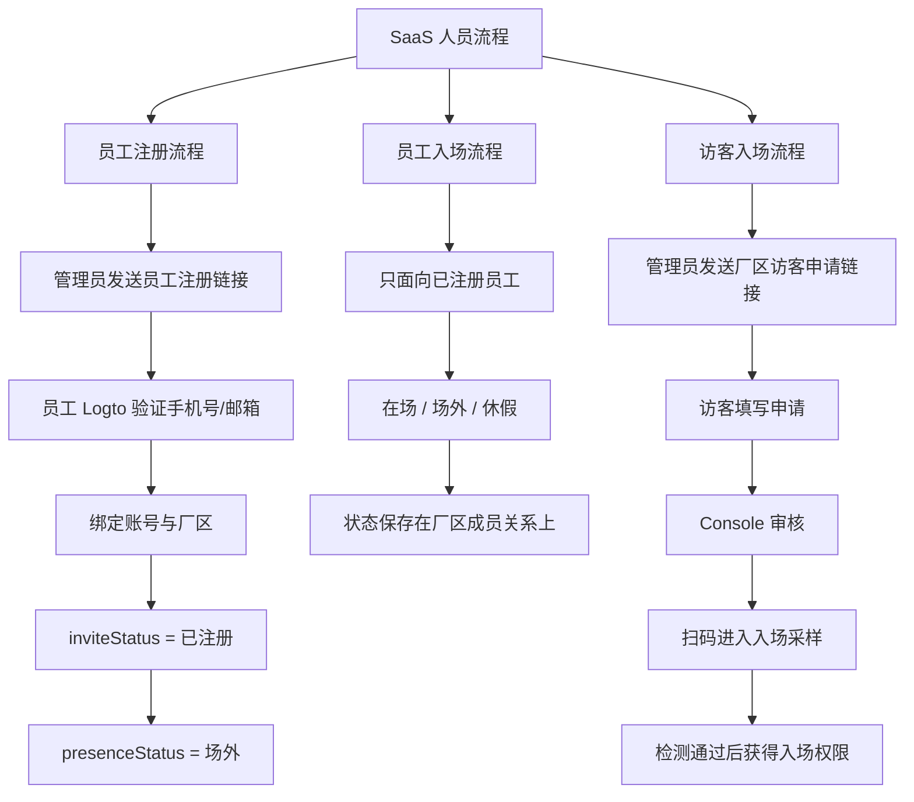

# PRD：SaaS 登陆与入场流程总览

## 背景

当前养殖系统正在从单厂区交付逐步改造成 SaaS 多厂区模式。厂区是最小租户单位，一个用户账号可以加入多个厂区。系统接入 Logto 后，员工可以通过手机号或邮箱验证码完成身份验证；但身份验证只是确认“这个人是谁”，能否进入某个厂区仍由业务系统的邀请和厂区成员关系决定。

本目录将 SaaS 改造下的人员相关流程拆为三份 PRD：

| 文档 | 说明 |
|---|---|
| `01-员工注册流程.md` | 员工通过管理员邀请完成账号验证、厂区绑定和注册状态流转 |
| `02-员工入场流程.md` | 已注册员工在场、场外、休假的现场状态流转 |
| `03-访客入场流程.md` | 访客提交入场申请、Console 审核、扫码采样、检测通过后获得入场权限 |

## 总体原则

- 厂区是最小租户单位。
- 员工账号可以加入多个厂区。
- Logto 负责身份验证，业务系统负责厂区绑定和入场资格。
- 员工注册状态与员工在场状态分开。
- 访客不是系统用户，不需要注册账号，也不进入 Console 或 Mobile。
- 访客入场必须先提交申请并通过 Console 审核；检测通过后才赋予入场权限。

## 三条主链路

## 核心状态边界

| 流程 | 状态维度 | 状态 | 说明 |
|---|---|---|---|
| 员工注册 | inviteStatus | 待注册、已注册、已过期 | 描述员工在某个厂区下的邀请/绑定进度 |
| 员工入场 | presenceStatus | 在场、场外、休假 | 描述已注册员工在某个厂区下的现场状态 |
| 访客入场 | visitorApplyStatus | 待审核、已通过、已拒绝、已过期 | 描述访客入场申请的审核状态 |
| 访客入场 | samplingStatus | 未采样、采样中、待检测、检测通过、检测未通过 | 描述访客入场采样和检测进度 |
| 访客入场 | entryPermissionStatus | 未生效、已生效 | 描述访客是否获得入场权限 |

## 关键区别

| 对比项 | 员工 | 访客 |
|---|---|---|
| 是否创建系统账号 | 是 | 否 |
| 是否使用 Logto | 注册时使用 | MVP 入场申请不使用；扫码采样时可作为安全增强 |
| 是否进入 Console/Mobile | 是，按后续权限进入 | 否，只进入入场申请和采样页面 |
| 是否绑定厂区成员关系 | 是 | 否 |
| 是否有在场状态 | 是 | 否 |
| 入场前是否需要审核 | 员工注册不需要入场审核 | 访客申请必须经 Console 审核通过 |
| 是否需要检测通过 | 员工入场流程暂不涉及 | 访客必须采样并检测通过后才获得入场权限 |

## 后续实现顺序建议

1. 先实现员工注册流程，因为它是 SaaS 多厂区账号体系的基础。
2. 再实现员工入场流程，用于管理已注册员工的现场状态。
3. 最后实现访客入场流程，因为它涉及申请、审核、采样点二维码、检测结果和入场权限多个模块。
