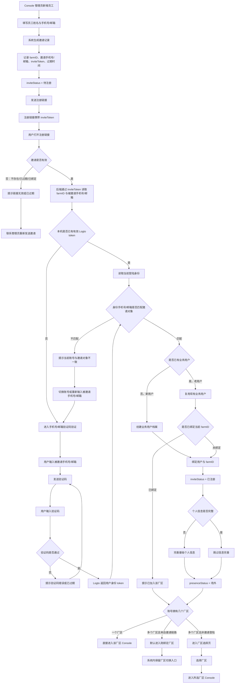
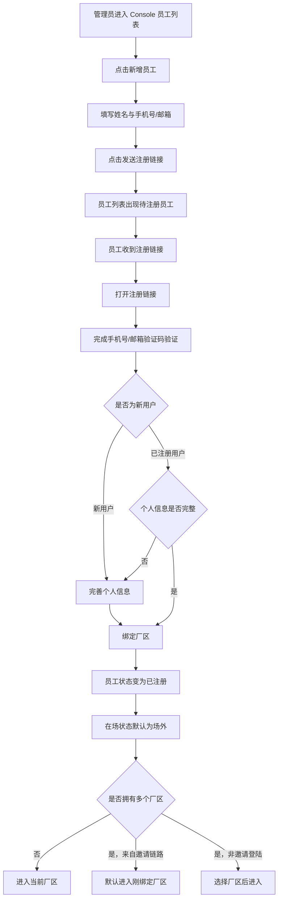

# PRD：员工注册流程

## 背景

系统将从单厂区部署逐步改造成 SaaS 多厂区模式。厂区是最小租户单位，一个用户账号可以加入多个厂区。员工注册流程的核心不是让用户创建一个全局账号，而是让员工通过管理员邀请，把已验证的手机号或邮箱身份绑定到指定厂区。

本流程接入 Logto。Logto 负责确认“这个人是谁”，业务系统负责确认“这个人是否通过邀请加入了当前厂区”。

## 目标

- 支持 Console 管理员新增员工并发送注册链接。
- 支持新用户通过手机号或邮箱验证码完成账号创建和厂区绑定。
- 支持已注册用户通过邀请链接绑定新的厂区。
- 支持一个账号加入多个厂区。
- 明确员工注册状态只属于厂区邀请关系，不是全局账号状态。

## 非目标

- 不设计访客入场申请流程。
- 不设计员工入场、离场、休假等现场状态流转。
- 不设计角色权限细节、账号封禁、账号暂停等能力。
- 不允许 Console 管理员管理其他人的 Logto 账号状态。

## 对象

| 对象 | 说明 | 核心诉求 |
|---|---|---|
| Console 管理员 | 在厂区内添加员工并发送注册链接 | 快速添加员工，看到注册进度 |
| 新员工 | 首次使用系统的员工 | 按邀请完成手机号/邮箱验证和注册 |
| 已注册员工 | 已有账号，被邀请加入新厂区 | 复用现有账号，不重复注册 |
| 多厂区管理者 | 一个账号拥有多个厂区登陆权限 | 能绑定新厂区，并能切换厂区 |
| 后端服务 | 管理邀请、用户档案和厂区成员关系 | 保障邀请安全和租户隔离 |
| Logto | 提供手机号/邮箱验证码验证 | 只负责身份认证 |

## 状态定义

### 1. 邀请状态 inviteStatus

邀请状态属于“员工在某个厂区下的邀请关系”。

| 状态 | 含义 | 产生方式 |
|---|---|---|
| 待注册 | 管理员已添加员工并发送邀请，员工尚未完成验证和厂区绑定 | 管理员新增员工并发送注册链接 |
| 已注册 | 员工已通过手机号/邮箱验证，并完成账号与当前厂区绑定 | 邀请校验通过并绑定成功 |
| 已过期 | 邀请 7 天内未完成注册/绑定 | 系统按邀请过期时间计算 |

### 2. 注册后的默认现场状态

员工注册成功后，员工在当前厂区的在场状态默认是 `场外`。在场状态的后续流转属于员工入场流程，不属于注册流程。

## 核心规则

- 注册链接由 Console 管理员发送。
- 产品表达上，注册链接对应即将注册的厂区 farmID 和被邀请手机号/邮箱。
- 安全实现上，URL 不直接暴露明文 farmID 和手机号/邮箱，只携带不可猜测的 inviteToken。
- 后端通过 inviteToken 查询 farmID、被邀请手机号/邮箱、邀请状态和过期时间。
- 用户完成 Logto 验证后，后端必须用 Logto 返回的已验证手机号/邮箱与邀请记录比对。
- 邀请对象不匹配时，不允许绑定厂区。
- 已注册用户可通过新的邀请链接绑定新厂区。
- 通过邀请链接完成绑定后，默认进入刚绑定的厂区。
- 非邀请场景下，如果账号拥有多个厂区，则进入厂区选择页。

## 程序流程图

## 操作流程图

## 功能说明

| 模块 | 前端展示/交互 | 后端/业务逻辑 |
|---|---|---|
| 新增员工 | 管理员填写姓名、手机号或邮箱 | 创建员工邀请记录 |
| 发送注册链接 | 展示发送成功状态，员工进入待注册列表 | 生成 inviteToken，默认 7 天有效 |
| 打开注册链接 | 展示待加入厂区和掩码手机号/邮箱 | 校验 inviteToken 是否存在、是否过期、是否已绑定 |
| Logto 验证 | 用户用被邀请手机号/邮箱收验证码 | Logto 返回已验证身份 |
| 身份匹配 | 不匹配时提示切换账号或重新输入 | 后端以 Logto 身份为准，不信任前端传参 |
| 厂区绑定 | 成功后邀请状态变为已注册 | 建立 userId 与 farmID 的成员关系 |
| 信息完善 | 新用户至少填写姓名；老用户资料完整时跳过 | 保存业务用户档案 |
| 进入系统 | 邀请链路默认进入刚绑定厂区 | 返回用户可访问厂区列表 |

## 页面流程设计

员工注册页面采用独立登录体验，不沿用 Console 后台布局。整体风格参考 Google 官网与 Microsoft 官网的登录体验：浅色背景、中央单卡片、强留白、单步聚焦、错误提示就近展示。

员工注册链接页面作为用户真实访问页面提供，演示地址为 `/#/employee-register`。Console 侧边栏的 `新登陆流程` 入口仅用于内部快速打开同一页面。

### 1. 接受邀请页

| 内容 | 说明 |
|---|---|
| 页面目标 | 让用户确认自己正在加入哪个厂区 |
| 标题 | `加入 {厂区名称}` |
| 副标题 | `你被邀请使用 Sentri 管理该厂区。` |
| 信息区 | 展示厂区名称、被邀请手机号/邮箱 |
| 辅助提示 | `注册链接 7 天内有效。` |
| 主按钮 | `继续` |
| 次操作 | `这不是我的手机号/邮箱` |

| 状态 | 文案 |
|---|---|
| 链接不存在 | `邀请链接无效，请联系管理员重新发送。` |
| 链接已过期 | `邀请已过期，请联系管理员重新发送注册链接。` |
| 已完成绑定 | `你已加入该厂区，可以直接进入系统。` |

### 2. 身份验证页

| 内容 | 说明 |
|---|---|
| 页面目标 | 在同一页面完成手机号/邮箱校验、验证码发送和验证码输入 |
| 标题 | `验证你的身份` |
| 副标题 | `请输入管理员邀请时填写的手机号或邮箱，通过后再输入验证码。` |
| 输入框 1 | `手机号或邮箱` |
| 发送按钮 | `发送验证码`，点击时先校验手机号/邮箱是否存在于当前厂区邀请名单 |
| 输入框 2 | 校验通过并发送验证码后展示 `6 位验证码` |
| 主按钮 | `验证并继续` |
| 辅助文案 | 演示环境展示验证码；生产环境不展示验证码明文 |

| 状态 | 文案 |
|---|---|
| 未填写 | `请输入手机号或邮箱。` |
| 格式错误 | `请输入有效的手机号或邮箱。` |
| 未在邀请名单 | `该手机号/邮箱不在当前厂区的邀请名单中，请确认后重试。` |
| 发送过于频繁 | `验证码发送过于频繁，请稍后再试。` |
| 发送失败 | `验证码发送失败，请检查网络后重试。` |
| 验证码未填写 | `请输入验证码。` |
| 验证码位数不足 | `验证码应为 6 位。` |
| 验证码错误 | `验证码不正确，请重新输入。` |
| 验证码过期 | `验证码已过期，请重新获取。` |
| 失败次数过多 | `验证失败次数过多，请稍后再试。` |

### 3. 账号不匹配页

| 内容 | 说明 |
|---|---|
| 触发场景 | 本机已有有效 token，但当前登录账号不是被邀请的手机号/邮箱 |
| 标题 | `当前账号与邀请不一致` |
| 正文 | `该邀请发送给 {掩码手机号/邮箱}。请切换账号后继续。` |
| 主按钮 | `切换账号` |
| 次按钮 | `返回` |

### 4. 完善个人信息页

| 内容 | 说明 |
|---|---|
| 页面目标 | 新用户补齐最小个人信息 |
| 标题 | `完善个人信息` |
| 副标题 | `这些信息会展示在当前厂区的员工列表中。` |
| 必填字段 | 姓名 |
| 只读信息 | 已验证手机号/邮箱、厂区名称 |
| 主按钮 | `完成注册` |

| 状态 | 文案 |
|---|---|
| 姓名为空 | `请输入姓名。` |
| 姓名过长 | `姓名不能超过 20 个字符。` |
| 保存失败 | `信息保存失败，请稍后重试。` |

### 5. 绑定成功页

| 内容 | 说明 |
|---|---|
| 页面目标 | 告知用户已完成厂区绑定 |
| 标题 | `已加入 {厂区名称}` |
| 副标题 | `你的员工状态已变为已注册，默认在场状态为场外。` |
| 主按钮 | `进入厂区` |
| 多厂区辅助入口 | `切换其他厂区` |

| 状态 | 文案 |
|---|---|
| 绑定失败 | `加入厂区失败，请刷新后重试。` |
| 已绑定 | `你已加入该厂区，无需重复注册。` |

### 6. 选择厂区页

| 内容 | 说明 |
|---|---|
| 触发场景 | 非邀请登录且用户拥有多个厂区 |
| 标题 | `选择要进入的厂区` |
| 厂区卡片 | 展示厂区名称、所在区域、最近进入时间 |
| 操作 | 点击厂区卡片进入 |
| 空状态 | `当前账号暂无可进入的厂区，请联系管理员发送邀请。` |

## 视觉风格

| 维度 | 规则 |
|---|---|
| 整体气质 | 参考 Google / Microsoft 登录页，简洁、克制、可信赖 |
| 背景 | 极浅灰或白色背景，不使用复杂插画 |
| 卡片 | 白底、轻边框、弱阴影，卡片承载单一步骤 |
| 布局 | 桌面端中央卡片；移动端卡片贴近全屏但保留安全边距 |
| 输入框 | 高度 44-48px，错误提示紧贴字段 |
| 按钮 | 主按钮使用蓝色，按钮文案明确当前动作 |
| 错误提示 | 使用红色小文本或页面状态，不使用打断式弹窗 |

## 员工列表展示建议

| 区域 | 展示规则 |
|---|---|
| 主 Tab | 待注册、已注册、已过期 |
| 待注册员工 | 展示姓名、手机号/邮箱、邀请发送时间、过期时间、重新发送入口 |
| 已注册员工 | 展示姓名、手机号/邮箱、在场状态、所属厂区、注册完成时间 |
| 已过期员工 | 展示姓名、手机号/邮箱、过期时间、重新发送入口 |

## 异常情况

| 场景 | 处理方式 |
|---|---|
| 邀请链接被转发 | 只有与邀请记录一致的手机号/邮箱验证通过后才能绑定厂区 |
| 用户输入非邀请手机号/邮箱 | 验证后与邀请记录不匹配，提示切换账号或使用被邀请手机号/邮箱 |
| 邀请过期 | 提示链接已过期，联系管理员重新发送 |
| 用户已绑定当前厂区 | 提示已加入该厂区，并允许进入系统 |
| 本机已有 token | 跳过验证码，但仍校验 token 身份与邀请对象一致 |

## 数据字段建议

### 邀请记录

| 字段 | 说明 |
|---|---|
| inviteId | 邀请记录 ID |
| inviteToken | 注册链接中的不可猜测邀请凭证 |
| farmID | 即将绑定的厂区 ID |
| inviteTargetType | 手机号或邮箱 |
| inviteTarget | 被邀请手机号或邮箱 |
| inviteStatus | 待注册、已注册、已过期 |
| inviterUserId | 邀请人 |
| sentAt | 邀请发送时间 |
| expiresAt | 邀请过期时间 |
| boundUserId | 完成绑定后的用户 ID |
| boundAt | 完成绑定时间 |

### 厂区成员关系

| 字段 | 说明 |
|---|---|
| farmID | 厂区 ID |
| userId | 用户 ID |
| presenceStatus | 在场、场外、休假 |
| joinedAt | 加入厂区时间 |

## 安全要求

- 注册链接不直接暴露明文手机号和 farmID，URL 只携带 inviteToken。
- 后端通过 inviteToken 查询邀请记录。
- Logto 验证后的手机号/邮箱必须与邀请记录一致。
- 邀请默认 7 天过期。
- 重新发送邀请时生成新的 inviteToken，并更新过期时间。
