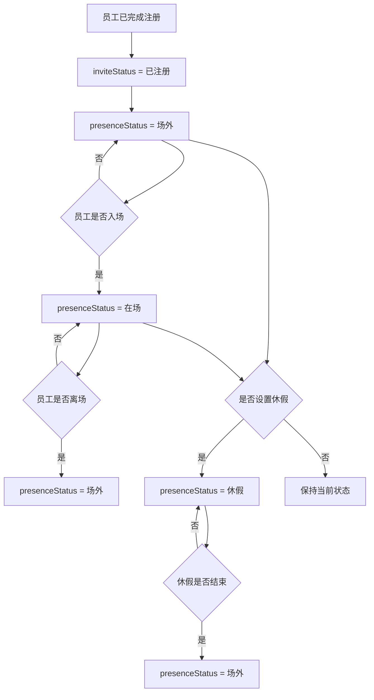
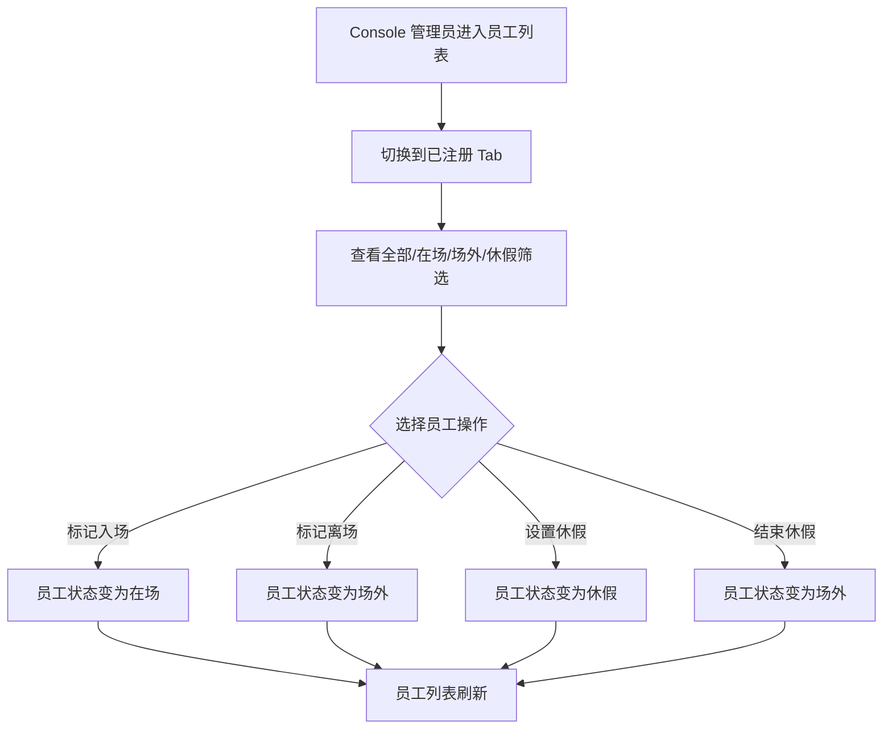

# PRD：员工入场流程

## 背景

员工完成注册后，账号已经与厂区绑定，员工在该厂区下的邀请状态为 `已注册`。但“已注册”只代表员工已经完成账号与厂区的绑定，并不代表员工当前在厂区现场。

员工入场流程用于管理已注册员工的现场状态，包括在场、场外和休假。该流程与登录/注册流程相互独立。

## 目标

- 明确员工在场状态的定义和流转。
- 让员工注册完成后默认处于场外。
- 支持管理员或现场流程把员工状态变为在场、场外或休假。
- 避免员工在场状态和邀请状态互相冲突。

## 非目标

- 不处理员工账号注册、邀请链接、Logto 验证。
- 不处理访客入场申请和访客采样。
- 不设计复杂考勤、薪酬、排班规则。
- 不设计账号封禁、暂停、离职归档等账号治理能力。

## 对象

| 对象 | 说明 | 核心诉求 |
|---|---|---|
| 已注册员工 | 已完成账号与厂区绑定的员工 | 清楚当前自己是否在场 |
| Console 管理员 | 管理厂区员工现场状态的人 | 能查看和调整员工在场状态 |
| 现场管理者 | 负责确认员工入场、离场或休假的人 | 状态流转简单明确 |
| 后端服务 | 保存员工在当前厂区的现场状态 | 保证状态只作用于当前厂区 |

## 状态模型

### 1. 邀请状态

员工入场流程只面向 `inviteStatus = 已注册` 的员工。`待注册` 和 `已过期` 员工不进入员工入场流程。

### 2. 在场状态 presenceStatus

| 状态 | 含义 |
|---|---|
| 在场 | 员工当前在厂区现场 |
| 场外 | 员工当前不在厂区现场 |
| 休假 | 员工处于休假状态，不参与现场在场统计 |

### 3. 默认规则

| 场景 | presenceStatus |
|---|---|
| 员工完成注册 | 场外 |
| 员工被绑定到新厂区 | 场外 |
| 员工入场 | 在场 |
| 员工离场 | 场外 |
| 员工请假/休假 | 休假 |
| 员工休假结束但未入场 | 场外 |

## 程序流程图

## 操作流程图

## 功能说明

| 模块 | 前端展示/交互 | 后端/业务逻辑 |
|---|---|---|
| 已注册员工列表 | 已注册 Tab 展示员工，并支持按全部、在场、场外、休假筛选 | 只返回当前 farmID 下 inviteStatus = 已注册 的员工 |
| 标记入场 | 对场外员工执行入场操作 | presenceStatus 更新为在场 |
| 标记离场 | 对在场员工执行离场操作 | presenceStatus 更新为场外 |
| 设置休假 | 对在场或场外员工设置休假 | presenceStatus 更新为休假 |
| 结束休假 | 对休假员工结束休假 | presenceStatus 更新为场外 |
| 状态展示 | 员工卡片或表格展示在场状态 | 在场状态保存在厂区成员关系上 |

## 列表展示建议

| 区域 | 展示规则 |
|---|---|
| 主 Tab | 待注册、已注册、已过期 |
| 已注册筛选 | 全部、在场、场外、休假 |
| 已注册员工字段 | 姓名、手机号/邮箱、在场状态、所属厂区、注册完成时间 |
| 操作入口 | 根据当前 presenceStatus 展示可用操作 |

## 操作可用性

| 当前状态 | 可用操作 |
|---|---|
| 场外 | 标记入场、设置休假 |
| 在场 | 标记离场、设置休假 |
| 休假 | 结束休假 |

## 边际情况 / 异常情况

| 场景 | 处理方式 |
|---|---|
| 待注册员工 | 不允许执行入场、离场、休假操作 |
| 已过期邀请 | 不进入已注册员工列表 |
| 同一账号多个厂区 | 每个厂区维护自己的 presenceStatus，互不影响 |
| 员工休假时尝试入场 | 需先结束休假，再标记入场 |
| 员工在场时再次标记入场 | 状态不变，提示员工已在场 |

## 数据字段建议

| 字段 | 说明 |
|---|---|
| farmID | 厂区 ID |
| userId | 员工用户 ID |
| inviteStatus | 员工在当前厂区的邀请状态 |
| presenceStatus | 在场、场外、休假 |
| presenceUpdatedAt | 在场状态更新时间 |
| presenceUpdatedBy | 操作人 |

## 安全要求

- 只能操作当前 farmID 下的员工在场状态。
- 后端必须校验操作者是否拥有当前 farmID 的员工管理权限。
- 在场状态不能作为登录权限判断依据。
- 在场状态不能替代邀请状态；只有 inviteStatus = 已注册 的员工才可进入入场流程。
