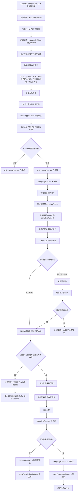
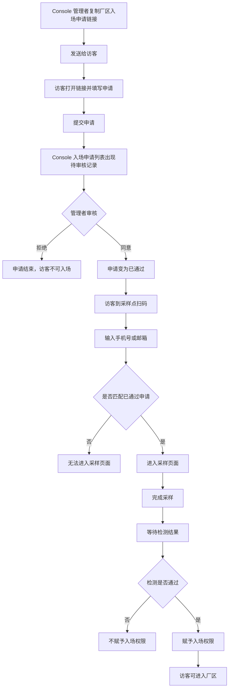

# PRD：访客入场流程

## 背景

访客不是系统内部员工，不需要注册账号，也不需要登录 Console 或 Mobile。访客入场的核心是：访客先提交入场申请，Console 管理者审核通过后，访客到场扫描采样点二维码，完成入场采样并等待检测结果；检测通过后，访客才被赋予入场权限。

访客流程与员工注册流程不同。员工注册需要 Logto 完成账号身份验证和厂区绑定；访客入场申请阶段不需要登录、不需要验证码验证。

## 目标

- 支持 Console 管理者生成并发送厂区级长期复用的入场申请链接。
- 支持访客填写入场申请信息并回传到 Console 入场申请列表。
- 支持 Console 管理者审核访客入场申请。
- 只有审核通过的访客，才能在采样点扫码后进入入场采样流程。
- 支持访客完成采样、等待检测结果，并在检测通过后获得入场权限。
- 明确扫码后是否需要验证码验证的 MVP 与安全增强方案。

## 非目标

- 不给访客创建 Console/Mobile 登录账号。
- 不让访客进入系统主页或业务模块。
- 不设计员工注册和员工入场状态流转。
- 不设计访客长期账号、访客权限管理后台或访客自助切换厂区。

## 对象

| 对象 | 说明 | 核心诉求 |
|---|---|---|
| Console 管理者 | 发送入场申请链接并审核申请的人 | 快速收集访客信息，控制是否允许入场 |
| 访客 | 外部到访人员 | 填写申请、完成采样、获得入场资格 |
| 采样点工作人员 | 在采样点协助访客完成采样的人 | 能核对访客信息并完成采样 |
| 后端服务 | 管理申请、采样点二维码、检测结果和入场权限 | 保证未审核访客不能进入采样流程 |

## 状态模型

### 1. 入场申请状态 visitorApplyStatus

| 状态 | 含义 |
|---|---|
| 待审核 | 访客已提交入场申请，管理者尚未处理 |
| 已通过 | 管理者同意访客入场申请 |
| 已拒绝 | 管理者拒绝访客入场申请 |
| 已过期 | 申请长期未处理或超过系统设定有效期 |

### 2. 采样状态 samplingStatus

| 状态 | 含义 |
|---|---|
| 未采样 | 申请已通过，但访客尚未完成入场采样 |
| 采样中 | 访客已扫码进入入场采样页面，采样流程进行中 |
| 待检测 | 采样完成，等待检测结果 |
| 检测通过 | 检测结果通过，可赋予入场权限 |
| 检测未通过 | 检测结果未通过，不赋予入场权限 |

### 3. 入场权限状态 entryPermissionStatus

| 状态 | 含义 |
|---|---|
| 未生效 | 访客尚未获得入场权限 |
| 已生效 | 访客检测通过，获得入场权限 |

## 核心规则

- 每个厂区有一个长期复用的访客入场申请链接。
- 入场申请链接对应厂区，不对应具体访客。
- 安全实现上，入场申请链接携带 visitorApplyToken，后端通过 token 解析 farmID。
- 访客填写申请时不登录、不验证手机号/邮箱。
- 访客申请提交后进入 Console 入场申请列表，状态为待审核。
- 只有 Console 管理者审核通过后，访客才能在采样点扫码进入采样流程。
- 访客在申请中填写预计到访开始时间和预计离场时间，但具体入场时间以实际为准。
- 预计时间用于审核参考，不作为采样流程硬拦截条件。
- MVP 阶段，访客扫码后输入手机号/邮箱，不强制验证码验证。
- 如果采样点无人值守或安全要求提高，可启用验证码验证作为增强方案。
- 检测通过后才赋予访客入场权限。

## 程序流程图

## 操作流程图

## 功能说明

### 1. 厂区入场申请链接

| 模块 | 前端展示/交互 | 后端/业务逻辑 |
|---|---|---|
| 链接管理 | Console 管理者复制或发送厂区入场申请链接 | 每个 farmID 对应一个长期复用 visitorApplyToken |
| 打开链接 | 访客看到厂区名称和申请表 | 后端通过 visitorApplyToken 解析 farmID |
| 链接复用 | 同一链接可发给多个访客 | 每次提交生成独立访客申请记录 |

### 2. 访客填写入场申请

| 模块 | 前端展示/交互 | 后端/业务逻辑 |
|---|---|---|
| 申请表 | 填写姓名、手机号、邮箱、预计到访开始时间、预计离场时间、访问目的等 | 保存访客申请记录 |
| 提交申请 | 提交后展示已提交反馈 | visitorApplyStatus = 待审核 |
| 时间字段 | 预计到访开始时间和预计离场时间仅作为审核参考 | 不作为采样扫码的硬拦截条件 |

### 3. Console 入场申请列表

| 模块 | 前端展示/交互 | 后端/业务逻辑 |
|---|---|---|
| 待审核列表 | 展示访客姓名、手机号、邮箱、预计到访时间、访问目的 | 按 farmID 返回访客申请 |
| 审核通过 | 管理者同意入场申请 | visitorApplyStatus = 已通过；samplingStatus = 未采样 |
| 审核拒绝 | 管理者拒绝入场申请 | visitorApplyStatus = 已拒绝 |

### 4. 采样点扫码

| 模块 | 前端展示/交互 | 后端/业务逻辑 |
|---|---|---|
| 采样二维码 | 访客扫描采样点二维码 | 二维码携带 samplingToken |
| 采样点确认 | 展示厂区名称与采样点名称 | 后端通过 samplingToken 解析 farmID 与 samplingPointID |
| 身份输入 | 访客输入手机号或邮箱 | MVP 不强制验证码验证 |
| 申请匹配 | 匹配该 farmID 下同手机号或邮箱的已通过申请 | 未匹配时不允许进入采样页面 |

### 5. 可选验证码验证

| 模块 | 前端展示/交互 | 后端/业务逻辑 |
|---|---|---|
| MVP 默认 | 输入手机号或邮箱后直接匹配已通过申请 | 依赖采样点现场核对和后续检测结果控制风险 |
| 安全增强 | 可配置开启 Logto 验证码验证 | 验证通过后再按手机号或邮箱匹配申请 |
| 适用场景 | 无人值守采样点、高风险厂区、外部审计要求 | 按 farmID 或采样点配置 |

### 6. 入场采样与检测

| 模块 | 前端展示/交互 | 后端/业务逻辑 |
|---|---|---|
| 采样页面 | 展示访客姓名、手机号/邮箱、厂区、采样点，供现场核对 | samplingStatus = 采样中 |
| 完成采样 | 采样完成后进入等待检测结果 | samplingStatus = 待检测 |
| 检测通过 | 展示可入场状态 | entryPermissionStatus = 已生效 |
| 检测未通过 | 展示不可入场状态 | entryPermissionStatus = 未生效 |

## 边际情况 / 异常情况

| 场景 | 处理方式 |
|---|---|
| 访客未提交申请 | 扫码后输入手机号/邮箱无法匹配申请，不允许进入采样页面 |
| 申请未审核 | 提示申请尚未通过审核 |
| 申请被拒绝 | 提示申请未通过审核 |
| 输入手机号/邮箱与申请不一致 | 不允许进入采样页面 |
| 当前时间偏离预计到访时间 | 可提示当前时间与预计到访时间不一致，但不拦截 |
| 采样二维码无效 | 提示采样点无效或二维码已失效 |
| 检测未通过 | 不赋予入场权限 |

## 数据字段建议

### 1. 厂区访客申请链接

| 字段 | 说明 |
|---|---|
| visitorApplyToken | 厂区访客申请链接凭证 |
| farmID | 厂区 ID |
| enabled | 链接是否启用 |
| createdAt | 创建时间 |

### 2. 访客申请记录

| 字段 | 说明 |
|---|---|
| visitorApplyId | 访客申请 ID |
| farmID | 厂区 ID |
| visitorName | 访客姓名 |
| phone | 手机号 |
| email | 邮箱 |
| visitPurpose | 访问目的 |
| expectedArrivalStartAt | 预计到访开始时间 |
| expectedLeaveAt | 预计离场时间 |
| visitorApplyStatus | 待审核、已通过、已拒绝、已过期 |
| samplingStatus | 未采样、采样中、待检测、检测通过、检测未通过 |
| entryPermissionStatus | 未生效、已生效 |
| reviewedBy | 审核人 |
| reviewedAt | 审核时间 |

### 3. 采样点二维码

| 字段 | 说明 |
|---|---|
| samplingToken | 采样点二维码凭证 |
| farmID | 厂区 ID |
| samplingPointID | 采样点 ID |
| enabled | 二维码是否启用 |

## 安全要求

- 访客申请链接不直接暴露明文 farmID，URL 只携带 visitorApplyToken。
- 采样二维码不直接暴露明文 farmID 和 samplingPointID，URL 只携带 samplingToken。
- 访客未通过 Console 审核时，不能进入入场采样页面。
- MVP 阶段不强制验证码时，采样页面必须展示访客申请信息供现场核对。
- 检测未通过前，不赋予入场权限。
- 后端所有访客申请、采样和入场权限接口都必须按 farmID 隔离。
