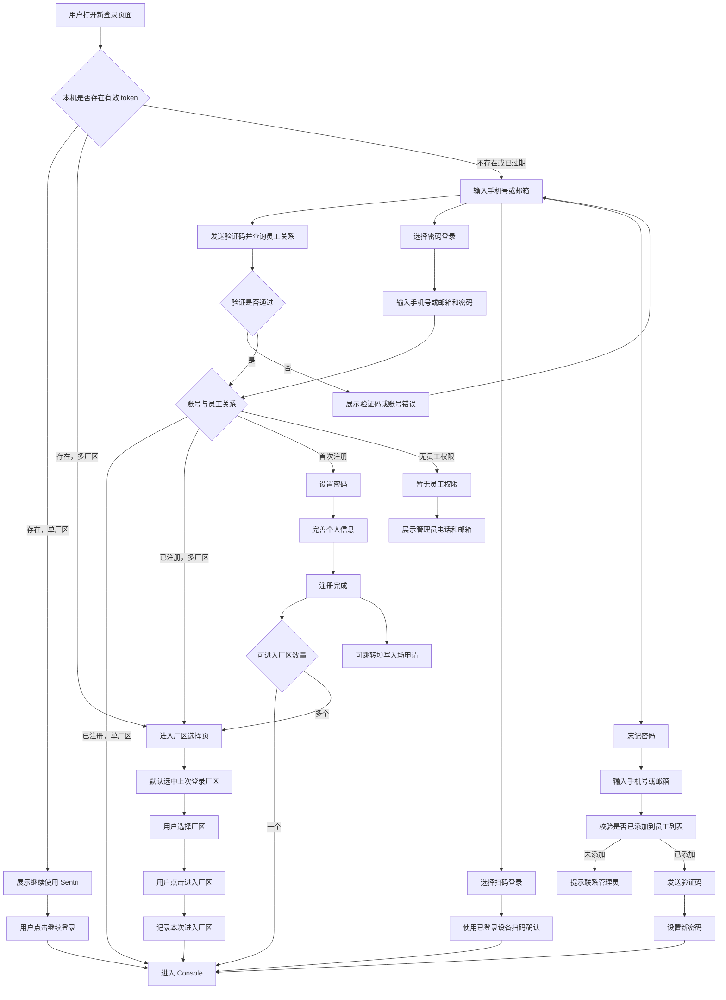
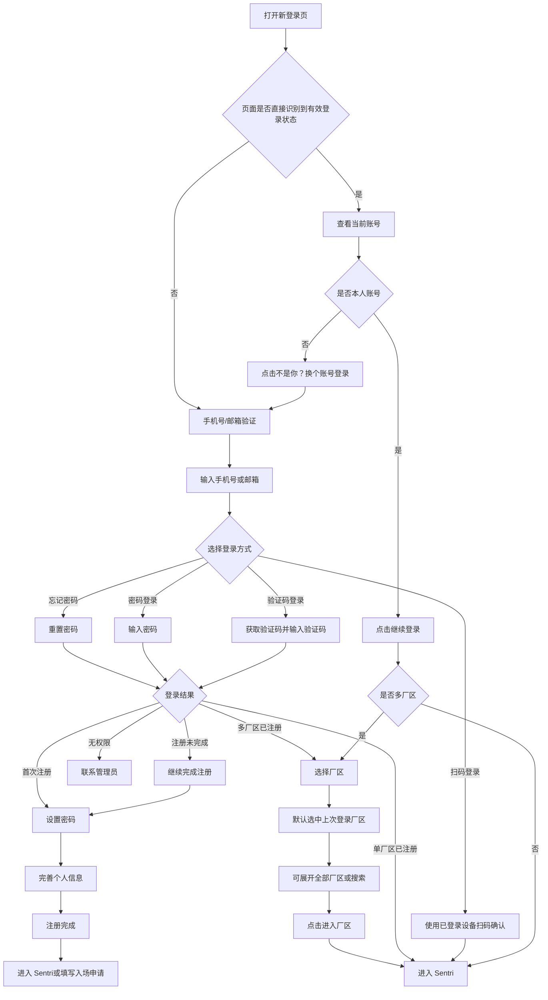

# PRD：新登录流程

更新时间：2026-06-09

## 背景

Sentri 正在从单厂区系统升级为 SaaS 多厂区系统。厂区是最小租户单位，一个账号可以进入多个厂区。用户可能是单厂区员工，也可能是管理多个厂区的负责人。

登录流程需要从“单一入口进入单一厂区”升级为“同一个入口识别用户身份、判断登录状态、处理多厂区选择，并在必要时完成首次注册”。员工入场申请与登录注册有关联，但不属于登录流程本身；注册完成页只提供填写入场申请的入口，不在登录流程内完成入场申请。

本 PRD 描述 Console 新登录流程，包括有效 token 登录、无 token 登录、验证码登录、密码登录、扫码登录、忘记密码、首次注册、多厂区选择和异常分支。

## 目标

- 用户打开登录页时，如果本机已有有效 token，可以直接继续使用 Sentri。
- 用户无 token 或 token 过期时，可以通过手机号/邮箱验证码登录，也可以使用手机号/邮箱 + 密码登录，或使用已登录设备扫码登录。
- 用户输入手机号/邮箱并完成验证码验证后，系统必须先判断该手机号/邮箱是否存在于员工关系中，再判断是否已完成注册流程。
- 用户已存在于员工关系但未完成注册时，需要引导用户继续进入注册流程。
- 用户首次注册时，必须设置密码并完善个人信息，后续才能使用密码登录。
- 已注册用户被管理员加入新厂区后，登录流程对用户无感；该厂区只作为普通可进入厂区出现在厂区选择页。
- 多厂区用户进入厂区选择页后，可以清楚识别上次登录和常用厂区。
- 厂区选择不再使用 5 秒倒计时自动进入，必须由用户点击 `进入厂区`。
- 登录流程不再区分“单个待注册厂区”和“多个待注册厂区”的确认页。

非目标：

- 不处理员工入场申请表单的填写、审批和在场状态更新。
- 不处理访客入场申请和访客采样。
- 不处理角色、权限、菜单授权配置。
- 不处理管理员对账号的封禁、暂停或全局账号状态管理。

## 对象

| 对象 | 使用场景 | 关注点 |
|---|---|---|
| 单厂区员工 | 打开 Console 完成登录并进入所在厂区 | 少步骤、少判断、快速进入 |
| 多厂区管理者 | 一个账号可进入多个厂区 | 快速找到本次要进入的厂区 |
| 首次注册用户 | 手机号/邮箱已被加入员工列表，但未完成账号注册 | 完成验证、设置密码、完善个人信息 |
| 无员工权限用户 | 手机号/邮箱未添加到员工列表 | 明确知道需要联系管理员 |

## 价值

- 减少多厂区用户误进厂区的概率，让用户在进入系统前完成清晰选择。
- 避免把管理员维护厂区关系的后台动作暴露成登录流程分支，减少用户理解成本。
- 把登录、注册、入场申请拆成清楚的流程边界，降低后续产品和开发维护成本。
- 保留验证码登录、密码登录和扫码登录三种方式，让临时登录、高频登录和跨设备登录都顺畅。
- 通过上次登录、常用标签，让多厂区用户的选择更接近日常使用习惯。

## 核心规则

### 登录状态

| 状态 | 含义 | 处理方式 |
|---|---|---|
| 有效 token | 当前设备保存了可用登录状态 | 直接展示继续登录页；多厂区时进入厂区选择页 |
| 无 token / token 过期 | 当前设备没有可直接使用的登录状态 | 进入手机号/邮箱验证页 |
| token 对应账号与用户想登录账号不同 | 当前设备已登录其他账号 | 不复用 token，提示用户进入系统后退出当前账号，再重新登录 |

### 厂区关系

| 关系 | 含义 | 处理方式 |
|---|---|---|
| 可进入厂区 | 当前账号已拥有进入权限的厂区 | 展示在厂区选择页 |
| 上次登录厂区 | 用户最近一次进入过的厂区 | 默认选中，展示 `上次登录` 标签 |
| 常用厂区 | 用户高频进入的厂区 | 展示 `常用` 标签 |

### 首次注册

首次注册指手机号/邮箱已被添加到员工列表，但账号尚未完成注册。首次注册必须包含：

- 设置密码
- 确认密码
- 填写姓名
- 填写身份信息

注册完成后，用户默认可进入已绑定厂区。如果可进入多个厂区，则先进入厂区选择页。

## 程序流程图



## 操作流程图



## 功能说明

### 1. 新登录页面入口

用户打开新登录页面后，页面先检查当前设备是否有可用登录状态。

如果存在有效 token：

- 单厂区用户直接展示 `继续使用 Sentri` 页面。
- 多厂区用户直接进入 `选择厂区` 页面。
- 页面不要求用户再次输入手机号、邮箱、验证码或密码。

如果不存在有效 token 或 token 已过期：

- 进入手机号/邮箱验证页。
- 测试场景中 `无token/token已过期` 归为同一种情况。

如果当前设备已有其他账号的有效 token：

- 不允许用新的手机号直接覆盖当前登录状态。
- 页面提示当前设备已登录其他账号。
- 主按钮为 `进入 Sentri`，用户进入系统后自行退出当前账号，再重新登录。

### 2. 有效 token 继续登录页

页面内容：

- 成功图标
- 标题：`继续使用 Sentri`
- 说明：`已识别到本机保存的登录状态，请确认当前账号。`
- 当前账号标签，展示手机号/邮箱脱敏信息
- 主按钮：`继续登录`
- 次按钮：`不是你？换个账号登录`

交互规则：

- 点击 `继续登录` 后，如果账号只有一个厂区，直接进入 Console。
- 点击 `继续登录` 后，如果账号有多个厂区，进入厂区选择页。
- 点击 `不是你？换个账号登录` 后，进入手机号/邮箱验证页。

### 3. 手机号/邮箱验证页

页面用于无 token、token 过期、主动换账号时识别用户身份。

页面内容：

- 手机号/邮箱输入框
- 验证码输入框
- `获取验证码` 按钮
- 主按钮：`登录 / 继续注册`
- 其他登录方式入口：`账号密码`、`扫码登录`

发送验证码规则：

- 点击 `获取验证码` 时先校验手机号/邮箱格式。
- 格式不正确时提示：`请输入正确的手机号或邮箱。`
- 发送成功后展示：`验证码已发送至 138****1234，请注意查收。`
- 邮箱场景展示：`验证码已发送至 he****@gmail.com，请注意查收。`
- 发送成功后开始 60 秒倒计时，倒计时结束后可重新获取验证码。

点击 `继续` 后：

- 校验验证码是否填写。
- 校验验证码是否正确。
- 校验通过后查询该手机号/邮箱对应的员工关系。
- 如果该手机号/邮箱未被任何厂区添加到员工列表，进入暂无员工权限页。
- 如果该手机号/邮箱已被添加到员工列表，但注册流程未完成，进入注册未完成页。
- 如果该手机号/邮箱已完成注册，根据可进入厂区数量进入 Console 或厂区选择页。

### 4. 登录方式选择

当用户需要选择其他登录方式时，页面底部展示三个主入口：

- `验证码登录`
- `密码登录`
- `扫码登录`

按钮需要固定在弹窗底部，避免不同内容导致按钮位置明显跳动。

### 5. 验证码登录

验证码登录适用于用户记不住密码、首次使用当前设备、token 过期等场景。

规则：

- 用户输入手机号/邮箱并获取验证码。
- 验证通过后，根据账号关系进入对应流程。
- 已注册单厂区用户直接进入 Sentri。
- 已注册多厂区用户进入厂区选择页。
- 未完成注册用户进入注册未完成页，并可继续设置密码、完善个人信息。
- 无员工权限用户进入暂无员工权限页。

### 6. 密码登录

密码登录适用于已设置过密码的用户。

规则：

- 用户输入手机号/邮箱和密码。
- 账号不存在时提示：`未找到该账号，请确认手机号或邮箱是否正确。`
- 密码错误时提示：`账号或密码不正确，请重新输入。`
- 登录成功后，根据厂区数量决定直接进入 Console 或进入厂区选择页。

### 7. 扫码登录

扫码登录适用于用户已经在其他设备登录过，并且该设备保存了登录密钥的场景。

页面内容：

- 标题：`扫码登录`
- 二维码区域
- 提示：`使用已登录并保存登录密钥的设备扫码，确认后即可登录。`
- 主按钮：`进入 Sentri`
- 其他登录方式入口：`验证码`、`密码`

规则：

- 二维码登录只用于已注册账号，不承担首次注册。
- 用户必须在已登录设备上扫码并确认。
- 扫码确认成功后，系统直接签发当前设备登录态。
- 如果二维码过期或扫码确认失败，页面提示用户刷新二维码或改用验证码/密码登录。

### 8. 忘记密码

入口：登录方式选择页中的忘记密码入口。

流程：

1. 用户输入手机号或邮箱。
2. 用户点击 `获取验证码`。
3. 系统校验该手机号/邮箱是否已添加到员工列表。
4. 如果未添加，提示：`该手机号或邮箱未添加到员工列表，请联系管理员确认。`
5. 如果已添加，发送验证码并展示发送成功提示。
6. 用户点击下一步后，进入设置新密码页。
7. 用户输入新密码和确认密码。
8. 重置成功后直接进入登录态，不需要再次输入密码。

### 9. 首次注册

首次注册入口来自手机号/邮箱验证通过后的关系判断。

用户需要完成：

- 设置密码
- 确认密码
- 填写姓
- 填写名
- 填写身份信息

规则：

- 密码和确认密码必须一致。

注册完成页展示：

- 标题：`注册完成`
- 说明：`已完成账号与厂区员工关系绑定，默认在场状态为场外/休假。`
- 姓名
- 登录账号
- 已绑定厂区

按钮：

- 主按钮：`完成注册，进入 Sentri`
- 次按钮：`填写入场申请`

说明：

- `填写入场申请` 只是跳转入口，不在登录流程中完成入场申请。

### 10. 已注册用户厂区关系变更

管理员在 Console 将已注册用户加入其他厂区后，该动作不进入登录流程，也不对用户展示特殊提示。

规则：

- 用户不需要再次验证、注册、设置密码或完善个人信息。
- 系统只更新该账号的可进入厂区范围。
- 如果用户只有一个可进入厂区，仍按单厂区登录流程直接进入。
- 如果用户拥有多个可进入厂区，仍按多厂区登录流程进入厂区选择页。
- 新加入的厂区不展示 `新` 标签，不作为单独测试场景，不触发额外确认页。

### 11. 厂区选择页

进入条件：

- 有效 token 且账号拥有多个厂区。
- 验证码登录成功后，账号拥有多个厂区。
- 密码登录成功后，账号拥有多个厂区。
- 首次注册完成后，账号可进入多个厂区。

页面内容：

- 标题：`选择厂区`
- 说明：`你可以进入多个厂区，请选择这次要打开的厂区。`
- 厂区列表
- `展开全部厂区` / `收起厂区`
- `进入厂区`

页面不展示：

- `可进入厂区` 标题
- 推荐厂区数量
- 搜索结果标题
- 5 秒倒计时
- 自动进入上次登录厂区的进度条

排序规则：

```text
上次登录 > 常用 > 其他
```

具体说明：

- 上次登录厂区永远排第一，并默认选中。
- 常用厂区按照最近进入频率和最近进入时间排序。
- 其他厂区按名称排序。

标签规则：

```text
上次登录 > 常用
```

- 一个厂区只展示一个标签。
- 如果一个厂区同时满足多个标签，只展示优先级最高的标签。

展开与搜索：

- 厂区数量超过 10 个时，默认只展示排序后的前 3 个厂区。
- 默认收起状态不展示搜索框。
- 点击 `展开全部厂区` 后展示全部厂区和搜索框。
- 搜索只过滤当前账号可进入的厂区。
- 搜索无结果时展示：`未找到匹配厂区。`
- 点击 `收起厂区` 后恢复默认展示。

### 12. 无员工权限页

出现条件：

- 用户输入的手机号/邮箱没有被添加到当前系统员工列表。
- 忘记密码时，该手机号/邮箱未添加到员工列表。

页面内容：

- 标题：`暂无员工权限`
- 说明：`当前手机号暂无员工权限，请联系管理员添加员工。`
- 管理员电话
- 管理员邮箱

规则：

- 不提供填写入场申请入口。
- 不提供注册入口。
- 用户只能联系管理员处理。

### 13. 注册未完成页

出现条件：

- 用户已完成验证码验证，但没有完成设置密码或个人信息。
- 用户中途关闭页面后再次访问。

页面内容：

- 标题：`注册未完成`
- 说明用户需要继续完成注册后才能进入 Sentri。
- 主按钮：`继续完成注册`

规则：

- 点击 `继续完成注册` 跳转到新注册流程页面。
- 系统根据用户已完成步骤，自动回到下一步未完成页面。

### 14. 测试场景

新登录流程需要提供以下测试场景，便于产品和开发验证：

| 场景 | 起始页面 | 预期结果 |
|---|---|---|
| 有效 token | 继续使用 Sentri | 展示当前账号标签，可继续登录 |
| 无 token/token 已过期 | 手机号/邮箱验证 | 验证后按账号关系分流 |
| 多厂区 token | 厂区选择页 | 默认选中上次登录厂区 |
| 无员工权限 | 手机号/邮箱验证 | 展示暂无员工权限和管理员联系方式 |
| 新注册用户 | 手机号/邮箱验证 | 验证通过后进入设置密码和完善个人信息流程 |
| token 账号不一致 | 当前设备已登录提示页 | 提示进入系统后退出账号再重新登录 |
| 扫码登录 | 扫码登录页 | 扫码确认后进入登录态 |
| 忘记密码 | 忘记密码页 | 重置密码后直接进入登录态 |

不再提供以下测试场景：

- 单个待注册厂区
- 多个待注册厂区
- 已注册 + 待注册二次确认页
- 已注册用户新增厂区特殊分支
- 5 秒自动进入上次厂区

## 边际情况 / 异常情况

| 场景 | 处理方式 |
|---|---|
| 手机号/邮箱格式错误 | 阻止发送验证码，提示用户输入正确格式 |
| 验证码未获取 | 阻止继续，提示先获取验证码 |
| 验证码错误 | 阻止继续，提示验证码不正确 |
| 验证码倒计时中重复点击 | 按钮置灰，倒计时结束后可再次获取 |
| 手机号/邮箱未添加到员工列表 | 进入暂无员工权限页 |
| 手机号/邮箱已添加但未完成注册 | 进入注册未完成页，引导继续注册 |
| 密码为空 | 阻止登录，提示请输入密码 |
| 密码错误 | 阻止登录，提示账号或密码不正确 |
| 扫码未确认 | 阻止进入，提示先使用已登录设备扫码确认 |
| 二维码过期 | 提示刷新二维码或改用验证码/密码登录 |
| 新密码与确认密码不一致 | 阻止提交，提示两次密码不一致 |
| 已注册用户被加入其他厂区 | 登录流程无感；下次进入厂区选择页时只作为普通可进入厂区展示 |
| 厂区搜索无结果 | 展示空状态，不改变原列表数据 |
| 当前设备 token 对应其他账号 | 不复用 token，提示进入系统后退出当前账号 |
| 进入厂区时权限失效 | 阻止进入，提示当前账号无法进入该厂区，请联系管理员 |
| 后端关系查询失败 | 保留当前页，提示网络或服务异常，可重试 |

## 后端与数据依赖

登录流程需要后端支持以下能力：

- 判断当前设备 token 是否有效，并返回当前账号可进入的厂区。
- 返回用户上次登录厂区，用于厂区选择页默认选中。
- 返回常用厂区判断结果，或返回足够的进入记录让前端/后端计算常用厂区。
- 用户点击进入厂区时，校验该账号是否仍可进入该厂区。
- 手机号/邮箱验证码验证通过后，返回该账号是否已注册、是否需要设置密码、是否需要完善个人信息、是否拥有员工权限。
- 扫码登录需要校验扫码设备是否已登录且保存有效登录密钥，并在确认后为当前设备签发登录态。
- 忘记密码发送验证码前，校验手机号/邮箱是否已添加到员工列表。
- 重置密码成功后，直接签发登录态。

## 验收标准

- 有效 token 单厂区用户打开页面后，可看到当前账号标签并继续登录。
- 有效 token 多厂区用户打开页面后，直接进入厂区选择页。
- 无 token/token 已过期用户从手机号/邮箱验证页开始。
- 验证码发送成功后展示脱敏账号和 60 秒倒计时。
- 验证码验证后必须判断手机号/邮箱是否存在于员工关系，以及是否完成注册流程。
- 登录方式入口包含 `验证码登录`、`密码登录`、`扫码登录`。
- 未完成注册用户会进入注册未完成页，并可继续完成注册。
- 扫码登录需要展示二维码区域，确认扫码后进入登录态。
- 忘记密码流程先校验手机号/邮箱是否在员工列表，再发送验证码。
- 忘记密码重置成功后直接进入登录态，不要求再次输入密码。
- 首次注册必须设置密码并完善个人信息。
- 已注册用户被加入其他厂区后，登录流程不出现特殊分支、提示或标签。
- 厂区选择页排序符合 `上次登录 > 常用 > 其他`。
- 厂区标签只展示 `上次登录`、`常用`，同一厂区只展示一个标签。
- 厂区数量超过 10 个时默认展示前 3 个，展开后展示搜索框。
- 页面中不再出现 5 秒倒计时进入厂区的设计。
- 页面中不再出现单个/多个待注册厂区测试场景。
