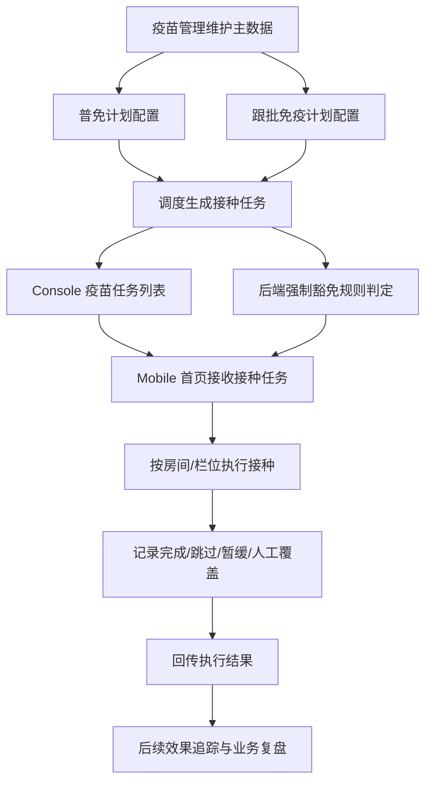
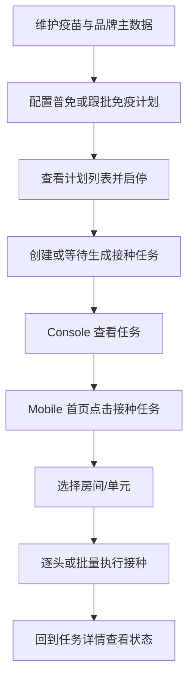

# PRD：疫苗业务总览

## 背景

疫苗相关功能横跨 Console 计划配置、任务下发、Mobile 现场执行和后续效果追踪。当前系统已经具备疫苗主数据、普免计划、跟批免疫计划、疫苗任务和 Mobile 接种任务的基础样机，但文档分散在旧目录中，结构与颗粒度也不一致。

为了让前端、后端和产品在同一套语言下沟通，需要把疫苗能力重新按功能模块整理为一组标准 PRD，明确每个模块的职责边界、上下游依赖、用户操作路径和关键业务规则。

## 目标

- 将疫苗业务按功能模块拆分为一组独立 PRD，便于按模块开发和评审。
- 统一 Console、Mobile、后端规则三端口径，减少“页面能做什么”和“系统实际如何流转”之间的理解偏差。
- 明确疫苗业务的主链路：主数据维护 → 计划配置 → 任务生成 → Mobile 执行 → 后续追踪。

## 对象

| 对象 | 说明 | 核心诉求 |
|---|---|---|
| 免疫管理员 | 维护疫苗主数据、普免计划、跟批免疫计划 | 计划可配置、数据可复用 |
| 调度员 | 创建接种任务、下发 Mobile | 创建简单、任务可追踪 |
| 现场接种员 | 在 Mobile 按猪只或房间执行接种 | 信息清楚、操作顺手 |
| 后端规则引擎 | 统一处理豁免、调度、状态流转 | 规则统一、结果可追溯 |
| 疫苗业务模块 | 一组互相依赖的能力集合 | 边界清楚、上下游明确 |

## 价值

- 对产品：把原来分散的能力沉淀成结构化模块，便于后续继续扩展效果追踪、采样任务等能力。
- 对研发：每个模块的边界更清楚，前后端分工更稳定。
- 对业务：从计划到执行形成闭环，减少线下补记和口径不一致。

## 程序流程图

## 操作流程图

## 功能说明

### 1. 模块划分

| 模块 | 主要职责 | 上游依赖 | 下游影响 |
|---|---|---|---|
| 疫苗管理 | 维护疫苗类目与品牌主数据 | 无 | 为计划和任务提供可复用参数 |
| 普免计划 | 维护固定日历型免疫计划 | 疫苗管理 | 生成固定日期接种任务 |
| 跟批免疫计划 | 维护事件触发型免疫计划 | 疫苗管理、生产事件 | 生成按批次触发的接种任务 |
| 疫苗任务 | 在 Console 组织和查看任务 | 计划或人工选猪 | 下发 Mobile 接种执行 |
| Mobile 接种任务 | 现场执行接种并回传 | 疫苗任务、豁免规则 | 更新任务状态与执行日志 |
| Console 接种任务详情 | 按任务状态查看配置、进度和结果 | 疫苗任务、Mobile 回传结果 | 承接待接种任务编辑与任务结果复盘 |
| 后端强制豁免规则 | 统一判定豁免命中 | 猪只档案、事件时间、疫苗参数 | 影响 Mobile 执行提示与人工覆盖记录 |

### 2. 文档使用方式

| 使用方 | 建议先看什么 | 再看什么 |
|---|---|---|
| 前端 | 业务总览 | 对应页面模块 PRD |
| 后端 | 业务总览 | 计划、任务、豁免规则 PRD |
| 产品 | 业务总览 | 各模块 PRD |

## 边际情况 / 异常情况

| 场景 | 处理方式 |
|---|---|
| 新功能只改了某一个页面 | 仍需同步回看它所在模块是否影响上下游逻辑 |
| 页面样机已变更但 PRD 未更新 | 以最新产品口径为准，PRD 必须补齐 |
| 某个能力暂时只有样机没有后端实现 | 文档中必须明确写出“当前样机支持什么、后端后续需要承接什么” |
