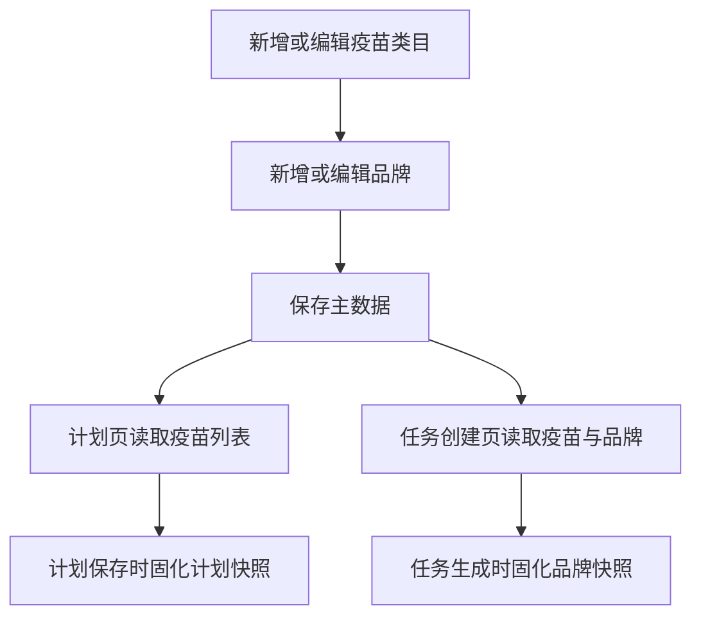
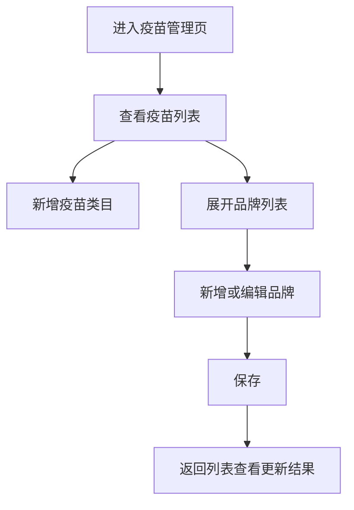

# PRD：疫苗管理

## 背景

疫苗管理是整个免疫业务的主数据源。计划配置、任务生成和 Mobile 执行依赖这里维护的疫苗类目和品牌信息，例如剂型、接种方式、剂量单位、免疫间隔期等。如果主数据维护不规范，下游计划与任务就会出现口径不一致。

## 目标

- 让免疫管理员在一个页面中维护疫苗类目与品牌主数据。
- 让计划配置页和任务创建页可以基于主数据自动回填关键参数。
- 保证历史任务与历史计划使用快照，不受后续主数据修改影响。

## 对象

| 对象 | 说明 | 核心诉求 |
|---|---|---|
| 免疫管理员 | 维护疫苗与品牌资料 | 一次维护，多处复用 |
| 计划配置人员 | 在计划页选择疫苗与品牌 | 自动回填、减少手输 |
| 调度系统 | 生成任务时固化品牌参数 | 快照稳定、避免漂移 |

## 价值

- 减少重复录入，提高计划和任务创建效率。
- 保证不同页面引用的是同一套疫苗业务口径。
- 让后端在执行豁免或间隔判断时有稳定的数据基础。

## 程序流程图

## 操作流程图

## 功能说明

### 1. 疫苗类目管理

| 模块 | 前端展示/交互 | 后端/业务逻辑 |
|---|---|---|
| 疫苗列表 | 展示中文名、英文名、目标抗体等核心信息 | 返回疫苗类目主表 |
| 新增疫苗 | 通过弹窗或表单新增类目 | 创建新的疫苗类目 |
| 编辑疫苗 | 修改已有类目信息 | 更新类目主表 |
| 删除/归档 | 已被引用的类目不应物理删除 | 建议归档而非硬删除 |

### 2. 品牌管理

| 模块 | 前端展示/交互 | 后端/业务逻辑 |
|---|---|---|
| 品牌展开表格 | 展示品牌名、剂型、接种方式、剂量、免疫间隔期、疫苗类型等 | 返回品牌明细 |
| 新增品牌 | 在指定疫苗下新增品牌 | 挂到对应疫苗类目下 |
| 编辑品牌 | 修改品牌参数 | 更新品牌明细 |
| 品牌参数复用 | 供计划页和任务页联动回填 | 计划和任务创建时读取该数据 |

### 3. 与下游联动

| 联动对象 | 页面表现 | 后端/业务逻辑 |
|---|---|---|
| 普免计划 | 选择疫苗后可选择品牌 | 品牌参数用于自动回填 |
| 跟批免疫计划 | 同上 | 同上 |
| 疫苗任务 | 创建任务时读取品牌信息 | 固化为任务快照 |
| Mobile 接种任务 | 不直接回查主数据 | 只消费任务快照 |

## 边际情况 / 异常情况

| 场景 | 处理方式 |
|---|---|
| 疫苗存在但没有品牌 | 计划页和任务页可选疫苗，但品牌为空，系统需明确提示 |
| 品牌参数缺失 | 允许手动补录，但应提示主数据不完整 |
| 已被引用的品牌被修改 | 历史计划与任务不应被覆盖，只影响后续新建内容 |
| 已被引用的品牌被删除 | 不允许硬删除，建议归档 |
