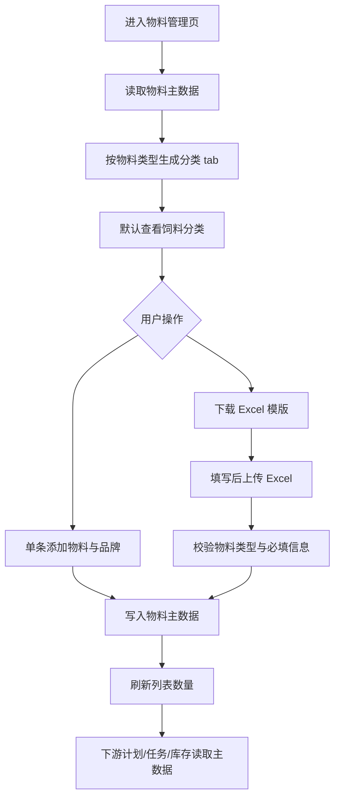
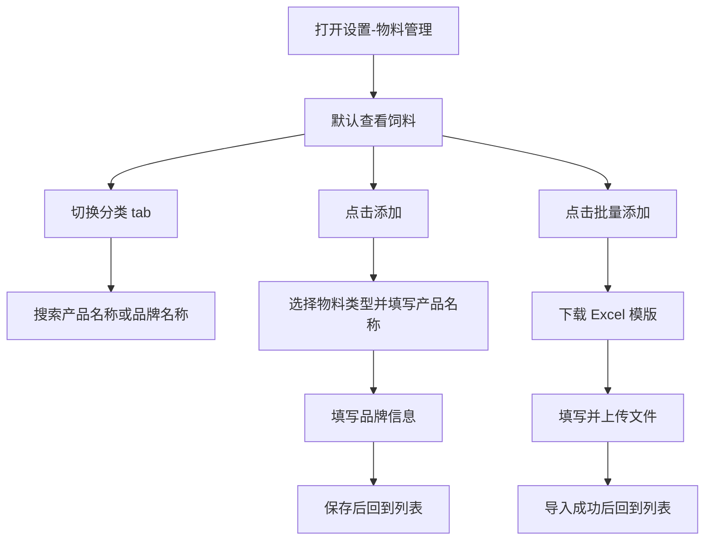

# PRD：物料管理

## 背景

原设置页以药品管理为主，主要维护疫苗、兽药、保健品、消毒用品及其他药品品牌信息。随着库存与现场业务统一到物料口径，主数据维护入口需要从药品扩展为物料，覆盖饲料、兽药、疫苗、消毒用品、保健品、工具、其他，避免同一类基础资料在不同页面重复维护。

## 目标

- 让 Console 用户在设置页统一维护物料产品与品牌信息。
- 通过分类 tab 快速查看不同物料类型，保持列表页轻量、可筛选、可搜索。
- 支持单条添加和 Excel 模版批量添加，降低初始化或集中维护时的录入成本。
- 疫苗类物料继续保留剂型、单次剂量、免疫有效期、休药期、免疫间隔期、接种方式、疫苗类型等参数，供免疫计划和任务链路复用。

## 对象

| 对象 | 使用场景 | 核心诉求 |
|---|---|---|
| Console 用户 | 维护场区基础物料资料 | 统一入口、快速录入、分类查找 |
| 免疫管理员 | 维护疫苗与品牌资料 | 疫苗参数可被计划和任务复用 |
| 库存管理人员 | 初始化或补齐物料主数据 | 可批量导入，减少重复手输 |

## 价值

- 统一药品与非药品物料口径，减少设置页和库存页之间的概念割裂。
- 批量添加适合初始化阶段导入大量物料，提高配置效率。
- 分类 tab 让用户按当前工作对象查看物料，避免在单一大列表中反复筛选。
- 保留疫苗专项参数，确保免疫计划、疫苗任务和 Mobile 执行仍有稳定的数据基础。

## 程序流程图

## 操作流程图

## 功能说明

### 1. 页面命名与入口

| 模块 | 前端展示/交互 | 后端/业务逻辑 |
|---|---|---|
| 导航入口 | 设置菜单中的入口名称展示为 `物料管理` | 后端模块可继续使用现有主数据接口，但业务口径应按物料管理理解 |
| 页面标题 | 页面标题展示为 `物料管理` | 返回饲料、兽药、疫苗、消毒用品、保健品、工具、其他物料 |
| 辅助说明 | 说明文案强调统一维护各类物料品牌信息 | 物料类型是后续筛选、导入校验和下游引用的基础分类 |

### 2. 分类 tab

| 模块 | 前端展示/交互 | 后端/业务逻辑 |
|---|---|---|
| tab 范围 | 固定展示 `饲料`、`兽药`、`疫苗`、`消毒用品`、`保健品`、`工具`、`其他` | 即使某分类当前无数据，也保留 tab，便于用户理解完整分类范围 |
| 数量展示 | 当前分类数量展示在列表工具栏，例如 `共 1 条` | 数量按当前分类和搜索条件实时统计 |
| 切换行为 | 切换 tab 后表格只展示对应类型 | 搜索条件与分类条件叠加生效 |

### 3. 物料列表

| 模块 | 前端展示/交互 | 后端/业务逻辑 |
|---|---|---|
| 搜索 | 支持按物料中文名、物料英文名、品牌中文名、品牌英文名、物料类型搜索 | 后端可按同等字段实现模糊查询 |
| 表格字段 | 展示物料名称（含 `资料待完善` 标记）、物料类型、品牌名称、核算单位、操作 | 物料类型复用统一分类枚举；核算单位复用库存核算单位 |
| 查看详情 | 打开物料详情弹窗，展示通用档案字段 + 按分类的专属字段 | 专属字段按分类口径返回（兽药、疫苗、饲料、消毒用品、保健品） |
| 编辑物料 | 修改通用档案与当前分类专属字段；分类变更时专属字段随之切换 | 切换分类后仅保留新分类的专属字段 |
| 删除物料 | 用户确认后删除当前物料行 | 被下游引用的正式数据建议后端做归档或引用校验 |

> 物料管理与库存采购入库共用同一套统一物料模型（通用档案字段 + 各分类专属字段集），字段定义、必填规则、专属字段口径一致。

通用档案字段：物料名称(中)*、物料名称(英)、物料类型*、品牌(中)*、品牌(英)*、核算单位*、安全库存、物料编码(系统生成)、备注。

各分类专属字段：

| 分类 | 专属字段 |
|---|---|
| 兽药 | 剂型、使用方式、休药期 |
| 疫苗 | 疫苗类型*、接种方式*、剂型*、是否冷链、储存温度、单次剂量、免疫有效期、休药期(天)、免疫间隔期(天) |
| 饲料 | 形态(颗粒/粉料/浓缩料)、适用猪只*(复用猪只类型枚举，多选)、适用阶段*(生产状态 + 起始天~结束天，如妊娠期 15-36天，可多条，默认展示一行输入) |
| 消毒用品 | 有效成分、稀释比例、适用场景(空栏/带猪/器械/车辆/人员) |
| 保健品 | 主要成分、使用方式 |
| 工具 / 其他 | 无专属字段 |

### 4. 单条添加

| 模块 | 前端展示/交互 | 后端/业务逻辑 |
|---|---|---|
| 添加按钮 | 主页面按钮文案为 `添加`，打开单页添加弹窗 | 创建一条统一物料档案 |
| 通用档案 | 填写物料名称(中/英)、物料类型、品牌(中/英)、核算单位、安全库存、备注 | 名称(中)、物料类型、品牌(中/英)、核算单位为必填 |
| 分类专属字段 | 选择物料类型后动态展示对应专属字段，饲料适用猪只/适用阶段与疫苗核心专属项必填 | 专属字段随分类切换，仅保存当前分类字段 |
| 资料待完善 | 必填专属项缺失时仍可保存，物料标记 `资料待完善` | 用于一线快速录入后续补全场景 |

### 5. 批量添加

| 模块 | 前端展示/交互 | 后端/业务逻辑 |
|---|---|---|
| 批量添加按钮 | 位于 `添加` 按钮左侧，打开批量添加弹窗 | 面向初始化和集中维护场景 |
| 下载模版 | 用户点击 `下载 Excel 模版` 获取导入文件 | 模版包含物料类型、物料名称(中/英)、品牌名称(中/英)、核算单位、安全库存 |
| 上传文件 | 用户填写模版后上传 `.xls` 文件 | 系统读取模版表格并校验数据 |
| 校验规则 | 物料类型、物料名称(中)、品牌名称(中)、核算单位为必填 | 物料类型必须为固定分类之一；校验失败时提示错误行 |
| 专属字段 | 批量模版只覆盖通用档案，专属字段不在模版内 | 缺必填专属项的物料导入后标记 `资料待完善`，可在编辑中补全 |
| 导入结果 | 导入成功后关闭弹窗，自动切换到首条新增物料所属分类，新增物料出现在列表顶部，分类数量同步更新 | 后端正式实现时应返回成功/失败明细，避免部分失败不可追溯 |

## 边际情况 / 异常情况

| 场景 | 处理方式 |
|---|---|
| 分类没有物料 | tab 仍展示，列表为空 |
| 搜索无结果 | 表格展示空态，不重复展示统计卡 |
| 上传空 Excel | 提示未读取到可导入物料 |
| 上传行缺少必填信息 | 阻止本次导入，并提示首个错误行 |
| 上传未知物料类型 | 阻止本次导入，并提示物料类型不在模板范围内 |
| 切换分类后旧专属字段 | 仅保存当前分类专属字段，旧分类专属值不保留 |
| 必填专属字段缺失 | 允许保存/导入，但物料标记 `资料待完善`，提示去物料管理补全 |
| 已被计划、任务或库存引用的物料被删除 | 正式后端应阻止硬删除或转为停用/归档，避免历史数据断链 |
