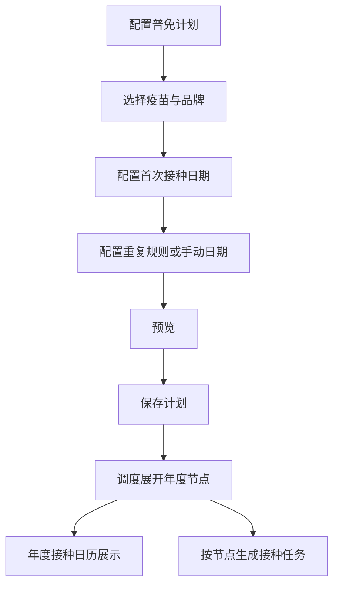
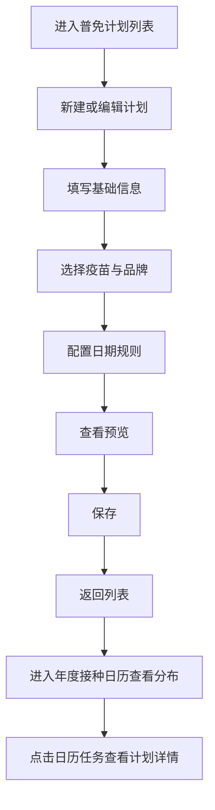

# PRD：普免计划

## 背景

普免计划用于配置固定日期、固定节律的接种安排，适合全年视角下重复执行的免疫工作。当前系统已经具备计划表单、重复规则、年度接种日历和只读查看能力，但需要在文档中明确它与跟批计划、疫苗任务、年度日历之间的关系。

## 目标

- 让用户能够配置固定日历型接种计划。
- 让用户可以查看计划在年度接种日历中的排布。
- 让计划启停、查看、预览和保存的边界更清楚。

## 对象

| 对象 | 说明 | 核心诉求 |
|---|---|---|
| 免疫管理员 | 配置普免计划 | 规则清楚、排期可视化 |
| 调度系统 | 按计划日期生成任务 | 展开后的日期稳定可用 |
| 年度接种日历 | 展示普免排期结果 | 便于查看全年分布 |

## 价值

- 帮助用户从全年角度理解接种安排。
- 避免人工逐次创建固定接种任务。
- 通过年度接种日历提升排期可视化和复盘效率。

## 程序流程图

## 操作流程图

## 功能说明

### 1. 计划配置表单

| 模块 | 前端展示/交互 | 后端/业务逻辑 |
|---|---|---|
| 基础信息 | 计划名、生产线、目标猪群等 | 保存计划主信息 |
| 疫苗配置 | 接种方式、疫苗、品牌、剂量等联动回填 | 保存最终快照 |
| 日期规则 | 支持首次接种日、重复规则或手动日期 | 后端用于展开年度节点 |
| 免疫复核 | 配置效果追踪相关参数 | 保存为计划的一部分 |

### 2. 年度接种日历

| 模块 | 前端展示/交互 | 后端/业务逻辑 |
|---|---|---|
| 日历总览 | 展示全年接种节点分布 | 使用计划展开后的日期结果 |
| 日期点击 | 点击某一天后，右侧展示该日任务 | 根据已选日期过滤计划节点 |
| 任务卡查看 | 右侧任务卡整卡点击进入只读详情 | 日历页只承担查看，不承担启停 |
| 启停边界 | 年度日历页不提供启用/禁用操作 | 启停只能在计划列表或详情页处理 |

### 3. 列表与计划状态

| 模块 | 前端展示/交互 | 后端/业务逻辑 |
|---|---|---|
| 计划列表 | 展示计划摘要、状态、效果追踪、年度查看入口 | 返回计划快照与状态 |
| 启用/停用 | 在列表页受锁控制 | 已下发或部分执行时需遵守业务限制 |
| 只读查看 | 从年度接种日历进入详情时为只读 | 防止在只读入口误修改 |

## 边际情况 / 异常情况

| 场景 | 处理方式 |
|---|---|
| 未配置重复规则 | 仅按手动日期保存 |
| 重复规则与手动日期冲突 | 系统需明确互斥口径，不允许两套逻辑同时生效 |
| 年度日历某天没有任务 | 右侧展示空状态 |
| 用户从年度日历进入详情 | 只读查看，不允许直接在该入口启停 |
