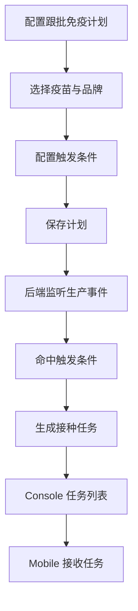
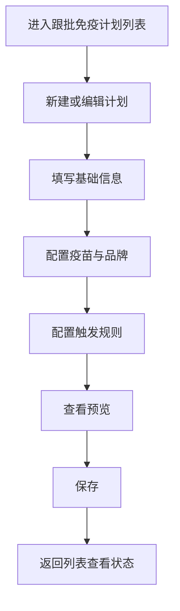

# PRD：跟批免疫计划

## 背景

跟批免疫计划服务于按生产事件触发的接种安排，不像普免计划那样依赖固定日历，而是依赖配种、分娩、断奶、日龄、状态变化等业务事件。它与普免计划使用相同的疫苗主数据，但在触发逻辑、任务生成时机和业务解释上完全不同。

## 目标

- 让用户配置可被生产事件触发的免疫计划。
- 让跟批计划与普免计划在配置体验上保持一致，但在触发逻辑上边界清楚。
- 让后端能够根据事件稳定生成接种任务。

## 对象

| 对象 | 说明 | 核心诉求 |
|---|---|---|
| 免疫管理员 | 配置跟批免疫计划 | 触发条件可理解、可维护 |
| 调度系统 | 根据事件生成任务 | 触发规则明确、可执行 |
| 后端规则引擎 | 负责解释触发条件 | 触发口径统一 |

## 价值

- 让免疫工作可以跟随生产批次自动推进。
- 降低人工记忆和线下提醒成本。
- 使批次型免疫任务更容易标准化。

## 程序流程图

## 操作流程图

## 功能说明

### 1. 计划配置

| 模块 | 前端展示/交互 | 后端/业务逻辑 |
|---|---|---|
| 基础信息 | 计划名、生产线、目标猪群等 | 保存计划主信息 |
| 疫苗配置 | 读取疫苗管理中的主数据并回填 | 保存接种快照 |
| 触发规则 | 支持按生产事件、状态、日龄等配置触发 | 后端按规则监听并解释 |
| 免疫复核 | 支持配置相关效果追踪参数 | 保存为计划的一部分 |

### 2. 触发逻辑

| 模块 | 前端展示/交互 | 后端/业务逻辑 |
|---|---|---|
| 规则表达 | 用户在表单中配置条件 | 后端转化为可执行的事件监听逻辑 |
| 任务生成 | 前端不直接生成任务 | 由后端在条件命中时生成 |
| 启停控制 | 计划可以启停，但受下发/执行状态限制 | 后端决定是否允许停用 |

### 3. 列表与状态

| 模块 | 前端展示/交互 | 后端/业务逻辑 |
|---|---|---|
| 计划列表 | 查看计划摘要、状态和关键触发信息 | 返回状态快照 |
| 启用/停用 | 列表中控制状态流转 | 若已有下发/执行需按规则限制 |
| 编辑入口 | 进入编辑页修改计划 | 保存后影响后续新触发任务 |

## 边际情况 / 异常情况

| 场景 | 处理方式 |
|---|---|
| 触发规则不完整 | 阻止保存并提示补齐 |
| 疫苗品牌缺失 | 不允许生成不完整计划 |
| 已经有任务下发后停用 | 需遵守业务锁，避免影响在途任务 |
| 生产事件缺失或脏数据 | 后端需要记录无法触发原因 |
