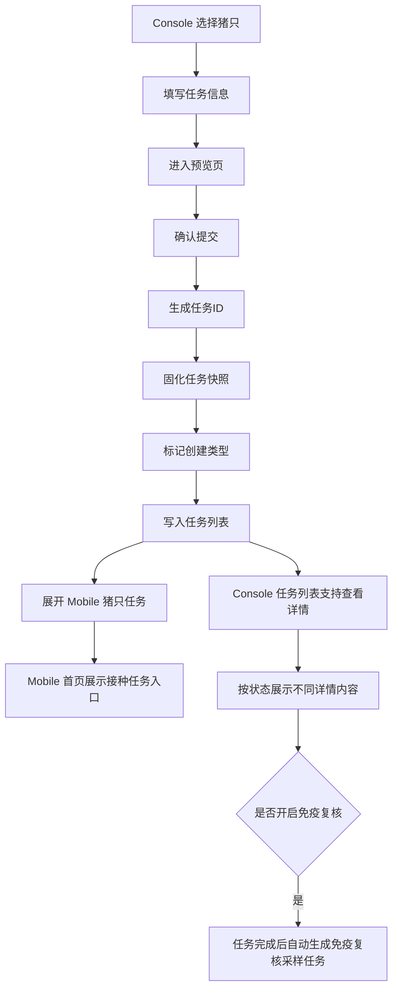
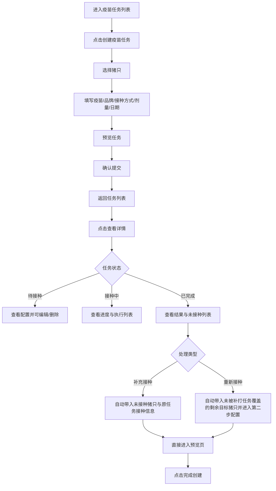

# PRD：疫苗任务

## 背景

疫苗任务是连接计划配置与 Mobile 执行的中间层。它既可以来自普免计划或跟批计划的自动下发，也可以来自 Console 人工选择猪只后创建任务。当前版本已经简化了任务创建表单，不再展示多次接种和间隔配置，重点是让任务创建、预览、列表、详情和 Mobile 执行保持统一口径。

## 目标

- 让 Console 用户以更低复杂度创建、查看和管理接种任务。
- 让任务创建页、预览页、任务列表页、任务详情页与 Mobile 首页展示同一套核心信息。
- 让待接种任务可以删除与编辑，接种中和已完成任务保持只读。
- 让已完成任务可以根据未接种结果发起补充接种，并根据免疫复核不合格结果发起重新接种。
- 让 `已完成` 任务能用统一的补打状态与补打原因来表达后续处理进展。
- 让任务列表区分 `自动` 与 `手动` 创建类型，说明任务来自计划自动生成还是用户手动创建。
- 让不同状态的任务在详情页中展示不同重点信息，避免所有状态共用一套无差别信息结构。

## 对象

| 对象 | 说明 | 核心诉求 |
|---|---|---|
| 调度员 | 人工创建任务并查看状态 | 创建简单、状态清楚、待接种任务可修正 |
| 接种任务 | 将一批猪只与疫苗信息绑定后的执行对象 | 信息完整、可下发、状态可追踪 |
| Mobile 接种端 | 接收 Console 下发的任务 | 读取稳定快照 |

## 价值

- 让人工补充任务和计划自动生成任务使用同一套下发模型。
- 减少创建任务时的无效字段，提高录入效率。
- 通过任务详情页，让管理者不仅能看到任务是否存在，还能看到任务到底执行到了哪里。

## 程序流程图

## 操作流程图

## 功能说明

### 1. 创建任务

| 模块 | 前端展示/交互 | 后端/业务逻辑 |
|---|---|---|
| 选猪页 | 勾选目标猪只后进入创建页 | 记录本次任务的目标范围 |
| 创建表单 | 保留疫苗、品牌、接种方式、剂量、剂量单位、接种日期；支持按开关决定是否填写 `免疫复核设置` | 生成任务所需核心快照；若开启免疫复核，则同步保存目标抗体、采样方式、样品容器、抽检间隔、抽样比例、抗体合格率阈值 |
| 已移除的配置 | 不再展示多次接种、间隔时间、间隔单位、底部动态通告栏 | 新任务不再依赖这些字段 |
| 预览页 | 查看接种日期、疫苗、品牌、接种方式、剂量；任务编号提交后由系统生成，预览页不提前展示；若开启免疫复核则同步预览复核配置 | 作为提交前确认步骤 |
| 编辑任务 | 仅 `待接种` 任务允许编辑；可修改接种日期、接种方式、剂量、剂量单位和目标猪只 | 保存后直接覆盖该待接种任务的任务快照 |
| 补充接种 | 仅 `已完成` 任务支持；补充接种按钮只在 `未接种` Tab 展示，`已接种` Tab 不展示；未接种分组支持勾选猪只，默认选中全部未接种猪只，用户可取消部分猪只后再补充接种；补充接种任务预填原任务的疫苗、品牌、接种方式、剂量、剂量单位 | 创建一条新的待接种任务；补充接种只允许用户修改接种日期，创建类型为 `手动` |

### 2. 任务列表

| 模块 | 前端展示/交互 | 后端/业务逻辑 |
|---|---|---|
| 列表展示 | 展示任务ID、疫苗/接种方式合并列、接种日期、目标猪只、创建人；合并列中主行展示疫苗，副行展示接种方式；列表不展示品牌、剂量、执行人/时间，品牌、剂量和执行人/时间进入详情页查看 | 返回任务快照、状态与创建来源 |
| 创建人 | 全部状态任务都使用同一口径：计划自动生成的任务在 `创建人` 列展示 `自动` 标签；用户通过创建疫苗任务或补充接种手动创建的任务上下两行展示创建人和创建时间 | 创建任务时按来源保存，不通过文案临时推断 |
| 跟批来源信息 | 跟批计划自动生成的任务需要保留所属生产线与批次，用于计划详情页展示 `生产线-批次` | 后端生成跟批任务时同步保存任务所属生产线和批次 |
| 已完成结果 | `已完成` Tab 额外展示 `实际接种 / 计划接种`，口径为任务结束时实际完成接种数量与任务计划接种数量 | 返回任务结束时的实际接种数与计划接种数；列表不展示补打状态和补打原因，用户进入详情页后自行判断后续处理 |
| 列口径收敛 | 不再展示间隔列 | 避免显示无效字段 |
| 删除操作 | 仅 `待接种` 状态显示删除图标按钮；删除后任务状态变为 `已取消`，不再在待接种列表中展示，但计划详情的所属疫苗任务列表需保留可追溯记录 | 同步移除 Mobile 下发数据，保留 Console 任务取消记录 |
| 查看详情 | 全状态都支持通过眼睛图标进入任务详情 | 根据任务状态切换详情页展示重点 |

### 3. 任务详情

| 模块 | 前端展示/交互 | 后端/业务逻辑 |
|---|---|---|
| 详情结构 | 统一包含 `所属免疫计划信息`、`疫苗任务信息`；`免疫复核设置` 仅在创建任务时开启过复核的任务中展示；若实验室检测结果已提交，则在 `免疫复核设置` 下方额外展示 `免疫复核结果`，汇总模块与复核结果详情页保持一致，采用上方检测进度概览、下方指标卡片的结构，展示当前合格率、阳性/阴性数量、阈值与检测结果；待接种、接种中、已完成详情均展示 `接种猪只列表`；`已接种 / 目标接种` 通过进度条旁数值统一呈现 | 详情页按模块拆分读取任务快照、执行结果与复核结果 |
| 待接种详情 | 展示所属免疫计划信息、疫苗任务信息、免疫复核设置；允许编辑任务和删除任务 | 读取当前任务快照；编辑后直接覆盖待接种任务 |
| 接种中详情 | 展示所属免疫计划信息、疫苗任务信息、接种猪只列表、免疫复核设置 | 读取当前任务快照和 Mobile 回传的执行状态 |
| 已完成详情 | 展示所属免疫计划信息、疫苗任务信息、接种猪只列表、免疫复核设置 | 读取最终执行结果，不允许再次编辑或删除 |
| 猪只列表批次信息 | 三种任务状态详情页的接种猪只列表均展示 `批次-生产线`，没有数据时展示 `—` | 跟批自动任务读取批次生产线来源，手动任务可为空 |
| 状态差异规则 | 待接种可编辑；接种中和已完成只读；已取消仅保留追溯 | 防止 Mobile 执行中被 Console 改口径 |

### 4. 与 Mobile 联动

| 模块 | 前端展示/交互 | 后端/业务逻辑 |
|---|---|---|
| 首页接种任务卡 | Mobile 首页显示接种任务入口 | 根据任务创建时间计算“已下发 X 天” |
| 房间/猪只执行 | Mobile 进入任务后按房间和猪只执行 | 读取任务快照，不回查实时主数据 |
| 任务详情回传 | Console 详情页展示已接种、未接种、命中豁免 | 依赖 Mobile 回传的执行状态 |

## 边际情况 / 异常情况

| 场景 | 处理方式 |
|---|---|
| 未选择疫苗 | 阻止进入下一步 |
| 已选猪只为空 | 不允许创建任务 |
| 品牌为空 | 可显示为 `—`，但需明确业务是否允许 |
| 接种方式未选 | 阻止进入下一步 |
| 删除待接种任务 | 允许删除，并同步清理 Mobile 数据 |
| 接种中任务进入详情 | 允许查看进度、已接种/未接种、命中豁免，但不允许修改任务配置 |
| 已完成任务进入详情 | 允许查看最终结果和未接种猪只，并支持按原因分别发起补充接种或重新接种；若开启复核，还需要查看实验室回写的免疫复核结果 |
| 需补打任务点击补充接种 | 在未接种分组中默认勾选全部未接种猪只，用户可按需只选择部分未接种猪只；点击补充接种后自动沿用原任务疫苗、品牌、接种方式、剂量、剂量单位；进入第二步配置页时上述字段预填并锁定，接种日期留空且需要用户手动填写；选择日期后进入第三步预览页 |
| 重新接种前已有补打任务 | 弹出二次确认，提示已安排补打的猪只不会再次进入重新接种任务；确认后只为剩余目标猪只进入第二步配置页创建重新接种任务 |
| 需补打任务点击重新接种 | 自动选中需重新接种的目标猪只，自动沿用原任务疫苗、品牌、接种方式、剂量、剂量单位；进入第二步配置页时标题为 `重新接种`，上述字段预填并锁定，接种日期留空且需要用户手动填写；第三步按钮文案为 `确认接种` |
| 开启免疫复核的任务完成 | 自动生成一条待检测的免疫复核采样任务，供实验室人员录入结果 |
| 已安排重新接种覆盖补打范围 | 若原任务同时存在未接种与复核不合格，且用户已创建整批重新接种任务，则详情页中的 `补充接种` 按钮置灰；点击问号提示用户无需再补充接种 |
| 补打状态与补打原因 | `需补打`、`已安排补打` 都不是主任务状态，只在 `已完成` 任务上用 `补打状态` 与 `补打原因` 两个属性表达后续处理进展 |
| 历史任务仍带有旧间隔信息 | 历史可保留，但新任务不再强调该字段 |
