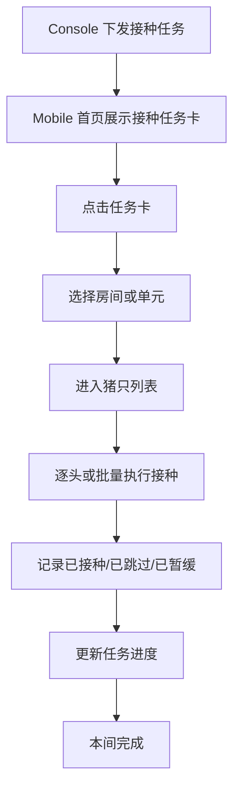
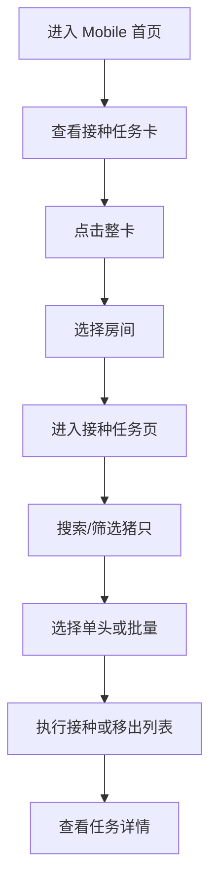

# PRD：Mobile 接种任务

## 背景

Mobile 接种任务是现场执行接种的主入口。当前首页已经恢复了接种任务入口，并与断奶检查入口并列展示。接种任务卡点击后进入房间/单元选择，再进入猪只执行列表。该模块重点承接现场执行、状态提示、批量处理和任务完成。

## 目标

- 让现场接种员可以从首页快速进入接种任务。
- 让首页任务卡、房间选择、猪只列表、任务详情和执行抽屉形成清晰闭环。
- 让豁免命中、批量操作、任务进度在 Mobile 端直观可见。

## 对象

| 对象 | 说明 | 核心诉求 |
|---|---|---|
| 现场接种员 | 在 Mobile 执行接种 | 入口清楚、批量操作顺手 |
| 接种任务卡 | 首页任务入口 | 信息清楚、可快速进入 |
| 房间/单元 | 任务分布维度 | 快速定位现场执行位置 |
| 猪只任务行 | 接种执行最小单元 | 状态明确、可操作 |

## 价值

- 把 Console 下发任务真正落地到现场执行。
- 降低现场切换和查找成本。
- 把豁免提示、接种结果和人工覆盖沉淀为结构化记录。

## 程序流程图

## 操作流程图

## 功能说明

### 1. 首页入口

| 模块 | 前端展示/交互 | 后端/业务逻辑 |
|---|---|---|
| 首页任务区 | 同时展示接种任务与断奶检查 | 返回首页任务卡数据 |
| 接种任务卡 | 展示标题、已下发天数、摘要、接种进度、进入提示 | 根据创建时间和任务进度聚合展示 |
| 点击整卡 | 进入房间/单元选择抽屉 | 根据任务范围加载房间分布 |

### 2. 房间与猪只执行

| 模块 | 前端展示/交互 | 后端/业务逻辑 |
|---|---|---|
| 房间抽屉 | 展示待处理房间和头数 | 返回 roomPending 聚合 |
| 猪只列表 | 按房间/栏位展示猪只任务 | 返回猪只维度执行数据 |
| 批量接种 | 批量标记已接种 | 更新多头任务状态 |
| 移出接种列表 | 需二次确认 | 从执行范围中移除该猪只 |
| 本间完成 | 结束当前房间执行 | 聚合本间状态并写日志 |

### 3. 任务详情与状态提示

| 模块 | 前端展示/交互 | 后端/业务逻辑 |
|---|---|---|
| 任务详情 Tab | 查看疫苗、品牌、接种方式、剂量等 | 返回任务快照 |
| 状态提示 | 展示待接种、已接种、已跳过、已暂缓、延期等状态 | 直接消费状态结果 |
| 豁免命中 | 猪只列表上的红色感叹号支持点击，弹出悬浮窗查看具体不建议接种原因 | 后端返回命中文案 |

## 边际情况 / 异常情况

| 场景 | 处理方式 |
|---|---|
| 首页没有接种任务 | 只显示其他任务卡或空态 |
| 房间下暂无待处理猪只 | 提示本间已处理完 |
| 批量操作失败 | 保留当前选择并提示失败原因 |
| 豁免命中但仍执行接种 | 允许继续，但必须记录人工覆盖 |
| 点击豁免感叹号 | 弹出悬浮窗，展示该猪具体因为什么不建议接种 |
| 弹层打开时 | 必须锁住底层滚动，避免穿透 |
