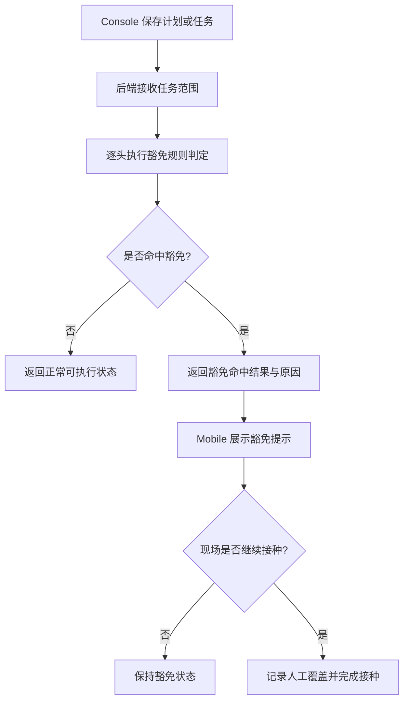
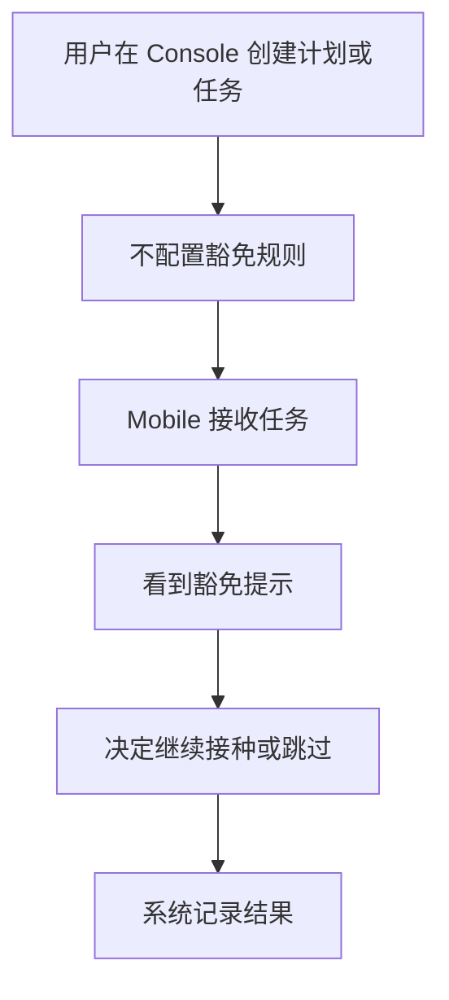

# PRD：后端强制豁免规则

## 背景

豁免规则决定了某头猪在接种任务中是否应该被提示“建议暂缓”或进入人工覆盖判断。此前如果让前端配置豁免规则，会导致不同页面、不同场区、不同任务之间口径不一致，因此当前方向是：豁免规则由后端统一维护，前端只负责展示结果。

## 目标

- 由后端统一管理豁免规则，不在 Console 开放规则配置入口。
- 让 Mobile 接种任务稳定接收 `是否命中豁免` 和 `命中原因`。
- 让现场仍可做人工覆盖决定，但系统必须保留记录。

## 对象

| 对象 | 说明 | 核心诉求 |
|---|---|---|
| 后端规则引擎 | 统一计算豁免命中 | 规则统一、可追溯 |
| Console 计划页 | 不负责配置豁免规则 | 页面简化、口径统一 |
| Mobile 现场执行 | 接收命中结果并决定是否继续接种 | 看到清晰提示 |

## 价值

- 避免规则配置分散在前端不同页面中。
- 让同一头猪在不同任务中遵循同一套豁免口径。
- 让现场判断建立在统一规则基础上，而不是个人经验上。

## 程序流程图

## 操作流程图

## 功能说明

### 1. Console 侧边界

| 模块 | 前端展示/交互 | 后端/业务逻辑 |
|---|---|---|
| 普免计划 | 不展示豁免规则配置项 | 保存时不依赖前端规则配置 |
| 跟批免疫计划 | 同上 | 同上 |
| 疫苗任务 | 只承接任务创建，不定义豁免规则 | 下发后由后端逐头计算 |

### 2. 规则引擎职责

| 模块 | 前端展示/交互 | 后端/业务逻辑 |
|---|---|---|
| 命中判定 | 前端不参与判定 | 后端统一计算是否命中 |
| 命中原因 | 前端只展示后端返回的说明 | 后端返回清晰可读原因 |
| 规则版本 | 前端无需配置 | 后端需保留规则版本与生效时间 |

### 3. Mobile 消费方式

| 模块 | 前端展示/交互 | 后端/业务逻辑 |
|---|---|---|
| 列表标识 | 在猪只列表中展示命中状态 | 返回布尔值或状态结果 |
| 抽屉提示 | 在单头执行页展示命中原因 | 返回可读文案 |
| 人工覆盖 | 用户仍可继续接种 | 后端记录人工覆盖动作 |

## 边际情况 / 异常情况

| 场景 | 处理方式 |
|---|---|
| 猪只关键时间缺失 | 该条规则无法计算时需记录异常，不得静默吞掉 |
| 多条规则同时命中 | 至少返回主原因；如条件允许，可返回命中列表 |
| 规则引擎临时异常 | 需记录告警，并定义降级策略 |
| 现场继续接种 | 必须记录人工覆盖，不能只改状态不留痕 |
