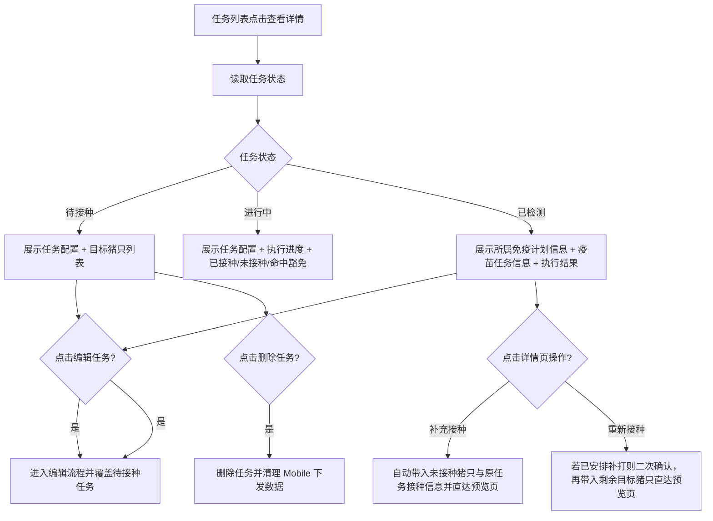
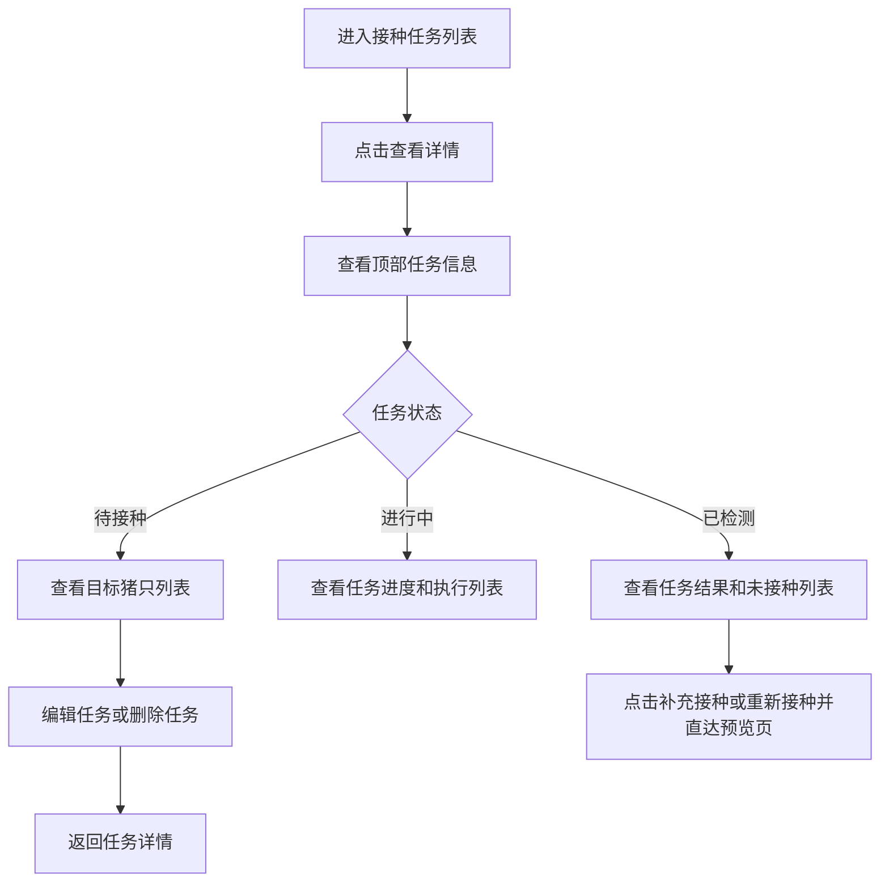

# PRD：Console 接种任务详情

## 背景

接种任务列表能够告诉用户“当前有哪些任务”，但不能回答管理者更关心的问题：

- 这条任务到底是怎么配置的？
- 已经执行到什么程度？
- 哪些猪已经接种，哪些还没有？
- 命中豁免的猪只有哪些？
- 待接种任务如果配置错了，能不能直接修改？

因此，接种任务列表需要配套一张 `任务详情页`，按任务状态展示不同重点信息，并承接待接种任务的编辑入口。

## 目标

- 让 Console 用户从任务列表进入单条接种任务详情。
- 让不同状态的任务展示不同重点内容，而不是所有状态共用同一套信息结构。
- 让待接种任务可以在详情页继续编辑或删除。
- 让 `已检测` 任务能通过补打状态与补打原因表达后续处理进度，并在详情页继续闭环。
- 让进行中和已检测任务保持只读，防止与 Mobile 执行产生冲突。

## 对象

| 对象 | 说明 | 核心诉求 |
|---|---|---|
| 调度员 | 创建并维护接种任务的人 | 看清任务配置，必要时修正待接种任务 |
| 场长 / 主管 | 关注任务执行结果的人 | 快速看进度、看未接种对象、看豁免命中情况 |
| 接种任务 | 由 Console 创建并下发到 Mobile 的任务对象 | 在不同状态下有不同的可查看重点 |

## 价值

- 把“创建任务”与“追踪任务”连接起来，减少列表页信息不足的问题。
- 待接种任务可直接修正，避免删除后重建的重复劳动。
- 进行中和已检测任务只读，减少 Console 与 Mobile 的口径错位。

## 程序流程图

## 操作流程图

## 功能说明

### 1. 页面结构

| 模块 | 前端展示/交互 | 后端/业务逻辑 |
|---|---|---|
| 顶部信息区 | 展示返回按钮、标题和状态相关操作按钮 | 读取任务基础信息和状态 |
| 所属免疫计划信息 | 采用上下排版，单列展示计划名称、计划类型、计划创建时间、计划状态、启用状态 | 读取任务关联的计划快照或展示映射后的计划信息 |
| 疫苗任务信息 | 采用上下排版，单列展示任务编号、任务状态、疫苗、品牌、接种方式、剂量、接种日期、目标范围、创建/执行信息；`已接种 / 目标接种` 通过进度条旁的数值统一展示 | 读取任务快照与执行聚合 |
| 接种猪只列表 | 仅在进行中与已检测展示；按 `已接种`、`未接种` 分组 | 读取任务快照或 Mobile 回传结果 |
| 免疫复核设置 | 仅在创建任务时开启过复核时展示；采用上下排版，回显用户填写的目标抗体、采样方式、样品容器、抽检间隔、抽样比例、抗体合格率阈值 | 读取任务保存时固化的复核配置快照 |
| 免疫复核结果 | 仅在实验室已提交结果后展示；回显配置阈值、合格/抽检总数、实际合格率与结果判定 | 读取关联免疫复核采样任务回写的结果快照 |

### 2. 待接种任务详情

| 功能点 | 规则 |
|---|---|
| 页面目标 | 让用户确认任务配置是否正确，并在下发前继续修正 |
| 任务进度 | 仍展示进度条，口径为 `已接种 / 目标接种 = 0 / 目标数` |
| 所属免疫计划信息 | 展示计划名称、计划类型、计划创建时间、计划状态、启用状态 |
| 疫苗任务信息 | 展示任务基础配置与 `已接种 / 目标接种 = 0 / N` 进度 |
| 免疫复核设置 | 仅在创建时开启了复核才展示，内容与创建时填写项保持一致 |
| 编辑任务 | 允许进入编辑流程；可修改接种日期、接种方式、剂量、剂量单位、目标猪只 |
| 删除任务 | 允许删除，并同步移除 Mobile 下发数据 |

### 3. 进行中任务详情

| 功能点 | 规则 |
|---|---|
| 页面目标 | 让管理者查看当前执行进度和未处理风险 |
| 所属免疫计划信息 | 展示任务关联的计划快照 |
| 任务信息 | 展示任务配置与 `已接种 / 目标接种` 进度 |
| 已接种列表 | 不展示状态字段，仅展示结果明细 |
| 猪只列表 | 分为 `已接种`、`未接种` 两类；其中 `未接种` 的字段与 `待接种` 状态保持一致 |
| 免疫复核设置 | 若该任务开启了复核，则继续回显相同复核配置，不因任务状态改变展示口径 |
| 免疫复核结果 | 若复核结果已回录，则展示配置阈值、实际检测结果、实际合格率与合格/不合格判定 |
| 编辑限制 | 不允许修改任务配置，不允许删除任务 |

### 4. 已检测任务详情

| 功能点 | 规则 |
|---|---|
| 页面目标 | 让管理者复盘本次任务结果 |
| 所属免疫计划信息 | 展示任务关联的计划快照 |
| 疫苗任务信息 | 展示任务配置与最终 `已接种 / 目标接种` 结果 |
| 接种猪只列表 | 分为 `已接种`、`未接种` 两类 |
| 免疫复核设置 | 若该任务开启了复核，则继续回显相同复核配置，不额外改写成系统推导文案 |
| 免疫复核结果 | 若复核结果已回录，则展示配置阈值、实际检测结果、实际合格率与最终判定，供管理者复盘 |
| 补充接种 | 当存在未接种猪只且 `补打状态 = 需补打` 时，在接种猪只列表右上角展示 `补充接种` 按钮；若用户已安排整批重新接种，则该按钮置灰并显示问号说明 |
| 重新接种 | 当实验室回写的免疫复核结果为不合格，且 `补打状态 = 需补打` 时，在 `免疫复核结果` 卡片右上角展示 `重新接种` 按钮 |
| 补充接种链路 | 自动沿用原任务的目标猪群、接种方式、疫苗、品牌、剂量、剂量单位，默认接种日期为当天，并直接进入第三步预览页；用户点击对应按钮即可创建任务；补充接种场景按钮文案为 `完成补打`，重新接种场景按钮文案为 `重新接种` |
| 重新接种链路 | 自动沿用原任务的目标猪群、接种方式、疫苗、品牌、剂量、剂量单位，默认接种日期为当天，并直接进入第三步预览页；若已有补打任务，则先弹二次确认并排除已安排补打的猪只 |
| 编辑限制 | 不允许修改任务配置，不允许删除任务 |

### 5. 操作边界

| 状态 | 查看详情 | 编辑任务 | 删除任务 |
|---|---|---|---|
| 待接种 | 允许 | 允许 | 允许 |
| 进行中 | 允许 | 不允许 | 不允许 |
| 已检测 | 允许 | 不允许 | 不允许 |

## 边际情况 / 异常情况

| 场景 | 处理方式 |
|---|---|
| 待接种任务没有目标猪只 | 列表展示空状态，并提示先返回编辑补充目标猪只 |
| 进行中任务暂无回传记录 | 详情页仍展示任务配置，进度按 0 处理，并提示现场尚待接种回传 |
| 已检测任务存在未接种猪只 | 详情页展示接种猪只列表中的未接种分组，并允许通过补充接种创建一条新任务 |
| 任务进入需补打口径 | 任务仍停留在 `已检测` 列表，通过 `补打状态 = 需补打` 与 `补打原因` 提示用户处理 |
| 重新接种时已有补打任务 | 二次确认提示“已安排补打的猪只不会出现在重新接种任务中”，确认后仅带入剩余目标猪只 |
| 已安排重新接种覆盖补打范围 | 若原任务同时存在未接种与复核不合格，且用户已创建整批重新接种任务，则接种猪只列表右上角的 `补充接种` 按钮置灰；点击问号提示“本次接种合格率未达到要求，您已经安排了任务内全部猪只重新接种，无需补充接种” |
| 用户从详情页编辑待接种任务后返回 | 详情页刷新为最新保存结果 |
