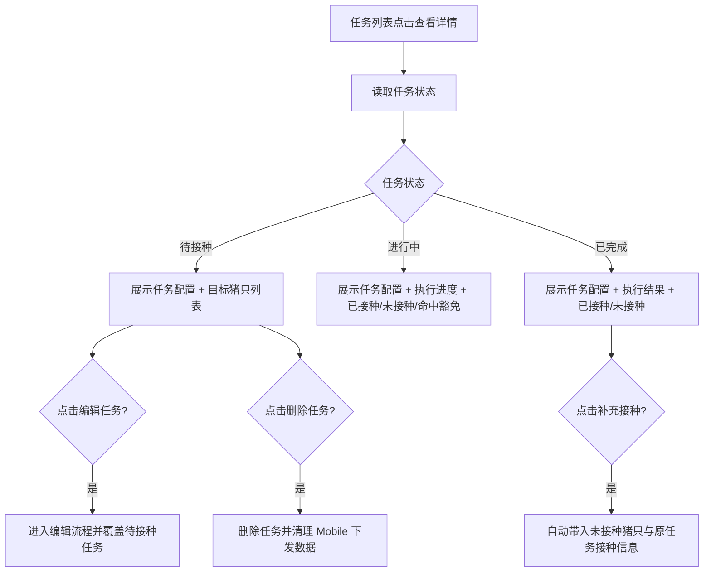
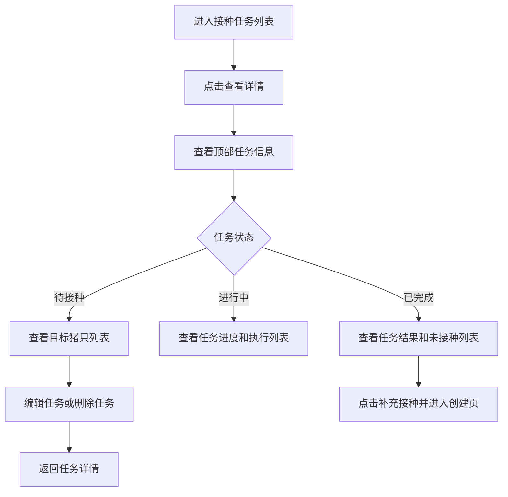

# PRD：Console 接种任务详情

## 背景

接种任务列表能够告诉用户“当前有哪些任务”，但不能回答管理者更关心的问题：

- 这条任务到底是怎么配置的？
- 已经执行到什么程度？
- 哪些猪已经接种，哪些还没有？
- 命中豁免的猪只有哪些？
- 待接种任务如果配置错了，能不能直接修改？

因此，接种任务列表需要配套一张 `任务详情页`，按任务状态展示不同重点信息，并承接待接种任务的编辑入口。

## 目标

- 让 Console 用户从任务列表进入单条接种任务详情。
- 让不同状态的任务展示不同重点内容，而不是所有状态共用同一套信息结构。
- 让待接种任务可以在详情页继续编辑或删除。
- 让已完成任务可以直接基于未接种猪只创建补充接种任务。
- 让进行中和已完成任务保持只读，防止与 Mobile 执行产生冲突。

## 对象

| 对象 | 说明 | 核心诉求 |
|---|---|---|
| 调度员 | 创建并维护接种任务的人 | 看清任务配置，必要时修正待接种任务 |
| 场长 / 主管 | 关注任务执行结果的人 | 快速看进度、看未接种对象、看豁免命中情况 |
| 接种任务 | 由 Console 创建并下发到 Mobile 的任务对象 | 在不同状态下有不同的可查看重点 |

## 价值

- 把“创建任务”与“追踪任务”连接起来，减少列表页信息不足的问题。
- 待接种任务可直接修正，避免删除后重建的重复劳动。
- 进行中和已完成任务只读，减少 Console 与 Mobile 的口径错位。

## 程序流程图

## 操作流程图

## 功能说明

### 1. 页面结构

| 模块 | 前端展示/交互 | 后端/业务逻辑 |
|---|---|---|
| 顶部信息区 | 展示返回按钮、标题、状态标签和状态对应操作按钮 | 读取任务基础信息和状态 |
| 任务信息卡 | 展示任务编号、疫苗、品牌、剂型、接种方式、剂量、剂次、接种日期、目标猪只数、创建信息；不单独展示“当前状态”字段 | 读取任务快照 |
| 任务进度卡 | 三种状态统一展示任务进度；待接种也展示 `已接种 / 目标接种 0 / N` | 读取任务状态与执行聚合 |
| 目标猪只列表区 | 待接种状态直接展示目标猪只列表；进行中/已完成按状态分组展示已接种、未接种、命中豁免 | 读取任务快照或 Mobile 回传结果 |

### 2. 待接种任务详情

| 功能点 | 规则 |
|---|---|
| 页面目标 | 让用户确认任务配置是否正确，并在下发前继续修正 |
| 任务进度 | 仍展示进度条，口径为 `已接种 / 目标接种 = 0 / 目标数` |
| 目标猪只列表 | 直接展示本任务的目标猪只列表，不使用 tab 包裹；字段包含猪只ID、房间、栏位、豁免命中 |
| 目标范围 | 细化展示到 section 层级，例如“生产一区母猪车间”“生产一区分娩车间” |
| 编辑任务 | 允许进入编辑流程；可修改接种日期、接种方式、剂量、剂量单位、目标猪只 |
| 删除任务 | 允许删除，并同步移除 Mobile 下发数据 |

### 3. 进行中任务详情

| 功能点 | 规则 |
|---|---|
| 页面目标 | 让管理者查看当前执行进度和未处理风险 |
| 进度展示 | 显示 `已接种 / 目标接种` 进度 |
| 已接种列表 | 不展示状态字段，仅展示结果明细 |
| 猪只列表 | 分为 `已接种`、`未接种` 两类；其中 `未接种` 的字段与 `待接种` 状态保持一致 |
| 配置展示 | 继续展示疫苗、品牌、剂型、接种方式、剂量等任务快照 |
| 编辑限制 | 不允许修改任务配置，不允许删除任务 |

### 4. 已完成任务详情

| 功能点 | 规则 |
|---|---|
| 页面目标 | 让管理者复盘本次任务结果 |
| 结果展示 | 显示最终 `已接种 / 目标接种` 结果 |
| 猪只列表 | 分为 `已接种`、`未接种` 两类 |
| 补操作 | 提供 `补充接种` 按钮；点击后自动带入所有未接种猪只（含命中豁免但未接种的猪只） |
| 补充接种表单 | 自动沿用原任务的疫苗、品牌、接种方式、剂量、剂量单位；这些字段锁定不可改，用户只需选择接种日期 |
| 编辑限制 | 不允许修改任务配置，不允许删除任务 |

### 5. 操作边界

| 状态 | 查看详情 | 编辑任务 | 删除任务 |
|---|---|---|---|
| 待接种 | 允许 | 允许 | 允许 |
| 进行中 | 允许 | 不允许 | 不允许 |
| 已完成 | 允许 | 不允许 | 不允许 |

## 边际情况 / 异常情况

| 场景 | 处理方式 |
|---|---|
| 待接种任务没有目标猪只 | 列表展示空状态，并提示先返回编辑补充目标猪只 |
| 进行中任务暂无回传记录 | 详情页仍展示任务配置，进度按 0 处理，并提示现场尚待接种回传 |
| 已完成任务存在未接种猪只 | 详情页展示未接种猪只列表，并允许通过补充接种创建一条新任务 |
| 用户从详情页编辑待接种任务后返回 | 详情页刷新为最新保存结果 |
