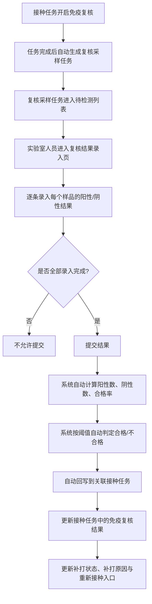
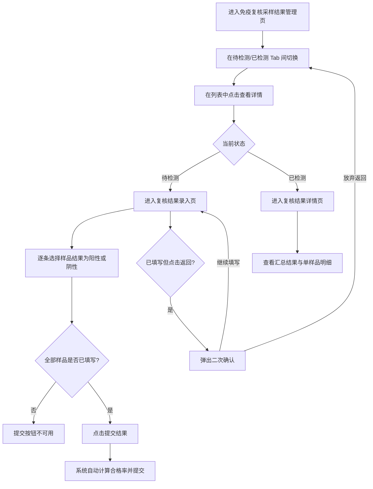

# PRD：免疫复核采样结果管理

## 背景

当前接种任务已经支持配置免疫复核，并在任务完成后展示复核结果与后续处理入口。但在真实业务里，复核结果并不是凭空出现的，而是来自实验室人员对每个独立样品逐条录入后的结果汇总。

现有采样能力更偏向“采样单元”管理，一条数据代表一个采样单元或样本容器；而免疫复核更关注的是“一轮复核任务”的最终结果，以及该轮任务下每个样品的检测结果。如果直接把每个样品都平铺到列表页，一条复核任务会拆成大量记录，实验室列表会失去可读性；但如果只记录汇总结果，又会失去单样品可追溯能力。

因此，需要新增一层面向实验室人员的“免疫复核采样结果管理”页面：列表页按“每一次免疫复核任务”管理，详情页再逐条录入样品结果，并由系统自动计算合格率、自动生成判定结果、自动回写到对应接种任务。

## 目标

- 为实验室人员提供一套独立的免疫复核采样结果管理页面。
- 让列表页按“复核任务”管理，而不是按单个样品管理，保证列表可读性。
- 让实验室人员在详情页先选择本轮检测单位，再逐条录入每个样品的检测值与检测结果；系统自动计算合格率，不要求用户手工计算，并支持同步上传本轮检测报告。
- 让复核结果一旦提交，立刻自动回写到关联接种任务，并影响接种任务中的复核结果展示与后续重新接种决策。
- 保证结果录入必须一次性完成，不允许部分提交；若用户已填写但未提交就离开页面，需要进行二次确认。

## 对象

| 对象 | 说明 | 核心诉求 |
|---|---|---|
| 实验室人员 | 负责录入样品检测结果的人 | 快速找到待检测复核任务，逐条录入并提交结果 |
| Console 管理者 | 查看接种结果、复核结果并决定后续是否重新接种的人 | 看到系统自动回写的合格率、判定结果与后续处理入口 |
| 免疫复核任务 | 每一轮接种任务对应的一次复核采样结果对象 | 既能在列表中汇总管理，也能在详情中追溯单样品结果 |

## 价值

- 对实验室人员：不需要自己统计阳性数和合格率，只需专注录入每个样品的检测结果。
- 对管理者：接种任务完成后，复核结果会自动回写，管理者能更快看到是否需要重新接种。
- 对业务：保留单样品追溯能力的同时，不把样品明细直接堆到列表页，兼顾可读性和可追踪性。

## 程序流程图

## 操作流程图

## 功能说明

### 1. 列表页结构

列表页顶部提供 `创建采样` 按钮，用于实验室或管理者自由创建采样任务。点击后先选择采样类型：

- `病毒`：检查样品（人、猪、环境、物品）是否携带或含有某种病毒传播源。本期只展示入口与说明，不进入创建页。
- `抗体`：创建抗体采样任务，自主检测猪只是否含有某类疫苗对应的抗体。

列表页采用状态导航分为三个 Tab：

- `待采样`
- `待检测`
- `已检测`

不单独展示“录入中”状态，因为系统不允许部分提交。用户如果填写了一部分结果但尚未提交，这些内容只停留在当前页面会话中，不进入正式状态流转。

### 2. 抗体采样任务创建

| 模块 | 前端展示/交互 | 后端/业务逻辑 |
|---|---|---|
| 创建采样按钮 | 位于列表页右上角 | 作为自由创建采样任务的统一入口 |
| 采样类型选择弹窗 | 提供 `病毒 / 抗体` 两个选项，并展示解释文案 | 帮助用户先明确采样目标 |
| 病毒入口 | 当前只展示说明，点击后提示暂未开放 | 保留后续扩展空间，不进入新页面 |
| 抗体创建页 | 进入独立创建页面 | 承接本期完整创建流程 |
| 检测抗体 | 从已有抗体类型中选择本次需要检测的抗体 | 作为任务级采样目的，写入后续样品明细 |
| 采样方式 | 选择本次采样方式 | 复用免疫复核配置项，供详情和实验室查看 |
| 样品容器 | 选择本次采样使用的容器 | 供实验室提前准备与列表展示 |
| 合格率阈值 | 设置本轮采样结果的判定阈值 | 用于后续自动判定合格/不合格 |
| 选择采样猪只 | 从猪群中勾选需要采样的猪只 | 生成样品明细，创建后进入待采样状态 |
| 完成创建 | 校验必填项后创建任务 | 新任务进入 `待采样`，并带上样品明细 |

### 3. 列表页字段建议

#### 待采样 Tab

| 模块 | 前端展示/交互 | 后端/业务逻辑 |
|---|---|---|
| 复核任务ID | 作为列表主标题字段 | 每一轮复核任务的唯一标识 |
| 关联接种任务 | 展示这条复核来自哪条接种任务；若为手动抗体采样则展示 `—` | 用于区分任务来源 |
| 检测抗体 | 展示本轮需要检测的抗体类型 | 来自接种任务复核配置或手动创建配置 |
| 抽样猪只 | 展示本轮样品总数 | 提示本次采样规模 |
| 样品容器 | 展示本轮采样要求使用的容器 | 便于实验室提前准备 |
| 创建时间 | 展示复核任务生成时间 | 辅助排序与追溯 |
| 操作 | 统一显示 `查看详情` 图标 | 进入待采样详情页，查看样品范围与采样要求 |

#### 待检测 Tab

| 模块 | 前端展示/交互 | 后端/业务逻辑 |
|---|---|---|
| 复核任务ID | 作为列表主标题字段 | 每一轮复核任务的唯一标识 |
| 关联接种任务 | 展示这条复核来自哪条接种任务 | 用于管理者与实验室核对来源 |
| 检测抗体 | 展示本轮需要检测的抗体类型 | 来自接种任务保存的复核配置 |
| 抽样猪只 | 展示本轮样品总数 | 提示实验室本次需要录多少条结果 |
| 样品容器 | 展示本轮采样要求使用的容器 | 方便实验室提前判断本轮样品处理要求 |
| 创建时间 | 展示复核任务生成时间 | 辅助排序与追溯 |
| 操作 | 显示上传结果图标按钮 | 进入结果录入页，开始逐条录入样品结果 |

#### 已检测 Tab

| 模块 | 前端展示/交互 | 后端/业务逻辑 |
|---|---|---|
| 复核任务ID | 作为列表主标题字段 | 每一轮复核任务的唯一标识 |
| 关联接种任务 | 展示这条复核来自哪条接种任务 | 用于查看回写目标 |
| 检测抗体 | 展示本轮检测的抗体类型 | 来自复核配置快照 |
| 抽样猪只 | 展示本轮样品总数 | 展示录入规模 |
| 样品容器 | 展示本轮采样要求使用的容器 | 便于查看本轮检测前提 |
| 阳性数 / 抽样总数 | 展示最终合格样品数 | 阳性即合格 |
| 合格率 | 展示系统自动计算结果 | 公式：阳性样品数 / 样品总数 |
| 判定结果 | 展示合格 / 不合格 | 系统根据阈值自动生成 |
| 创建时间 | 展示复核任务生成时间 | 辅助追溯 |
| 操作 | 统一显示 `查看详情` | 进入只读详情页 |

### 4. 结果录入页（待检测）

| 模块 | 前端展示/交互 | 后端/业务逻辑 |
|---|---|---|
| 页面标题 | 显示 `复核结果上传` | 区分于已检测后的只读详情页 |
| 字段说明区 | 在录入页顶部解释 `检测单位`、`检测值`、`检测结果` 分别代表什么 | 避免实验室人员只看到缩写而不清楚自己在填写什么 |
| 检测单位选择 | 在样品列表上方选择本轮检测单位，例如 `S/P值`、`OD值`、`阻断率`、`滴度` | 适配不同实验室与不同试剂盒的检测口径 |
| 搜索栏 | 支持按耳标号、样品ID搜索当前列表 | 方便实验室人员快速定位样品 |
| 样品明细列表 | 一行一条样品数据，表格内直接录入检测值与检测结果 | 每条样品都需要可追溯 |
| 单条检测值录入 | 每条样品需填写一个检测值 | 仅作为原始实验结果留存，不参与自动阳性/阴性判断 |
| 单条结果录入 | 每条样品支持选择 `阳性` / `阴性` | `阳性 = 合格`，`阴性 = 不合格`，由实验室人员手动判断 |
| 表格底部汇总 | 在列表底部展示已填写数 | 提醒实验室当前还有多少样品尚未完成录入 |
| 上传报告 | 支持上传本轮检测报告文件 | 用于后续追溯查看，不影响合格率计算规则 |
| 提交结果 | 仅在全部样品都已填写时可点击 | 提交后固化本轮结果，并回写关联接种任务 |
| 返回 | 返回列表页 | 若已有填写内容但未提交，必须弹出二次确认 |

#### 样品明细字段建议

- 样品ID
- 耳标号
- 房间 / 栏位
- 检测值
- 检测结果（未填写 / 阳性 / 阴性）

### 5. 结果详情页（已检测）

| 模块 | 前端展示/交互 | 后端/业务逻辑 |
|---|---|---|
| 页面标题 | 显示 `复核结果详情` | 与录入页区分 |
| 汇总结果 | 展示抽样总数、阳性数、阴性数、合格率、阈值、最终判定 | 读取已提交的最终结果 |
| 样品明细列表 | 只读展示每个样品的结果 | 保证单样品可追溯 |
| 返回 | 返回列表页 | 无需二次确认 |

### 6. 自动计算规则

#### 结果定义

- `阳性`：检测到检测抗体
- `阴性`：未检测到检测抗体
- `阳性 = 合格`

#### 合格率计算

系统自动计算：

`合格率 = 阳性样品数 / 样品总数`

示例：

- 抽样总数：20
- 阳性样品数：14
- 阴性样品数：6
- 合格率：14 / 20 = 70%

#### 判定规则

- 若 `合格率 >= 阈值` → 判定为 `合格`
- 若 `合格率 < 阈值` → 判定为 `不合格`

示例：

- 阈值：80%
- 实际合格率：70%
- 最终判定：`不合格`

### 7. 与接种任务的回写联动

复核采样任务一旦提交结果，系统需要立刻自动回写到关联接种任务，更新以下信息：

- `免疫复核结果`
- `补打状态`
- `补打原因`
- `重新接种` 入口是否显示

如果本轮结果为 `不合格`，且接种任务允许后续重新接种，则应在对应接种任务详情中出现新的后续处理入口。

### 8. 与重新接种的关系

- 如果原接种任务因为复核不合格触发了 `重新接种`
- 新生成的 `重新接种任务` 应自动沿用上一条任务的复核配置
- 重新接种任务执行完成后，再自动生成一条新的复核采样任务

这样每一条接种任务都只对应自己这一轮的复核采样任务，但整个业务链可以形成多轮复核记录，保证追溯清楚。

## 边际情况 / 异常情况

| 场景 | 处理方式 |
|---|---|
| 用户只录了一部分样品结果或未填写检测值 | 不允许提交，提交按钮不可点击 |
| 用户已经填写部分结果，点击返回 | 弹出二次确认，提示当前结果尚未提交，返回后本次填写不会生效 |
| 所有样品都未填写就点击提交 | 提示用户先完成全部样品结果录入 |
| 阳性数为 0 | 系统仍正常计算合格率为 0%，并判定是否不合格 |
| 抽样总数与样品明细数量不一致 | 不允许提交，系统提示数据异常 |
| 提交成功后回写失败 | 前端提示提交成功但回写异常，后台需记录异常并支持补偿重试 |
| 同一条重新接种任务再次触发复核 | 自动生成新一轮复核采样任务，不覆盖上一轮记录 |
