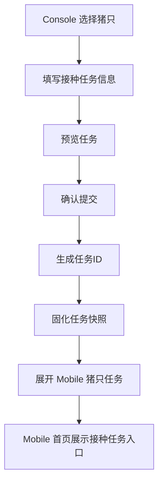
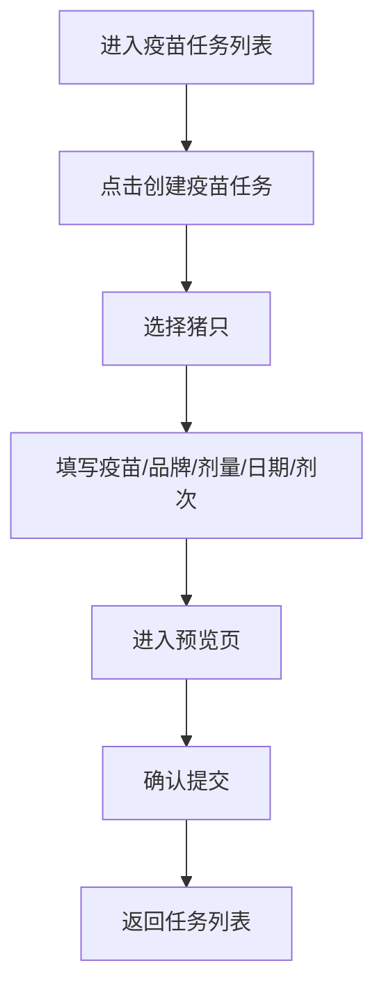

# 疫苗任务 PRD（最新实现）

## 背景

Console 端疫苗任务用于把已选猪只与疫苗配置组合成一批可下发到 Mobile 的接种任务。当前版本的目标是让创建流程尽量直接、字段尽量稳定，避免在创建页引入一线暂时并不需要的复杂配置。

本次调整后，创建接种任务时不再要求用户配置“多次接种”开关、间隔时间、间隔时间单位；Console 端只保留本次任务真正需要的核心信息，用于生成标准化的接种任务并同步到 Mobile。

## 目标

- 让调度员在 Console 端完成接种任务创建时，只填写当前批次真正必要的信息。
- 让任务创建页、预览页、任务列表页与 Mobile 执行页保持同一套核心口径。
- 让 Console 创建完成后的任务数据，可以稳定下发到 Mobile 首页与猪只执行列表。

## 对象

| 对象 | 说明 | 核心诉求 |
|---|---|---|
| 调度员 | 在 Console 端创建并下发接种任务 | 字段简单、提交流程清晰 |
| 接种任务 | Console 创建并下发给 Mobile 的任务对象 | 信息完整但不过度冗余 |
| Mobile 执行端 | 接收任务并按猪只执行接种 | 能读取稳定的任务快照 |

## 价值

- 减少 Console 创建任务时的无效配置项，提升录入效率。
- 避免表单、预览、列表、Mobile 执行页之间口径不一致。
- 降低后续维护成本，减少因为无效字段残留而形成的页面噪音。

## 程序流程图

## 操作流程图

## 功能说明

### 1. 创建接种任务

| 模块 | 前端展示/交互 | 后端/业务逻辑 |
|---|---|---|
| 选择猪只 | 用户从猪只列表中勾选目标猪只后进入创建页 | 记录本次任务的目标猪只范围 |
| 创建表单 | 仅保留 `疫苗`、`品牌(剂型)`、`剂量`、`剂量单位`、`接种日期`、`剂次` | 生成本次接种任务所需的核心快照 |
| 删除的字段 | 不再展示 `多次接种`、`间隔时间`、`间隔时间单位`、底部动态通告栏 | 不再依赖这些字段生成新任务 |
| 预览页 | 展示任务编号、接种日期、疫苗、品牌、剂型、接种途径、剂量、剂次 | 给用户做最终确认，不再展示间隔信息 |
| 提交任务 | 点击完成后生成任务并回到列表 | 生成任务 ID，并下发到 Mobile |

### 2. 任务列表

| 模块 | 前端展示/交互 | 后端/业务逻辑 |
|---|---|---|
| 列表列展示 | 展示任务ID、疫苗、品牌、剂型、接种途径、剂量、剂次、接种日期、目标猪只、创建/执行信息 | 返回当前任务状态与核心快照 |
| 删除的列口径 | 不再展示 `间隔` 列 | 避免展示已不再由创建页维护的无效字段 |
| 未开始任务删除 | 仅 `未开始` 状态显示 `删除` 按钮；用户确认后删除任务 | 同步移除 Console 任务记录及该任务下发到 Mobile 的接种数据 |

### 3. Mobile 下发

| 模块 | 前端展示/交互 | 后端/业务逻辑 |
|---|---|---|
| 首页任务卡 | Mobile 首页读取接种任务并展示入口 | 使用任务创建时间计算“已下发 X 天” |
| 猪只执行页 | 按房间/栏位进入接种执行列表 | 使用任务快照展示疫苗、品牌、剂型、接种途径、剂量等信息 |

## 边际情况 / 异常情况

| 场景 | 处理方式 |
|---|---|
| 未选择疫苗 | 阻止进入下一步，并提示必填 |
| 已选猪只为空 | 不允许进入创建页 |
| 品牌未选择 | 允许为空时展示为 `—`；若业务要求品牌必填，应由表单规则阻断 |
| 提交失败 | 保留当前草稿，允许用户重新提交 |
| 删除未开始任务 | 允许删除；删除后 Console 列表与 Mobile 下发数据同时移除 |
| 进行中或已完成任务 | 不展示删除入口，避免误删执行中或历史任务 |
| 旧任务仍带有历史间隔信息 | 历史数据可继续保留，但 Console 新创建任务与列表页不再强调该字段 |
